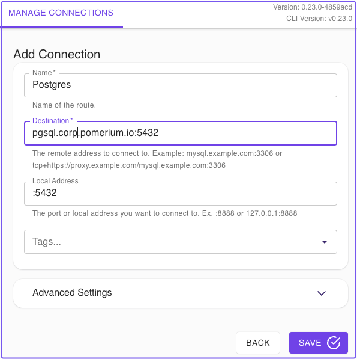

import Tabs from '@theme/Tabs';
import TabItem from '@theme/TabItem';

PostgreSQL is a popular relational database used in many modern applications. This guide provides the basic steps to tunnel a connection through Pomerium to a Postgres instance.

## Basic Connection

1. Creact a TCP tunnel, using either [`pomerium-cli`](/docs/deploy/clients/pomerium-cli) or the Pomerium Desktop client:

<Tabs>
<TabItem label="pomerium-cli" value="pomerium-cli">

```bash
$ pomerium-cli tcp pgsql.localhost.pomerium.io:5432 --listen localhost:5432
```

</TabItem>
<TabItem label="Pomerium Desktop" value="pomerium-desktop">



:::tip Local Address

The **Local Address** field is optional. Using it defines what port the tunnel listens on locally. If not specified, Pomerium Desktop will choose a random available port.

:::

</TabItem>
</Tabs>

2. Initiaite your Postgres connection, pointing to `localhost`:

  ```bash
  $  psql -h localhost -W -U postgres -c '\dn'
  ```


## Resources

- [Configure Postgres Backend with Pomerium](/docs/internals/data-storage#postgres)

