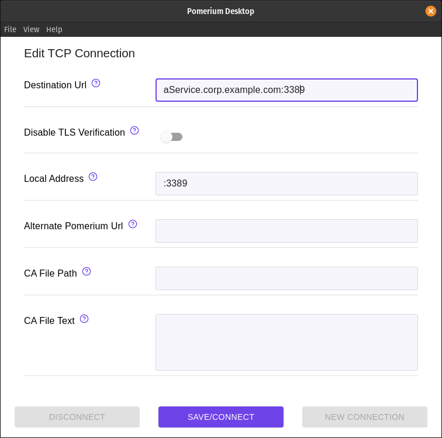
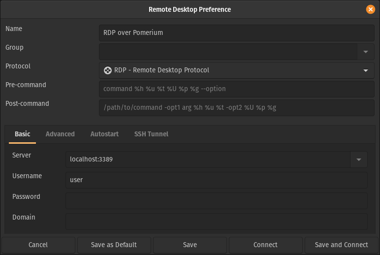
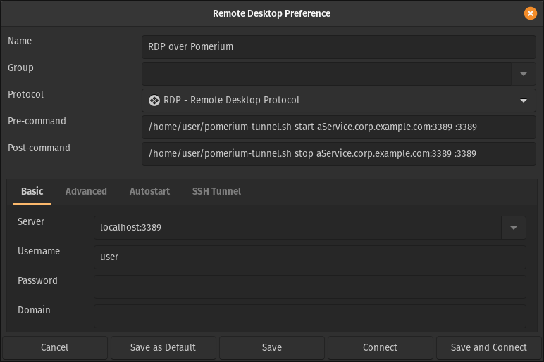

import Tabs from '@theme/Tabs';
import TabItem from '@theme/TabItem';
import TunnelExample from '@site/content/examples/tcp/pomerium-tunnel.sh.md'

# Tunneled RDP Connections

Remote Desktop Protocol (**RDP**) is a standard for using a desktop computer remotely. It was released by Microsoft and is most commonly used to access Windows systems, but can be used for macOS and Linux systems as well.

:::tip
This example assumes you've already [created a TCP route](/docs/capabilities/tcp#configure-routes) for this service.
:::

## Basic Connection

1. Create a TCP tunnel, using either [`pomerium-cli`](@site/content/docs/releases/pomerium-cli.mdx) or the Pomerium Desktop client:

    <Tabs>
    <TabItem value="pomerium-cli" label="pomerium-cli">

    ```bash
    pomerium-cli tcp aService.corp.example.com:3389 --listen :3389
    ```

    :::tip --listen
    The `--listen` flag is optional. It lets you define what port the tunnel listens on locally. If not specified, the client will choose a random available port.
    :::

    </TabItem>
    <TabItem value="Pomerium Desktop" label="Pomerium Desktop">

    

    :::tip Local Address
    The **Local Address** field is optional. Using it defines what port the tunnel listens on locally. If not specified, Pomerium Desktop will choose a random available port.
    :::

    </TabItem>
    </Tabs>

1. Initiate your RDP connection, pointing to `localhost`. This example uses the [Remmina](https://remmina.org/) client, but the procedure should be similar for other tools:

    

    :::caution
    The first connection attempt will initiate a redirect to authenticate you in the browser. Once you're signed in, subsequent connections will succeed. If your client isn't configured to retry the connection, you may have to reconnect manually.
    :::


## Always Tunnel through Pomerium

Some clients, like Remmina, support running commands before and after connection. The script below (adopted from [this example](https://kgibran.wordpress.com/2019/03/13/remmina-rdp-ssh-tunnel-with-pre-and-post-scripts/) using SSH tunnels) starts and stops an instance of `pomerium-cli`:

<TunnelExample/>

1. Save the script above to your home folder (`~/`), and make it executable:

    ```bash
    cd ~/
    wget https://github.com/pomerium/pomerium/blob/main/examples/tcp/pomerium-tunnel.sh
    chmod +x pomerium-tunnel.sh
    ```

1. Update your client profile to execute the script before and after the connection:

    

:::caution
Flatpak versions of client software may not be able to read external scripts or programs.
:::

## More Resources

- [Remote Desktop Protocol (Wikipedia)](https://en.wikipedia.org/wiki/Remote_Desktop_Protocol)
- [Remmina (Linux)](https://remmina.org/)
- [Microsoft Remote Desktop (macOS)](https://apps.apple.com/us/app/microsoft-remote-desktop/id1295203466?mt=12)
