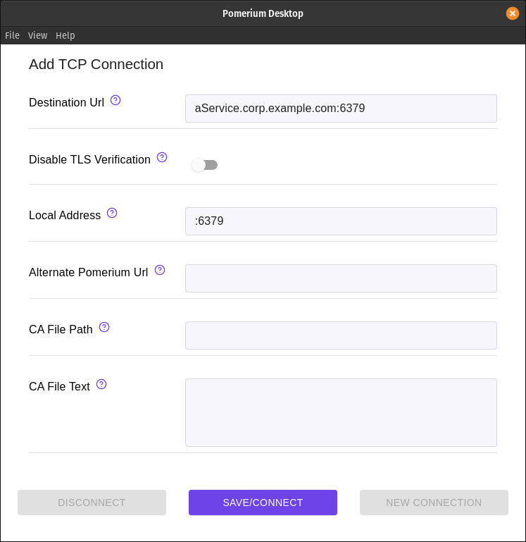

import Tabs from '@theme/Tabs';
import TabItem from '@theme/TabItem';

# Tunneled Redis Connections

Redis is a popular in-memory data structure store. It can be run locally or configured as a single or distributed standalone service.

:::info long-running socket connection behavior

**When you open long-running socket connections in Pomerium, the connections aren’t terminated with the user session.**

Socket connections include **TCP connections** and long-running **Websocket** and  **gRPC connections** (HTTP streams).

When you offboard a user and remove them from your identity provider directory, Pomerium stops refreshing the user’s HTTP sessions. As a result, their requests will no longer be authorized.

However, Pomerium doesn’t terminate a user’s long-running, streaming connections when you remove them from your identity provider directory.

At the moment, the best way to terminate these connections is to restart your Pomerium proxy service.

:::

:::tip
This example assumes you've already [created a TCP route](/docs/capabilities/tcp#configure-routes) for this service.
:::

## Basic Connection

 1. Create a TCP tunnel, using either [`pomerium-cli`](/docs/deploy/clients/pomerium-cli) or the Pomerium Desktop client:

    <Tabs>
    <TabItem value="pomerium-cli" label="pomerium-cli">

    ```bash
    pomerium-cli tcp redis.corp.example.com:6379 --listen :6379
    ```

    :::tip --listen
    The `--listen` flag is optional. It lets you define what port the tunnel listens on locally. If not specified, the client will choose a random available port.
    :::

    </TabItem>
    <TabItem value="Pomerium Desktop" label="Pomerium Desktop">

    
    :::tip Local Address
    The **Local Address** field is optional. Using it defines what port the tunnel listens on locally. If not specified, Pomerium Desktop will choose a random available port.
    :::

    </TabItem>
    </Tabs>

1. Initiate your Redis connection, pointing to `localhost`:

    ```bash
    redis-cli -h localhost -p 6379
    ```

This demonstrates access to a Redis server through Pomerium from the `redis-cli` tool. Pomerium Enterprise users can utilize [Service Accounts](/docs/capabilities/service-accounts) to enable secure machine-to-machine communication of Redis services.

## More Resources

- [redis-cli](https://redis.io/topics/rediscli)
- [Redis ACL](https://redis.io/topics/acl)
