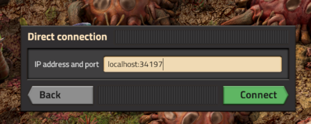
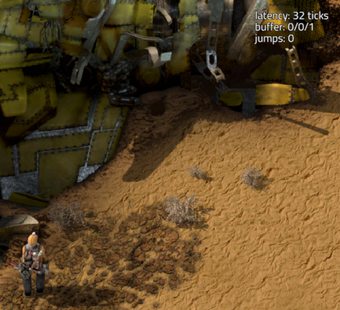

# Testing Pomerium UDP Tunnels with Factorio

Since v0.29.0 Pomerium supports tunneling UDP traffic. This example demonstrates how to do this using [Factorio](https://www.factorio.com/), a popular game where you build and maintain factories with multiplayer support. Like many games Factorio uses a custom UDP protocol for multiplayer.

You will need two machines: one running Factorio and the Pomerium CLI, and another running the Factorio headless server and Pomerium. Replace __`factorio.corp.example.com`__ with your domain name.

## Server

1. Install Pomerium
2. Download the Linux Factorio headless server

   ```bash
   curl -L -o factorio.tar.xz https://factorio.com/get-download/stable/headless/linux64
   tar -xJf factorio.tar.xz
   ```

3. Enable QUIC by setting [`codec_type`](/docs/reference/codec-type) to `http3`

   ```yaml
   codec_type: http3
   ```
   :::tip QUIC

    Pomerium also supports UDP tunneling with `http1` or `auto` (the default), but using `http3` significantly improves performance.

   :::

4. Add a UDP route on port 34197

   ```yaml
   - routes:
       from: udp+https://factorio.corp.example.com:34197
       to: udp://127.0.0.1:34197
       allow_any_authenticated_user: true
   ```


5. Run Pomerium
6. Create a new Factorio save

   ```bash
   ./bin/x64/factorio --create ./saves/pomerium-example.zip
   ```

7. Run the Factorio headless server

    ```bash
    ./bin/x64/factorio --start-server ./saves/pomerium-example.zip
    ```

## Client

1. Install the Pomerium CLI
2. [Install Factorio](https://www.factorio.com/download)
3. Start a UDP tunnel

   ```bash
   pomerium-cli udp factorio.corp.example.com:34197 --listen :34197
   ```

   :::tip TLS issues

   If you don't have a valid certificate use `--disable-tls-verification`.

   :::
4. Run Factorio, click _Multiplayer_, then _Connect to Address_, and enter `127.0.0.1:34197` as the server address and click _Connect_.

   

You should now be connected to the server.


