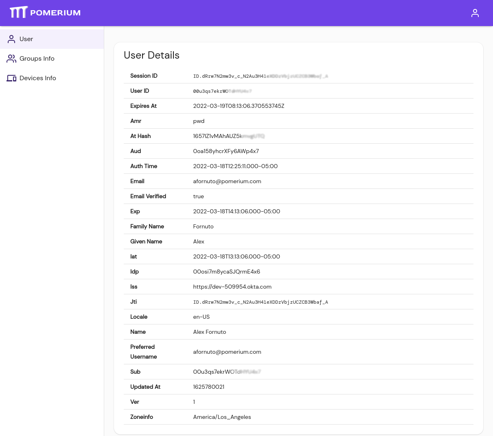

# Access, Authentication, Authorization, oh my!

Authentication and authorization are similar concepts that are often used interchangeably.

**Authentication** is the process of determining if you are who you say you are.

**Authorization** is the process of determining if you are allowed to do the thing you are trying to do.

Pomerium provides a standardized interface to add access control, regardless if an application itself has authorization or authentication baked in, so developers can focus on their app's functionality, not reinventing access control.

## Authentication

Pomerium provides authentication via your existing identity provider (Pomerium supports all major [single sign-on](/docs/identity-providers) providers (Okta, G Suite, Azure, AD, Ping, Github and so on).

## Authorization

Authorization policy can be expressed in a high-level, [declarative language](/docs/enterprise/reference/manage#pomerium-policy-language) or [as code](/docs/enterprise/reference/manage#rego) that can be used to enforce ABAC, RBAC, or any other governance policy controls. Pomerium can make holistic policy and authorization decisions using external data and request context factors such as user groups, roles, time, day, location and vulnerability status.

Pomerium enables zero trust based access in which trust flows from identity, device-state, and context, not network location. Every device, user, and application's communication should be authenticated, authorized, and encrypted.

With Pomerium:

- requests are continuously re-evaluated on a per-request basis.
- authorization is identity and context aware; pomerium can be used to integrate data from any source into authorization policy decisions.
- trust flows from user and device identity, not network location. Every device, user, and application's communication should be authenticated, authorized, and encrypted.
- Pomerium provides detailed audit logs for all activity in your environment. Quickly detect anomalies to mitigate bad actors and revoke access with a click of a button. Simplify life-cycle management and access reviews.

[reference: policies]: /docs/enterprise/reference/manage#policies-2
[reference: namespace]: /docs/concepts/namespacing
[reference: routes]: /docs/enterprise/reference/manage#routes

## Users and Groups

Pomerium populates users and groups from your IdP. This data is cached to prevent hitting API rate-limits, ensure policy enforcement performance, and provides look-ahead support when adding users or groups to [Namespaces](#namespaces) and [Policies](#policies).

### Non-Domain Users

You may encounter a situation where you may want to add users that are not directly associated with your corporate identity provider service. For example, if you have a corporate GSuite account and want to add a contractor with a gmail account. In this case, there are two workarounds:

- Create a group within your identity provider directly with the non-domain users in it. This group can be found and added to Namespaces and Policies.
- Manually add the user's unique ID. Identify the ID from a user's Session Details page, or the [Sessions](/docs/enterprise/reference/reports#sessions) page in Pomerium Enterprise.

  A user can see their session ID by navigating to the special `/.pomerium` URL endpoint from any Pomerium managed route. The unique ID is listed as "Sub" under User Details:

  

[reference: policies]: /docs/enterprise/reference/manage#policies-2
[reference: namespace]: /docs/concepts/namespacing
[reference: routes]: /docs/enterprise/reference/manage#routes
