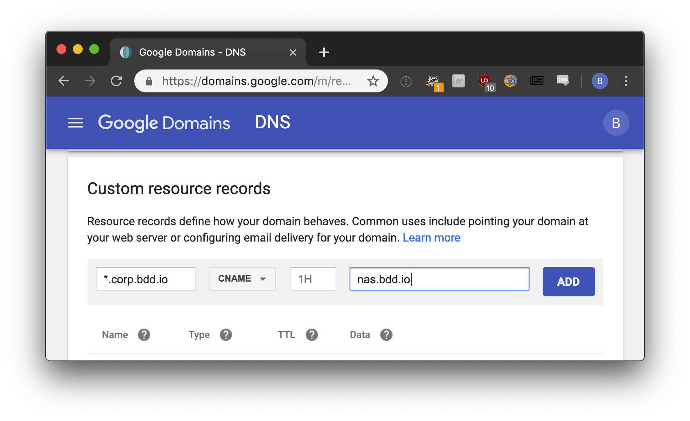
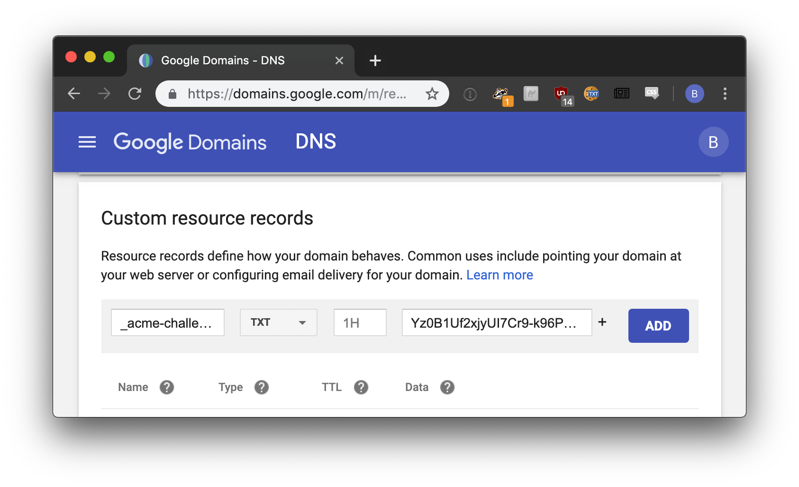
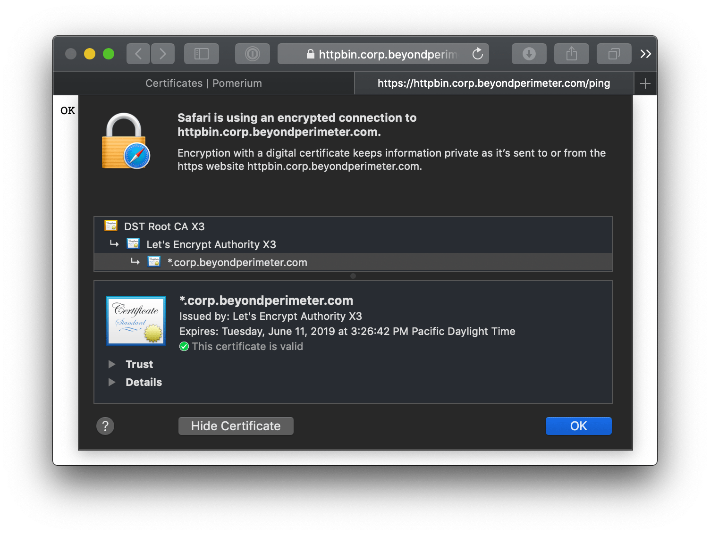
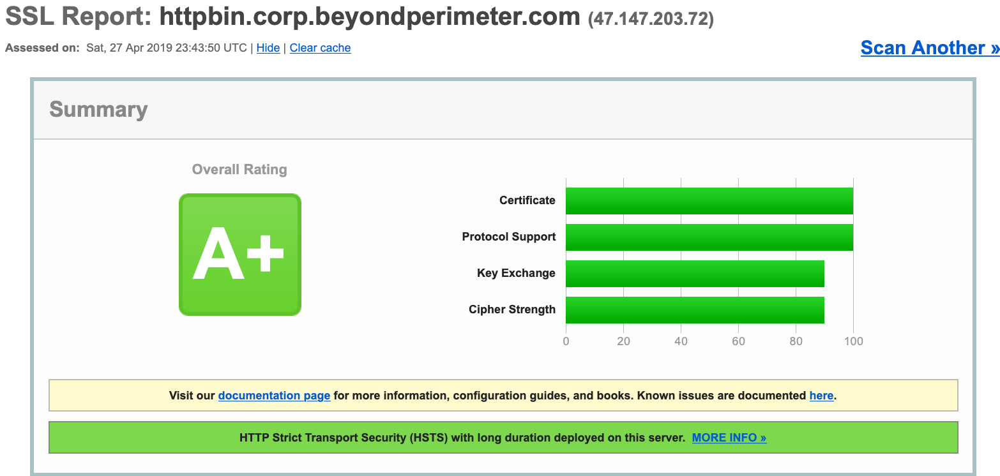

---
# cSpell:ignore filippo

title: SSL/TLS Certificates & Encryption
sidebar_label: SSL/TLS Certificates & Encryption
lang: en-US
description: description
keywords: [x509, certificates, tls, mtls, letsencrypt, lets encrypt]
pagination_prev: null
---

import Tabs from '@theme/Tabs';
import TabItem from '@theme/TabItem';
import GenerateWildcardCert from '@site/content/examples/sh/generate_wildcard_cert.sh.md';

# SSL/TLS Certificates & Encryption

Learn what SSL/TLS is, how it secures applications, and how Pomerium incorporates SSL/TLS to secure connections between its end-users, other Pomerium services, and your internal applications.

## What are SSL/TLS certificates?

The Transport Layer Security (TLS) protocol, formerly known as the Secure Sockets Layer (SSL) protocol, is a cryptographic protocol that secures HTTP communications over a computer network.

### Private key pairs

TLS relies on private and public key pairs to authenticate users or services, verify digital signatures, and encrypt and decrypt data.

### SSL/TLS certificates

TLS certificates enable computer systems to verify your identity and encrypt communication over TLS.

Certificates are issued by a Certificate Authority (CA). The CA, which can be public or private, is a trusted entity that establishes digital identities.

The CA generates and signs a certificate (a digital object) that includes your public key, the certificate issuer, expiration and issuance dates, and other relevant metadata.

Both computer systems (servers and other backend services) and end-users rely on certificates to verify each other’s identity before exchanging information.

### TLS Handshake

The TLS handshake is how a client and server verify each other’s identities, determine which cryptographic algorithms they will use to communicate securely over HTTP, and generate session keys to create new sessions.

During the TLS handshake, both parties use their public key for encryption and their private key for decryption. This gives both parties the opportunity to generate and exchange an agreed-upon shared key used to encrypt and decrypt communication in a session.

## Mutual TLS (mTLS) authentication

Mutual TLS (mTLS), or mutual authentication, means that both the client and server verify each other’s identities.

mTLS makes it possible to verify end-users, devices, and servers within an organization, which is a core principle for organizations that are serious about implementing a zero- trust security model.

## Why Pomerium uses mTLS

Since one of Pomerium's core principles is to treat internal and external traffic impartially, Pomerium uses mutually authenticated TLS ubiquitously.

This enables Pomerium to secure connections between:

- The end-user and Pomerium
- Pomerium services (even if the network is trusted)
- Pomerium and the destination application

Securing all communication with mTLS bolsters security and can help prevent attacks like:

- Spoofing
- Credential stuffing
- Brute force attacks
- On-path attacks
- Malicious API attacks

## Set up mTLS with Pomerium

This guide covers how to generate and set up TLS certificates suitable for working with Pomerium.

Tools and resources:

- [LetsEncrypt](https://letsencrypt.org/about/): a public CA that issues free certificates trusted by major browsers; other [private](https://blog.cloudflare.com/how-to-build-your-own-public-key-infrastructure/) or [public](https://scotthelme.co.uk/are-ev-certificates-worth-the-paper-theyre-written-on/) CAs are also fine
- [mkcert](https://mkcert.org/): a free tool for generating self-signed certificates ideal for testing purposes
- [Google Domains](https://domains.google.com/): a domain name registrar you will use to set up your wildcard domain and certificate validation. You can use other registrars as well (some even support [automatic renewal](https://github.com/Neilpang/acme.sh/wiki/dnsapi))
- [Acme.sh](https://github.com/Neilpang/acme.sh): an Automated Certificate Management Environment (ACME) client you will use to fetch your wildcard certificate. Any [LetsEncrypt client](https://letsencrypt.org/docs/client-options/) that supports wildcard domains would work.

:::tip **Note**

There are countless ways to build and manage your public-key infrastructure. Although we hope this guide serves as a helpful baseline for generating and securing Pomerium with certificates, you should modify these instructions to meet your own organization's tools, needs, and constraints.

In a production environment you will likely use your corporate load balancer or a key management system to manage your certificate authority infrastructure.

:::

### Set up DNS

Set a CNAME record for the wildcard domain you will use with Pomerium.



### Enable per-route TLS certificate automation

Pomerium can retrieve, manage, and renew certificates for you (for free) using LetsEncrypt. To enable certificate automation, you must allow public traffic on ports `80` and `443`.

To use Pomerium’s autocert configuration setting, set `autocert` to `true` in your configuration file:

```yaml
autocert: true
```

See the [Autocert] and [Autocert Directory] settings for more information.

### Generate a self-signed wildcard certificate

In production, you would use a public CA like LetsEncrypt to generate your wildcard certificate. For a local proof of concept or development, you can use mkcert to generate a locally-trusted, self-signed development certificate with any name you like.

For the purposes of this guide, create a wildcard certificate using the domain `*.localhost.pomerium.io`, which we’ve pre-configured to route to localhost.

1.  Install mkcert.

    <Tabs>

    <TabItem value="go" label="Go">

    ```bash
    go install filippo.io/mkcert@latest
    ```

    </TabItem>

    <TabItem value="homebrew" label="Homebrew">

    ```bash
    brew install mkcert
    ```

    </TabItem>

    </Tabs>

1.  Bootstrap mkcert's root certificate into your operating system's trust store.

    ```bash
    mkcert -install
    ```

1.  Create your wildcard domain. `*.localhost.pomerium.io` is a helper domain we've hard-coded to route to localhost:

    ```bash
    mkcert "*.localhost.pomerium.io"
    ```

### Sign wildcard certificate

With your wildcard domain set at `*.localhost.pomerium.io`, use acme.sh to create a certificate signing request with LetsEncrypt.

<GenerateWildcardCert />

LetsEncrypt will respond with the corresponding `TXT` record needed to verify your domain.



It may take a few minutes for the DNS records to propagate. Once they do, run the following command to complete the certificate request process:

```bash
acme.sh  --signcsr  --csr /path/to/mycsr/csr  --dns  dns_cf
```

Here's how the above certificates signed by LetsEncrypt correspond to their respective Pomerium configuration settings:

| Pomerium Config | Certificate file |
| --- | --- |
| [CERTIFICATE] | `$HOME/.acme.sh/*.corp.example.com_ecc/fullchain.cer` |
| [CERTIFICATE_KEY][certificate] | `$HOME/.acme.sh/*.corp.example.com_ecc/*.corp.example.com.key` |

Your end users will see a valid certificate for all domains delegated by Pomerium.





:::caution

LetsEncrypt certificates must be renewed [every 90 days](https://letsencrypt.org/2015/11/09/why-90-days.html).

:::

## Resources

Certificates, TLS, and Public Key Cryptography is a vast subject we cannot adequately cover here. If you are unfamiliar with these topics, the following resources may be helpful:

- [Why HTTPS for Everything?](https://https.cio.gov/everything/) The US government's CIO office has an excellent guide covering HTTPS and why future government sites will all be HTTPS.
- [Is TLS Fast](https://istlsfastyet.com/) debunks the performance myth associated with HTTPS.
- [Use TLS](https://smallstep.com/blog/use-tls.html) covers why TLS should be used everywhere; not just for securing typical internet traffic, but for securing service communication in both "trusted" and adversarial situations.
- [Everything you should know about certificates and PKI but are too afraid to ask](https://smallstep.com/blog/everything-pki.html)

[autocert]: /docs/reference/autocert
[autocert directory]: /docs/reference/autocert/autocert-directory
[certificate]: /docs/reference/certificates
[certificate_authority]: /docs/reference/certificate-authority
[certificate_key]: /docs/reference/certificates
[override_certificate_name]: /docs/reference/override-certificate-name
[principles]: /docs/concepts/zero-trust.md#history
[zero trust]: /docs/concepts/zero-trust.md#zero-trust
