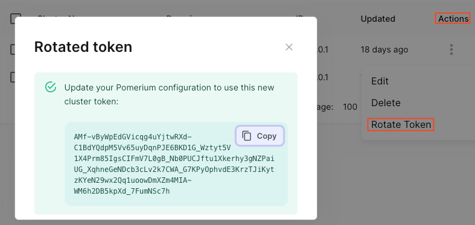
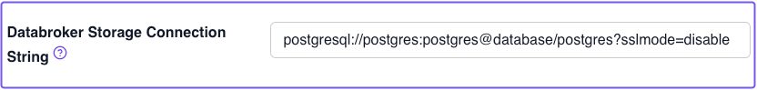
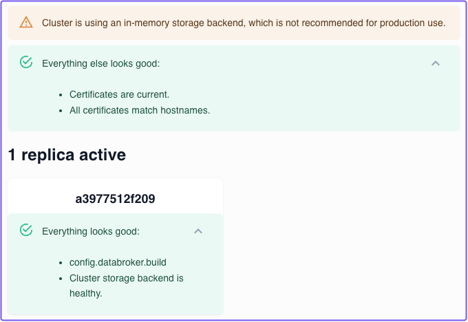

---
# cSpell:ignore interconnectivity

id: clusters
title: Clusters
description: This document describes Clusters in Pomerium Zero.
keywords: [clusters, pomerium zero]
sidebar_label: Clusters
sidebar_position: 1
---

import Tabs from '@theme/Tabs';
import TabItem from '@theme/TabItem';

# Clusters in Pomerium Zero

This document provides an overview of Clusters in Pomerium Zero.

## Overview

When you install Pomerium Zero, you get your own **Cluster**. A cluster consists of one or more replicas of [Pomerium Core](/docs/core), the primary server component that secures your services. Clusters are deployed locally and managed through Pomerium Zero's hosted control plane.

## Why clusters?

A cluster model reduces the complexity of managing Pomerium: All of a cluster's configuration, including settings, routes, policies, and certificates, are managed from a central control plane hosted in the Pomerium Zero cloud. This allows you to manage multiple isolated Pomerium Core deployments, each with its own configuration.

Configuration changes applied in the hosted control plane are communicated over a streaming connection to your local cluster. Each cluster is connected to its own storage backend, which synchronizes state across replicas.

    

Each replica runs Pomerium Core in an all-in-one mode, meaning the services that comprise Core are deployed together and share session state. Similarly, replicas communicate with each other to synchronize state across a cluster. The interconnectivity between replicas enables you to horizontally scale your cluster to support multiple workloads and higher availability.

This model affords the following benefits:

- Simplified configuration
- Enhanced data privacy
- Improved scalability

## Cluster benefits

### Simplified configuration

Cluster configuration is fully managed in Pomerium Zero. Configuration changes applied in Pomerium Zero are fetched and applied locally by your cluster.

This model ensures that:

- Your cluster remains synchronized with Pomerium Zero as changes are applied
- You don't have to manage cluster configuration files or environment variables
- Pomerium Zero persists your cluster's last-known configuration

### Enhanced data privacy

Pomerium can't monitor your organization's traffic or collect private user data. However, Pomerium does need to store configuration details required to maintain the hosted control plane.

Pomerium also stores deployment and configuration details required to control access to your services, such as routes, policies, TLS certificates, and sensitive encrypted data when appropriate.

### Improved scalability

Replicas within a cluster synchronize records over a streaming connection, which keeps the cluster abreast of configuration changes. In this way, you can deploy multiple replicas to meet the needs of your infrastructure and organization.

See [**Persistence and scalability**](#persistence-and-scalability) below for more information.

## Deploy your cluster

### Cluster token

When you deploy a cluster in Pomerium Zero, a **Cluster Token** is generated for you. The cluster token environment variable instructs Pomerium to run in a special "Zero-managed" mode, wherein your cluster connects to the Pomerium Zero cloud.

You can generate a new cluster token at any time. See the [**Rotate cluster token**](#rotate-cluster-token) steps below for more information.

#### Rotate cluster token

A cluster token does not have a set expiration time. However, you may want to rotate the cluster token for security reasons. For example:

- A cluster token was accidentally exposed
- You may lose track of the existing token, and want a new one

:::caution

Rotating the cluster token invalidates the current token, and shuts your cluster down.

:::

To rotate your cluster token:

<Tabs>
<TabItem label="Zero Console" value="zero-console">

1. From the navigation bar, select **Manage Clusters**
1. Under **Actions**, select **Rotate Token**
1. In the confirmation modal, select **Confirm**
1. Copy the token value and store it somewhere safe



</TabItem>
<TabItem label="Zero API" value="zero-api">

Send a `POST` request to the `/token` endpoint:

```curl
curl 'https://console.pomerium.app/api/v0/organizations/{organizationId}/clusters/{clusterId}/token' \
--header 'Authorization: Bearer {ID-TOKEN}'
```

You'll receive a response with a new cluster `refreshToken`:

```json
{
  "refreshToken": "token"
}
```

</TabItem>
</Tabs>

After rotating the cluster token, you must pass it into your configuration and run Pomerium. See the steps below for your deployment environment.

<Tabs>
<TabItem value="linux" label="Linux">

In the shell script below, replace `<cluster_token>` with your new cluster token before running the command:

```bash
curl https://console.pomerium.app/install.bash | env POMERIUM_ZERO_TOKEN=<cluster_token> bash -s install
```

</TabItem>
<TabItem value="docker" label="Docker">

1. In your `docker-compose.yaml` file, replace `<CLUSTER_TOKEN>` with your new token:

```yaml title="docker-compose.yaml" {8} showLineNumbers
services:
  pomerium:
    image: pomerium/pomerium:v0.27.2
    ports:
      - 443:443
    restart: always
    environment:
      POMERIUM_ZERO_TOKEN: <CLUSTER_TOKEN>
      XDG_CACHE_HOME: /var/cache
    volumes:
      - pomerium-cache:/var/cache
    networks:
      main: {}

networks:
  main: {}

volumes:
  pomerium-cache:
```

1. Run `docker compose up -d`

</TabItem>
<TabItem value="kubernetes" label="Kubernetes">

1. Run the following command, replacing `cluster_token` with your new cluster token:

```bash
$ export POMERIUM_ZERO_TOKEN=<cluster_token>
```

1. Then, to write the new cluster token to the Kubernetes secret, run:

```bash
kubectl -n pomerium patch secret pomerium-zero-token -p "{\"stringData\":{\"pomerium_zero_token\":\"${POMERIUM_ZERO_TOKEN}\"}}"
```

</TabItem>
</Tabs>

### Detected and Override IP Address

When you first deploy a cluster, it connects itself to the Pomerium Zero cloud, and Pomerium Zero automatically assigns the cluster a unique [**Starter Domain**](#starter-domain). During this process, Pomerium Zero attempts to detect the cluster’s outbound IP address to connect to it.

Once Pomerium Zero successfully connects to the cluster’s **Detected IP Address**, it sets A (IPv4) or AAAA (IPv6) records for the starter domain. Depending on your environment, the detected IP address may not be reachable by you, the end-user. This could be the case if, for example, you're running a cluster:

- Locally from your laptop behind a NAT-enabled router
- Inside a corporate intranet
- Behind a firewall
- In a Kubernetes server where the ingress load balancer IP address doesn't match the egress IP address

In such cases, you may see one of the following errors:

- `ERR_CONNECTION_REFUSED`
- `DNS_PROBE_FINISHED_NXDOMAIN` (when accessing a route)

The `ERR_CONNECTION_REFUSED` error means that your cluster is running, but Pomerium Zero can't reach it with the detected IP address. The `DNS_PROBE_FINISHED_NXDOMAIN` error means that there is no DNS record available for the domain. This could mean that the domain name changes haven't finished propagating yet, or that the cluster never connected to Pomerium Zero because the IP address couldn't be detected.

As a workaround, we've provided the **Override IP Address** field, which allows you to manually set the IP address so that Pomerium Zero can connect to your cluster.


## Manage cluster configuration

### Starter domain

Pomerium Zero generates and assigns a unique **Starter Domain** to your cluster. A starter domain is a randomly generated domain name that follows this format:

`<CLUSTER-SUBDOMAIN-XXXX>.pomerium.app`

For example: `voracious-ape-1578.pomerium.app`

The starter domain comes with its own DNS records and TLS certificates so you can quickly test Pomerium Zero before adding your own custom domain.

:::info Add Custom Domain

See the [**Custom Domains**](/docs/capabilities/custom-domains) page for more information on how to add custom domains to a cluster.

:::

### Cluster name

The **Cluster Name** is a customizable identifier for your cluster. It defaults to the randomly generated subdomain of your cluster domain, but you can change it at any time. Changing the cluster name does not affect your starter domain.

If you want to change the cluster name, you can update it in your cluster settings:

1. From the navigation bar dropdown, select **Manage Clusters**
1. Under **Actions**, select the **edit** icon
1. In the **Cluster Name** field, enter your preferred cluster name
1. Save your changes and apply the changeset


### Routes, policies, and certificates

Routes and policies defined in a cluster are scoped only to that cluster, and are not available in other clusters.

Pomerium Zero automatically provisions and renews wildcard TLS certificates issued by ZeroSSL for each cluster. Like routes and policies, certificates are scoped to a cluster and are not available in other clusters.

:::info

To learn more about routing, policies, and certificates in Pomerium, see the following docs:

- [**Routing**](/docs/capabilities/routing)
- [**Policy Language**](/docs/capabilities/ppl)
- [**Certificates**](/docs/reference/certificates)

:::

## Persistence and scalability

### Persistence

By default, Pomerium uses an in-memory storage backend to synchronize a cluster's configuration and session state. This is suitable for test environments, but not for production. In the event of a service outage, your cluster can't fetch its configuration from the cloud, so it can't serve traffic.

To avoid service outages, we recommend that you deploy a PostgreSQL database to persist your cluster's configuration state. Since all replicas share the same storage connection, the database will persist cluster state if a replica restarts due to a service outage.

To configure a database connection in Pomerium Zero:

1. Select **Settings**
1. Go to the **General** tab
1. Enter the connection string in the [**Databroker Storage Connection String**](/docs/reference/databroker#databroker-storage-connection-string) field



### Replicas

To deploy a replica, run the Pomerium Zero installation script using the same [cluster token](#cluster-token) you used to deploy your cluster. This will generate another replica, which you can verify on the [**Status**](https://console.pomerium.app/app/reports/status) page.

:::note

Replicas left inactive for over 24 hours will not appear on the Status page.

:::


