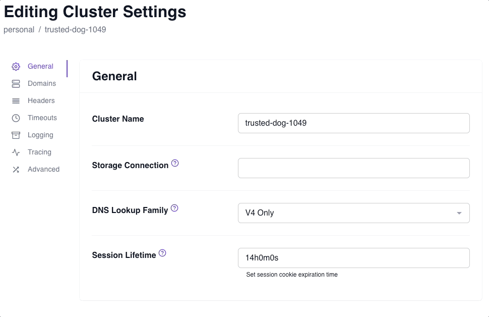
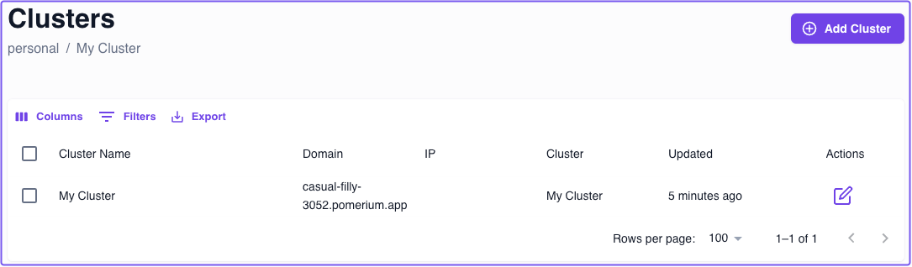
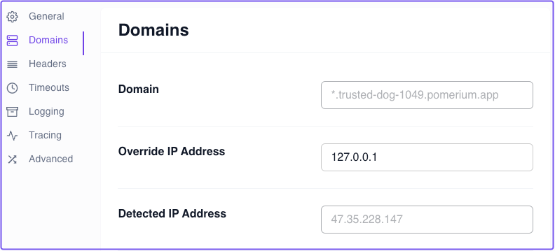
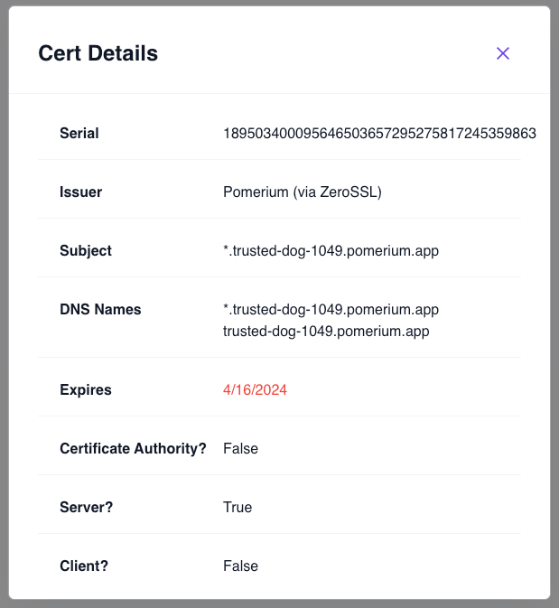

import Tabs from '@theme/Tabs';
import TabItem from '@theme/TabItem';

# Clusters in Pomerium Zero

This document describes Clusters in Pomerium Zero.

TODO: include a video that walks through Clusters

## Clusters overview

A **Cluster** represents a single Pomerium deployment managed by Pomerium Zero, our hosted control plane. Pomerium Zero enables you to configure cluster settings for your personal account or organization.

Each cluster gets its own:

- **Cluster identity**
- **Cluster domain**
- **Cluster settings**
- **Routes and Policies**
- **Wildcard certificates**

### Cluster architecture

TODO: It would be ideal to get an architecture diagram here.

### Cluster identity

When you create an account in Pomerium Zero, a new **Cluster Token** is generated and assigned to your personal account. This cluster token, which is provided to you during onboarding, is required to deploy your cluster instance.

You can generate a new cluster token at any time. See the [**Rotate cluster identity**](#rotate-cluster-identity) steps below for more information.

#### Rotate cluster identity

A cluster token does not have a set expiration time. However, you may want to rotate the cluster identity in the Zero Console for security reasons. For example:

- A malicious insider could use the token to view the cluster's configuration, which may contain sensitive data
- You may lose track of the existing token, and want a new one

:::caution

Rotating the cluster identity will invalidate the existing cluster token.

:::

To rotate your cluster identity in the Zero Console:

1. From the navigation bar dropdown, select **Manage Clusters**
1. Under **Actions**, select the **edit** icon
1. Select the **Domains** tab
1. In the **Cluster Identity** field, select **Rotate Identity**
1. Copy the token value and store it somewhere safe 

After rotating the cluster identity, you must pass it into your configuration and run Pomerium. See the steps below for your deployment environment.

<Tabs>
<TabItem value="linux" label="Linux">

In the shell script below, replace `<cluster_token>` with your new cluster token before running the command:

```bash
curl https://console.pomerium.app/install.bash | env POMERIUM_ZERO_TOKEN=<cluster_token> bash -s install
```

</TabItem>
<TabItem value="docker" label="Docker">

1. In your `docker-compose.yaml` file, replace the value of the `POMERIUM_ZERO_TOKEN` environment variable with the new cluster token value:

   ```yaml title="docker-compose.yaml"
   services:
     pomerium:
       image: pomerium/pomerium:v0.25.1
       ports:
         - 80:80
         - 443:443
       restart: always
       environment:
       // highlight-start
         POMERIUM_ZERO_TOKEN: <CLUSTER_TOKEN>
       // highlight-end
         XDG_CACHE_HOME: /var/cache
         AUTOCERT_DIR: /var/cache/autocert
       volumes:
         - pomerium-cache:/var/cache

   volumes:
     pomerium-cache:
   ```

1. Run `docker compose up -d`

</TabItem>
<TabItem value="kubernetes" label="Kubernetes">

1. Replace the value of `pomerium_zero_token` with your new cluster token:
   ```yaml
   apiVersion: v1
   kind: Secret
   metadata:
     name: pomerium
     namespace: pomerium-zero
   type: Opaque
   stringData:
     pomerium_zero_token: <cluster_token>
   ```
1. Apply the manifest to your Kubernetes cluster
   ```bash
   kubectl apply -f ./secret.yaml
   ```

</TabItem>
</Tabs>

### Cluster domain

Pomerium Zero generates and assigns a unique **Cluster Domain** to your cluster. A cluster domain contains a randomly generated subdomain and the `pomerium.app` domain.

It follows this format: `<CLUSTER-SUBDOMAIN-XXXX>.pomerium.app`

For example: `voracious-ape-1578.pomerium.app`

#### Cluster name

The **Cluster Name** is a customizable identifier for your cluster. It defaults to the randomly generated subdomain of your cluster domain, but you can change it at any time. Changing the cluster name does not affect your cluster domain.

If you want to change the cluster name, you can update it in your cluster settings:

1. From the navigation bar dropdown, select **Manage Clusters**
1. Under **Actions**, select the **edit** icon
1. In the **Cluster Name** field, enter your preferred cluster name
1. Save your changes and apply the changeset



#### Detected and Override IP Address

Whenever you start a cluster, it must fetch its configuration from the Pomerium Zero control plane. During this process, Pomerium attempts to detect the cluster's outbound IP address to connect to it.

In the Zero Console, the cluster's IP address is referred to as the **Detected IP Address**. Depending on your environment, the detected IP address may not be reachable by you, the end-user. This could be the case if, for example, you're running a cluster:

- Locally from your laptop behind a NAT-enabled router
- Inside a corporate intranet
- Behind a firewall
- In a Kubernetes server where the ingress load balancer IP address doesn't match the egress IP address

In such cases, you may see a `DNS_PROBE_FINISHED_NXDOMAIN` error in your browser when you access a route. As a workaround, we've provided the **Override IP Address** field, which allows you to manually set the IP address so that Pomerium Zero can connect to your cluster.



### Cluster settings

Each cluster is assigned its own **Cluster settings** object, meaning the available settings within a cluster apply only to that cluster instance. This means changes applied to one cluster instance won't affect another cluster deployed with the same token.

### Routes and Policies

**Routes** and **Policies** defined in a cluster are scoped only to that cluster, and are not available in other cluster instances.

:::info

To learn more about routing and policies in Pomerium, see the following docs:

- [**Routing**](/docs/capabilities/routing)
- [**Policy Language**](/docs/capabilities/ppl)

:::

### Wildcard certificates

Pomerium Zero issues **Wildcard Certificates** generated by ZeroSSL for each cluster. You can view the **Cert Details** of a certificate in the **Certificates** settings dashboard:



:::info

See [**Certificates**](/docs/concepts/certificates) to learn more about how certificates work in Pomerium.

:::
