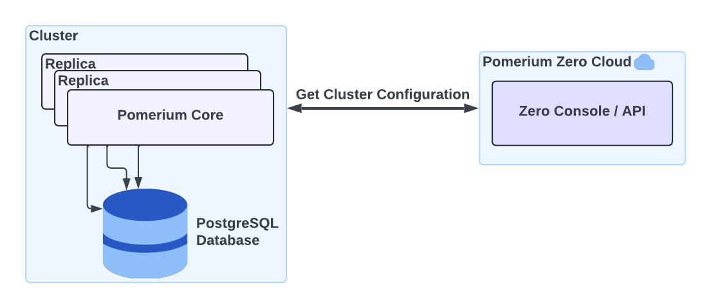
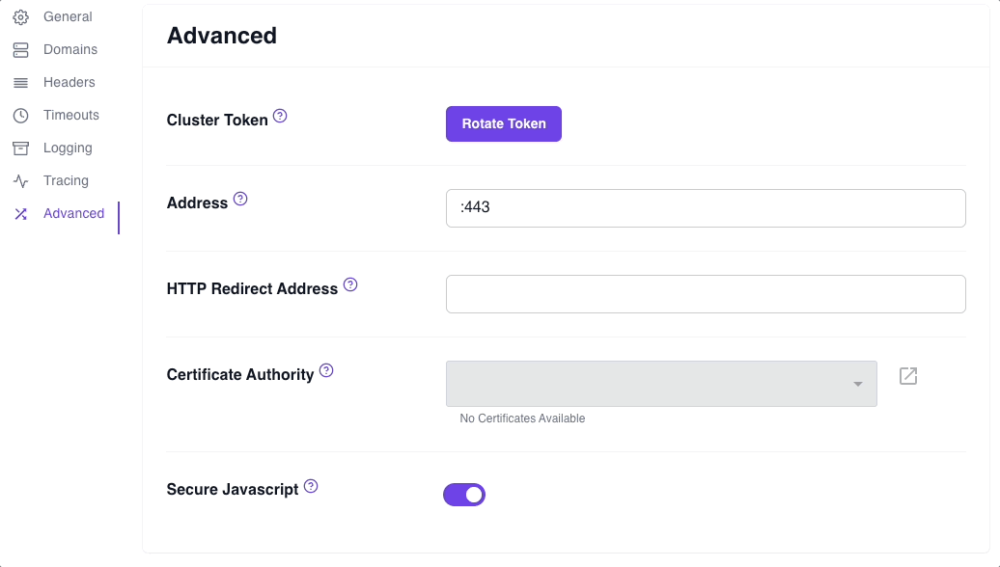

import Tabs from '@theme/Tabs';
import TabItem from '@theme/TabItem';

# Clusters in Pomerium Zero

This document describes Clusters in Pomerium Zero.

## Overview

When you deploy Pomerium Zero, you get your own **Cluster**. A cluster represents a local deployment of [Pomerium Core](/docs/deploy/core), the primary server component that secures your services.

## Why clusters?

### Simpler configuration

Cluster configuration is managed entirely in the **Zero Console**, our hosted control plane. When you apply configuration changes in the Zero Console, your cluster fetches and applies these changes locally.

This model ensures that:

- Your cluster always stays in sync with the Zero Console as changes are applied
- The Zero Console maintains your cluster's last-known configuration, so Pomerium Core can continue running in the event of a service outage
- There is less code and configuration surface area to maintain, which makes Pomerium easier to manage

### Data privacy

Pomerium doesn't monitor your organization's traffic or collect private user data. Pomerium _does_ store deployment and configuration details that are necessary to control access to your services, such as your routes, policies, and TLS certificates.

### Scalability

You can deploy multiple cluster replicas from the same cluster token as long as each cluster shares the same backend storage instance. In this way, you can scale Pomerium horizontally to meet the needs of your infrastructure and organization.



## Connect to the Zero Console

### Cluster token

When you create a cluster in Pomerium Zero, a **Cluster Token** is generated that enables your Pomerium instance to connect to the Pomerium Zero cloud. This cluster token, which is provided to you during onboarding, instructs Pomerium to run in a Zero-managed mode.

You can generate a new cluster token at any time. See the [**Rotate cluster token**](#rotate-cluster-token) steps below for more information.

#### Rotate cluster token

A cluster token does not have a set expiration time. However, you may want to rotate the cluster token in the Zero Console for security reasons. For example:

- A cluster token was accidentally exposed
- You may lose track of the existing token, and want a new one

:::caution

Rotating the cluster token will invalidate the existing cluster token.

:::

To rotate your cluster token in the Zero Console:

1. From the navigation bar dropdown, select **Manage Clusters**
1. Under **Actions**, select the **edit** icon
1. Select the **Advanced** tab
1. In the **Cluster Token** field, select **Rotate Token**
1. In the confirmation modal, select **Confirm**
1. Copy the token value and store it somewhere safe



After rotating the cluster token, you must pass it into your configuration and run Pomerium. See the steps below for your deployment environment.

<Tabs>
<TabItem value="linux" label="Linux">

In the shell script below, replace `<cluster_token>` with your new cluster token before running the command:

```bash
curl https://console.pomerium.app/install.bash | env POMERIUM_ZERO_TOKEN=<cluster_token> bash -s install
```

</TabItem>
<TabItem value="docker" label="Docker">

1. In your `docker-compose.yaml` file, replace the value of the `POMERIUM_ZERO_TOKEN` environment variable with the new cluster token value:

   ```yaml title="docker-compose.yaml"
   services:
     pomerium:
       image: pomerium/pomerium:v0.25.1
       ports:
         - 80:80
         - 443:443
       restart: always
       environment:
       // highlight-start
         POMERIUM_ZERO_TOKEN: <CLUSTER_TOKEN>
       // highlight-end
         XDG_CACHE_HOME: /var/cache
         AUTOCERT_DIR: /var/cache/autocert
       volumes:
         - pomerium-cache:/var/cache

   volumes:
     pomerium-cache:
   ```

1. Run `docker compose up -d`

</TabItem>
<TabItem value="kubernetes" label="Kubernetes">

1. Replace the value of `pomerium_zero_token` with your new cluster token:
   ```yaml
   apiVersion: v1
   kind: Secret
   metadata:
     name: pomerium
     namespace: pomerium-zero
   type: Opaque
   stringData:
     pomerium_zero_token: <cluster_token>
   ```
1. Apply the manifest to your Kubernetes cluster
   ```bash
   kubectl apply -f ./secret.yaml
   ```

</TabItem>
</Tabs>

### Detected and Override IP Address

Whenever you start a cluster, it must fetch its configuration from the Zero Console. During this process, Pomerium attempts to detect the cluster's outbound IP address to connect to it.

In the Zero Console, the cluster's IP address is referred to as the **Detected IP Address**. Depending on your environment, the detected IP address may not be reachable by you, the end-user. This could be the case if, for example, you're running a cluster:

- Locally from your laptop behind a NAT-enabled router
- Inside a corporate intranet
- Behind a firewall
- In a Kubernetes server where the ingress load balancer IP address doesn't match the egress IP address

In such cases, you may see a `DNS_PROBE_FINISHED_NXDOMAIN` error in your browser when you access a route. As a workaround, we've provided the **Override IP Address** field, which allows you to manually set the IP address so that Pomerium Zero can connect to your cluster.


## Manage your cluster

### Starter domain

Pomerium Zero generates and assigns a unique **Starter Domain** to your cluster. A starter domain is a randomly generated domain name that follows this format:

`<CLUSTER-SUBDOMAIN-XXXX>.pomerium.app`

For example: `voracious-ape-1578.pomerium.app`

The starter domain comes with its own DNS records and TLS certificates so you can quickly test Pomerium Zero before adding your own custom domain.

:::info

See the **Custom Domains** page for more information on how to add custom domains to a cluster.

:::

### Cluster name

The **Cluster Name** is a customizable identifier for your cluster. It defaults to the randomly generated subdomain of your cluster domain, but you can change it at any time. Changing the cluster name does not affect your starter domain.

If you want to change the cluster name, you can update it in your cluster settings:

1. From the navigation bar dropdown, select **Manage Clusters**
1. Under **Actions**, select the **edit** icon
1. In the **Cluster Name** field, enter your preferred cluster name
1. Save your changes and apply the changeset


### Routes, policies, and certificates

Routes and policies defined in a cluster are scoped only to that cluster, and are not available in other clusters or replicas.

Pomerium Zero provisions wildcard TLS certificates issued by ZeroSSL for each cluster. Like routes and policies, certificates are scoped to a cluster and are not available in other clusters or replicas.

:::info

To learn more about routing, policies, and certificates in Pomerium, see the following docs:

- [**Routing**](/docs/capabilities/routing)
- [**Policy Language**](/docs/capabilities/ppl)
- [**Certificates**](/docs/concepts/certificates)

:::
