---
# cSpell:ignore xdocker

title: Mutual Authentication
lang: en-US
keywords:
  [pomerium, identity access proxy, mutual authentication, jwt, jwks, mtls]
description: Learn how Pomerium supports mutual authentication and can help you incorporate it into your security framework.
---

# Mutual Authentication

Pomerium enables you to configure mutual authentication on both the application and protocol layer of your network. The sections below detail what mutual authentication is and how Pomerium can help you incorporate mutual authentication into the authentication flow for your internal applications and services.

## What Is Mutual Authentication?

Mutual authentication is when two parties authenticate each other’s identities before communicating over a computer network. In the context of Pomerium, that typically means a client and an upstream server must authenticate each other before the server will communicate with the client over HTTPS. 

While mutual authentication is simple in theory, applying it may be complex depending on your organization’s needs. This guide explains how Pomerium supports mutual authentication and can help you build a zero trust architecture where both clients and services are mutually authenticated.

This guide covers the following mutual authentication methods with Pomerium: 

- JWT verification: Application-based mutual authentication
- mTLS: Protocol-based mutual authentication
- Mutual authentication with a sidecar

## Mutual authentication examples

This section provides examples of mutual authentication methods you can implement with Pomerium. 

Each example diagrams Pomerium as a single service, as it is in [all-in-one mode](/docs/internals/configuration#all-in-one-vs-split-service-mode). This is the version provided by our [binaries] and in our Docker-based [Quickstart].   

### Basic Pomerium installation

- **Security**: Moderate
- **Difficulty**: Easy
- **Encrypted**: Yes (from the end-user to Pomerium. It's up to the service to provide a TLS endpoint for Pomerium to use.)
- **Mutual Authentication**: None

This example shows you what a basic Pomerium installation looks like on a local area network (LAN). The Pomerium instance proxies requests to a single upstream service. Assume that the service contains sensitive data that only authorized users should have access to. 

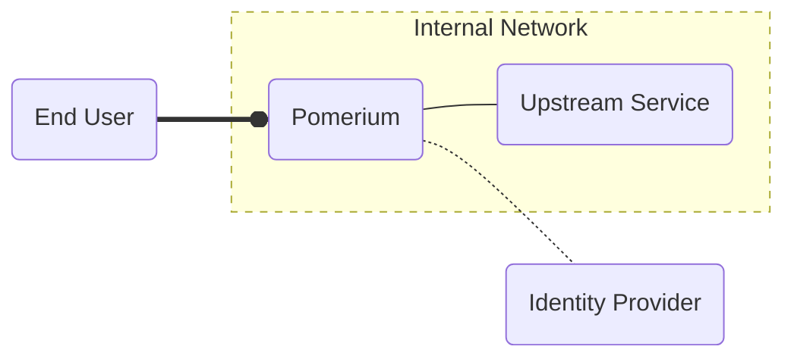

1. The user connects to the route `service.example.com` and Pomerium receives the traffic.
1. Pomerium redirects the user to the identity provider (IdP) to sign in and validate their identity.
1.  After the user signs in to the IdP, Pomerium verifies that the authenticated user is authorized to access the upstream service before communicating with it

In this scenario, Pomerium only grants access to authorized users. However, this model depends on the security of your network perimeter: If a bad actor gains access to your internal network, they can communicate with the upstream service directly:

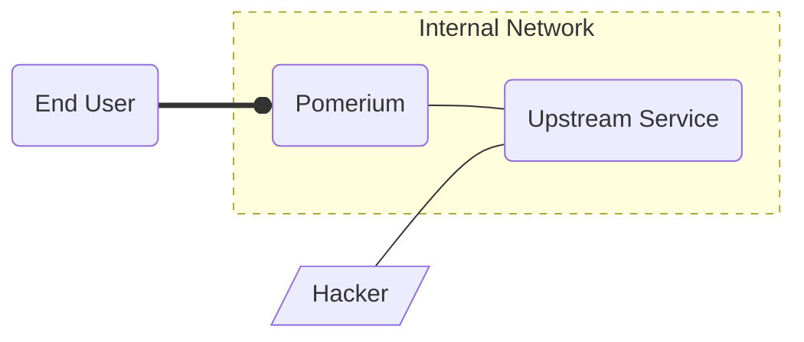

While your network _should_ be secured to only allow traffic at specified ports and directed to specified services, this creates a single point of failure. A hacker only needs to bypass your firewall to get direct access to the upstream service.

### JWT verification: Application-based mutual authentication

- **Security**: Strong
- **Difficulty**: Moderate
- **Encrypted**: Yes (from the end user to Pomerium. It's up to the service to provide a TLS endpoint for Pomerium to use.)
- **Mutual Authentication**: Application Layer

Many modern web applications support [JSON web tokens](https://datatracker.ietf.org/doc/html/rfc7519) (JWTs) as a means to authenticate and authorize users. Pomerium supports JWT authentication with the [`pass_identity_headers`] configuration setting, which forwards JWT claims as identity headers in the request body when a user accesses the upstream service. 

JWT authentication with Pomerium enables the upstream service to verify that:
- Pomerium issued and signed the JWT
- The JWT itself was intended for the upstream service
- The user is authorized to access the upstream service

To verify a JWT, the upstream service must check that the JWT was signed by a trusted authority – in this case, that’s Pomerium. Pomerium requires a user’s private key to sign the JWT and stores the corresponding public key in a **JSON web key set** (JWKS). The upstream service can access Pomerium’s JWKS endpoint to fetch the public key and verify that Pomerium signed the JWT. 

See the diagram below for a step-by-step example:

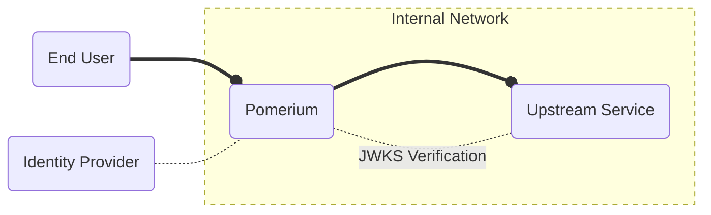

1. The user connects to the route `service.example.com` and Pomerium receives the traffic.
1. Pomerium redirects the user to the IdP to sign in and validate their identity.
1. After the user signs in to the IdP, Pomerium verifies that the authenticated user is authorized to access the upstream service and sends the request, which includes the `X-Pomerium-JWT-Assertion` header containing the JWT signed by Pomerium.
1. The upstream service retrieves the public key from the JWKS endpoint and verifies that Pomerium signed the JWT with the corresponding private key. Because the JWT was signed with a trusted key, the traffic is allowed.

A hacker may be able to forge a basic JWT, but they can't sign it with the key secured in the Pomerium configuration, so the upstream service rejects their connections:

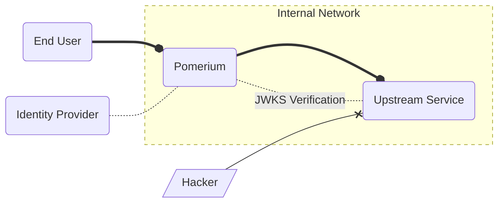

In this way, Pomerium applies a zero trust security model to the application layer of the infrastructure's network model. You can see JWT verification in practice with the [Grafana](/docs/guides/grafana) integration guide. 

:::tip 

For more information on how Pomerium implements JWT verification, see the following docs:
- [JWT Verification](/docs/capabilities/jwt-verification)
- [JavaScript SDK](/docs/guides/js-sdk)
- [Identity Verification](/docs/capabilities/getting-users-identity)

:::

## mTLS: Protocol-based Mutual Authentication

- **Difficulty**: Hard
- **Encrypted**: Yes
- **Mutual Authentication**: Protocol Layer

### North-south mTLS

Transport Layer Security (TLS) is a security protocol that encrypts HTTP traffic between a server and a client using the server’s TLS certificate. The server validates its identity with its TLS certificate and the certificate authority (CA) that signed it. 

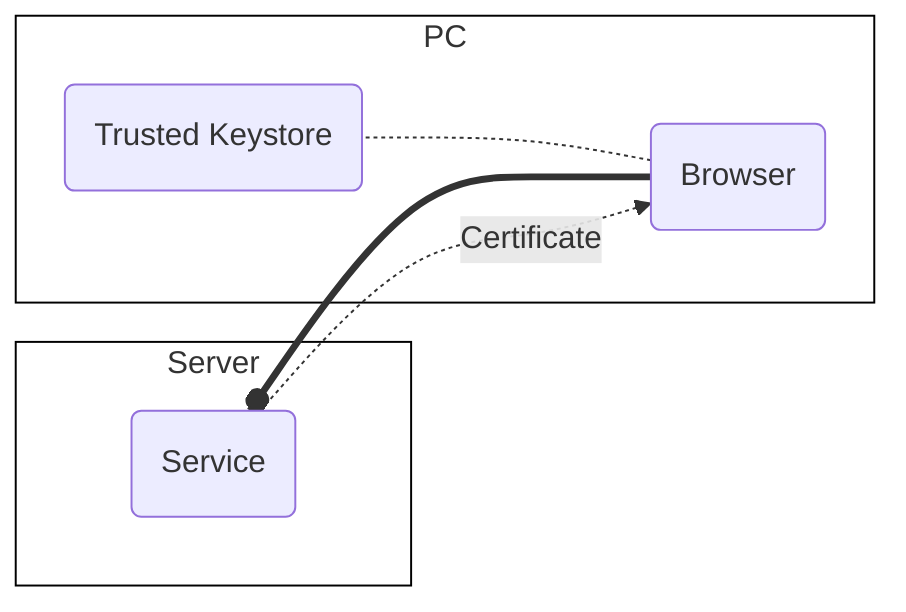

1. The browser initiates a connection to `example.com` over the `HTTP` protocol.
1. The server sends its public certificate to the browser.
1. The browser reads the certificate chain to find the CA, and checks against the computer's keystore to see if the CA is one that it trusts.
1. After confirming the CA is trusted the browser reconnects to the server, this time using the `HTTPS` protocol and encrypting the traffic using the public certificate.

The process above, an example of [north-south traffic](https://en.wikipedia.org/wiki/North-south_traffic) over `HTTPS`, confirms the identity of the _server_, protecting the client. Mutual TLS (**mTLS**) allows the server to confirm the identity of the _client_ using a client certificate.

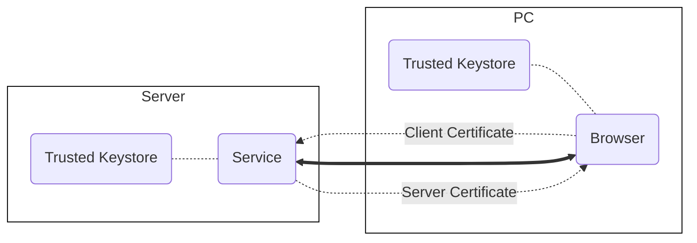

1. After the server certificate is trusted and an `HTTPS` connection is established, the server requests a client certificate.
1. The user is prompted to use one of the certificates previously imported into the browser; the certificate is sent to the server.
1. The server validates the client certificate signing authority against its trusted keystore or authorized client CA. Once authorized, the server resumes normal encrypted communication with the client.

See [client-side mTLS](/docs/capabilities/mtls-clients) and [upstream mTLS](/docs/capabilities/mtls-services) for more information. 

### East-west mTLS

Traffic between services in an internal network is referred to as [east-west traffic](https://en.wikipedia.org/wiki/East-west_traffic). You can also configure mTLS between Pomerium and the end-user and with an upstream service. Configuring mTLS for many end-users is cumbersome, and new technologies like [device identity verification] provide verification of the user and their hardware.

But, you only need to configure mTLS between Pomerium and an upstream service (the east-west traffic) once per service and maintain it by updating certificates.

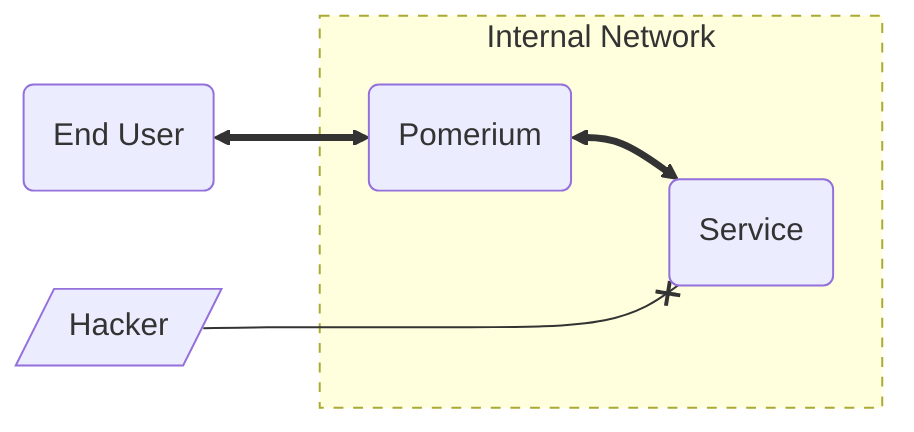

In this way, you've applied a zero trust security model to the protocol layer of your infrastructure's network model.

## Mutual authentication with a sidecar

If your company depends on software that was not built for mutual authentication, you can still secure those services using a **Sidecar**. This is a piece of software designed to provide a new sole method of accessing a service, and provides the authentication for traffic routed to that service.

We describe the technical steps to test such a configuration using Envoy and Docker containers in our [JWT Verification] guide, but let's describe it conceptually here:

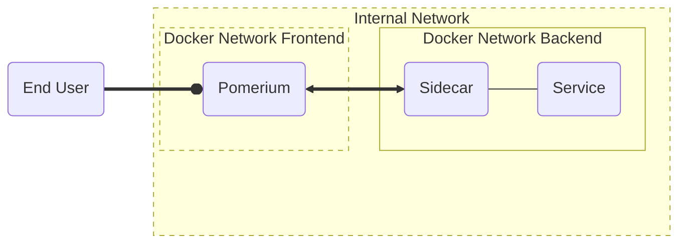

In this example, the service is only network-accessible from the `backend` network. The only other container with access to that network is `sidecar`, which performs the JWT or mTLS authentication before allowing traffic to the service.

Because the `backend` network is inaccessible to any traffic not coming from the sidecar, a bad actor has no way of accessing it:

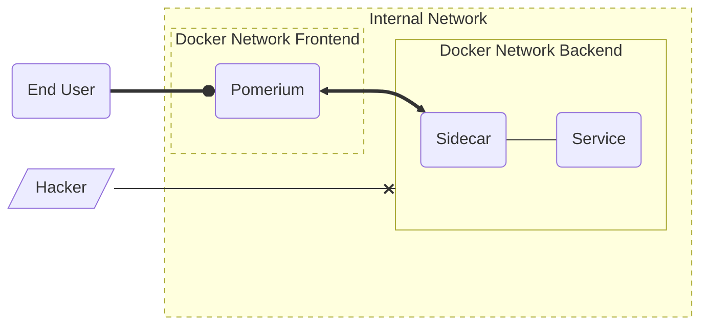

## Putting it all together

Each of the techniques described above provides an additional form of security. Which you choose to apply to your infrastructure depends on your needs, end-users, and what your services or infrastructure can support.

Security practices can often seem like a scale with best practices at one end and ease of use at the other. Pomerium is designed to make it reasonably easy to enable the best security model that fits each service. 

For example, it's usually not reasonable to expect a service with many unique end-users to require client certificates for downstream mTLS, but communication between Pomerium and the upstream application or service mesh can use mTLS without any additional overhead for the client.

This final diagram demonstrates what mTLS might look like in an organization when applied to downstream and upstream applications and services with Pomerium proxying the requests and securing the traffic:

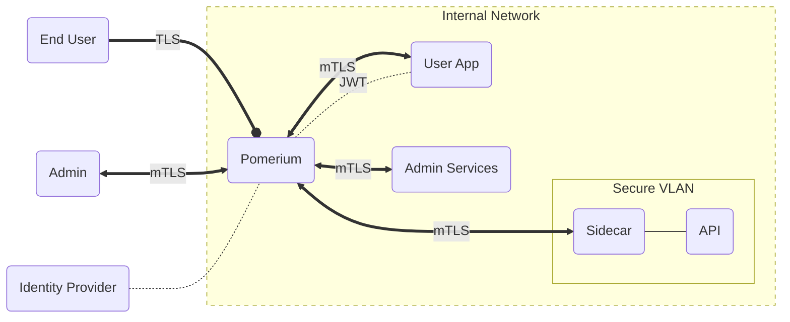
In this example:

**`End User` authenticates with Pomerium to access the `User App`:**
- The end-user's connection to Pomerium is authenticated after signing in to their IdP and encrypted with TLS.
- Pomerium mutually authenticates communication between Pomerium and `User App` with TLS, and the user's JWT is passed from Pomerium to the app to confirm the user identity to the service. The service validates the JWT against Pomerium's signing key.

**`Admin` authenticates with Pomerium to access `Admin Services`:**
- Pomerium authenticates and encrypts the connection the same as the user's, but the route to `Admin Services` also requires a client certificate for mutual authentication at the protocol layer.
- Pomerium mutually authenticates the upstream and downstream connections from `Admin` to `Admin Services`.

**`Sidecar` communicates with the `API` server:** 
- Rather than build authentication into the `API` server, both users and admin apps must access it with the sidecar. 
- The sidecar only accepts mTLS-authenticated connections from the proxy, so both apps connect to the API through Pomerium.

## Legend

The expandable legend below describes how different elements are used in the graphs above.

  
Legend

  

The graphs in this guide use a consistent format to indicate certain aspects of the data flow.

---

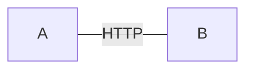

Thin lines represent un-encrypted traffic over HTTP.

---

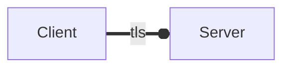

Thick lines represent encrypted traffic using TLS. the circle represents which end of the connection is providing a certificate to establish trust.

---

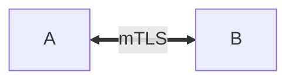

Thick lines with arrows on both ends represent a connection secured by mTLS, where each side provides a TLS certificate and the other can verify its identity.

---

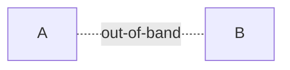

Dashed lines represent out-of-band connections. These occur when, for example, various services talk to each other to validate connections made by the user.

---

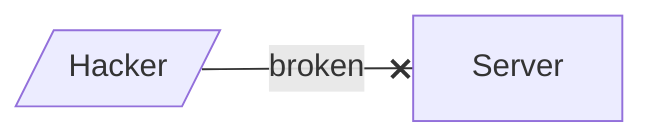

Lines with an **X** represent a failed attempt to gain access to a system.

---

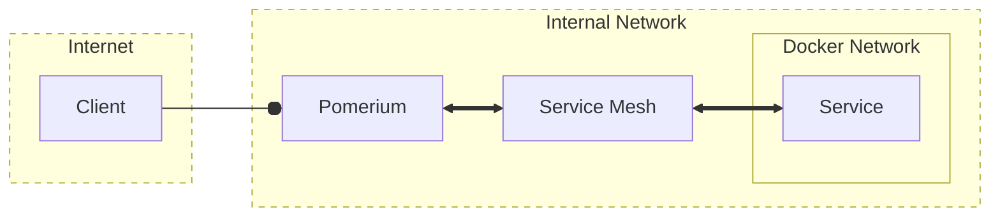

Yellow blocks represent different networks like the internet, an internal network, or a virtual network like Docker provides. Dashed borders represent network perimeters allowing general access. Solid borders represent secured perimeters only permitting the traffic represented in the diagram.

  

[binaries]: /docs/releases/core
[device identity verification]: /docs/concepts/device-identity.md
[grafana]: /docs/guides/grafana
[jwt verification]: /docs/guides/jwt-verification.md
[jwt-rfc]: https://datatracker.ietf.org/doc/html/rfc7519
[`pass_identity_headers`]: /docs/reference/routes/pass-identity-headers
[Quickstart]: /docs/quickstart
[transport layer security]: https://en.wikipedia.org/wiki/Transport_Layer_Security
[zero trust]: https://www.pomerium.com/docs/background.html
