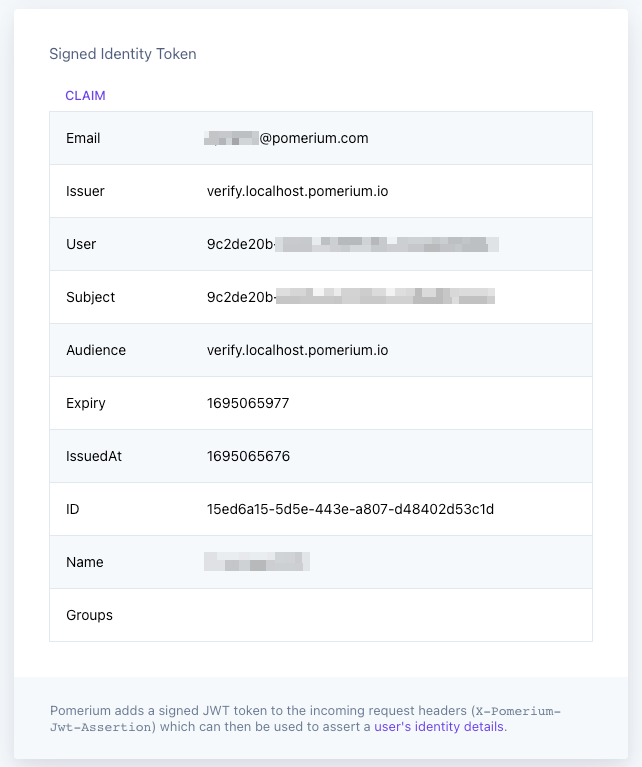

# Build Advanced Policies

In this guide, you’ll learn how to build **Advanced Policies** with Pomerium.

:::note **Before You Start**

Make sure you’ve completed the following tutorials:

- [**Get Started**](/docs/courses/fundamentals/get-started)
- [**Build a Simple Route**](/docs/courses/fundamentals/build-routes)
- [**Build a Simple Policy**](/docs/courses/fundamentals/build-policies)
- [**Identity Verification with JWTs**](/docs/courses/fundamentals/jwt-verification)

Each tutorial builds on the same configuration files. In this tutorial, you’ll add complexity to your authorization policy.

:::

## What’s an advanced policy?

An “advanced policy” usually means the policy includes:

- Chaining policy blocks
- Additional operators, criteria, and matchers

For example, the policy below will only grant access if a user’s email address includes an `example.com` domain:

```yaml
policy:
  allow:
    and:
      - domain:
          is: example.com
```

But, with Pomerium Policy Language (PPL), you can build richer policies that use all sorts of context to control access to upstream applications.

:::info **Establishing house rules**

Think of it like this: you have a dog, and obviously you normally let your dog in the house. But what if your dog was sprayed by a skunk? Suddenly the “allow my dog in the house” policy needs additional caveats. Advanced policies allow you to have better policy logic than what you currently have in your configuration file.

:::

### Evaluate claims

Let’s extend the policy above to include a claim from your JWT. If a user doesn’t have the matching claim in their JWT, Pomerium will deny the user access.

1. **Get the value of the** `Name` **claim**

While running your Docker containers, access the Verify service. Under **Signed Identity Token**, you’ll see a list of claims:



Find the **Name** claim and copy the value.

2. **Update your policy**

Right now, your policy consists of one `allow` block with the `and` logical operator.

Change `and` to `or`.

```yaml
policy:
  allow:
    or:
      - domain:
          is: example.com
```

The `or` operator grants access if either of two criteria are true.

Right now, you only have one criterion: `domain`.

Let’s add a second criterion, `claim`, and add it to the same policy block:

```yaml
policy:
  allow:
    or:
      - domain:
          is: example.com
      - claim/Name: <"Your Name">
```

The `claim` operator requires a sub-path and the value of a JWT claim.

You use `/` to delimit the beginning of the sub-path. In this case, the claim we want is `Name`. The value of `Name` is the name included in your JWT.

Replace `Your Name` with the value in your JWT.

Now, if a user’s email address includes `example.com` _or_ their claim matches the `Name` claim, Pomerium will grant the user access.

### Add a deny rule

Now, let’s add a second `deny` block to this policy. We will write a policy that denies access if a user’s email starts with `admin`.

```yaml
policy:
  allow:
    or:
      - domain:
          is: example.com
      - claim/Name: <"Your Name">
  deny:
    and:
      - email:
          starts_with: admin
```

As is, this policy will deny access if a user’s email starts with `admin` (of course, you can change this value to whatever you want).

Swap out the value with the beginning of your email address to test it out. This policy will still deny you access, even if your email’s domain and your JWT claim satisfy the `allow` block’s criteria.

## Summary

In this tutorial, you built more advanced policies that require multiple rules, logical operators, matchers, and criteria. Then, you attached these policies to your routes.

Now, your Pomerium instance can evaluate claims and grant or deny access based on additional policies you’ve built! We’re teaching Pomerium to do exactly what you want it to do: Verify authorization whenever someone accesses a route.

Organizations with multiple applications and services will want to know how they can scale Pomerium for their needs.

In the next tutorial, you’ll learn how to build more complex routes!

### Configuration file state

By now, your configuration files should look similar to this:

```yaml
authenticate_service_url: https://authenticate.pomerium.app

signing_key: LS0tLS1CRUdJTiBFQyBQUklWQVRFIEtFWS0tLS0tCk1IY0NBUUVFSUVSNThaeDA2SHJXTW9PUTRaNjlMaDdMZUtFZW5TSmJZcHJvZ3V3TEl0blNvQW9HQ0NxR1NNNDkKQXdFSG9VUURRZ0FFK1FtamZKQ2ovdzkrOUhrRDVlbTlIZFhRM3ViUEhIdWNOMTlNOXJxR05PeEpTRmR3VHgvaAphdVkvcVFSWWR0YVpnVEpEUWZSYVQ2Q1pPYndSYTl2TXNnPT0KLS0tLS1FTkQgRUMgUFJJVkFURSBLRVktLS0tLQo=

routes:
  - from: https://verify.localhost.pomerium.io
    to: http://verify:8000
    pass_identity_headers: true
    policy:
      allow:
        or:
          - domain:
              is: example.com
          - claim/Name: <"Your Name">
      deny:
        and:
          - email:
              starts_with: admin
  - from: https://grafana.localhost.pomerium.io
    to: http://grafana:3000
    pass_identity_headers: true
    policy:
      allow:
        and:
          - domain:
              is: example.com
```

Docker Compose:

```yaml
services:
  pomerium:
    image: cr.pomerium.com/pomerium/pomerium:latest
    volumes:
      - ./config.yaml:/pomerium/config.yaml:ro
    ports:
      - 443:443
  verify:
    image: cr.pomerium.com/pomerium/verify:latest
    expose:
      - 8000
    environment:
      - JWKS_ENDPOINT=https://pomerium/.well-known/pomerium/jwks.json
  grafana:
    image: grafana/grafana:latest
    ports:
      - 3000:3000
```
