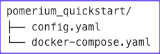
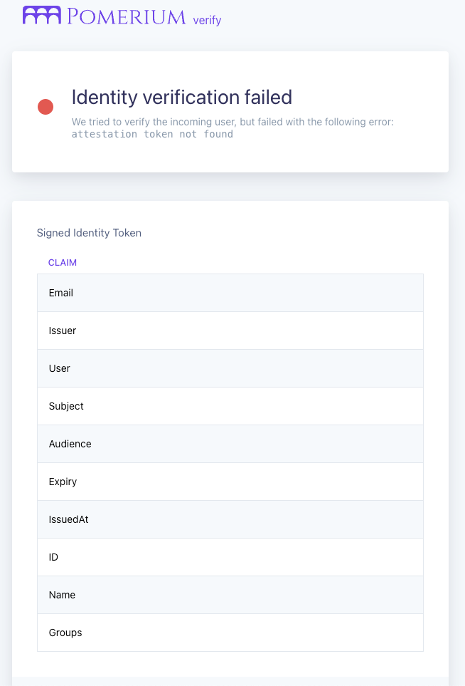

---
# cSpell:ignore preconfigured
id: get-started
title: Get Started With Pomerium
description: In lesson 1 of Pomerium Fundamentals, you'll configure and run a Pomerium instance with Docker.
keywords: [pomerium, docker, docker compose, configuration file, reverse proxy]
sidebar_label: 1. Get Started
sidebar_position: 1
---

# Get Started With Pomerium

Welcome to **Pomerium Fundamentals - Get Started**! This is your starting point to learning the essentials of how Pomerium works so you can use it effectively to secure your own web apps and services.

To set expectations, we estimate the full Fundamentals course will take more or less an hour of your time, resulting in a fully deployed, production-level Pomerium instance.

This tutorial teaches you how to set up Pomerium using [Docker](https://docs.docker.com/install/) and [Docker Compose](https://docs.docker.com/compose/install/).

In a later tutorial, we will cover how to self-host and run Pomerium in a virtual machine environment. For now, we will work in containerized environments so we can easily configure Pomerium and run it alongside other services, which you can access behind Pomerium.

## Step 1: Create a new project

For the purposes of this guide, we’ll call this project `pomerium_quickstart` (but name it whatever you want).

Your project will contain all the files and configurations you need to run **Pomerium Core**.

The directory structure will look like this:



- The `config.yaml` file configures Pomerium itself
- The `docker-compose.yaml` file configures and runs your Docker containers

We’ll configure these files together in the next section.

:::info What is **Pomerium Core**?

[**Pomerium Core**](/docs/core) is our open-source, identity-aware reverse gateway. Pomerium consists of **4 service** identities (that can be deployed together or independently), including the:

- **Proxy** service — the red-linen rope
- **Authentication** service — the bouncer checking the user's ID to see if they are who they say they are
- **Authorization** service — the bouncer checking if the user is authorized to do what they want to do
- **Databroker** service — the waiter remembering the user’s current session to offer the best user experience

When you run Core, these services work together to secure your apps and connect your users to them.

:::

## Step 2: Set up Pomerium

Create a YAML file called `config.yaml`.

Add the following configuration settings to `config.yaml`:

```yaml title="config.yaml"
authenticate_service_url: https://authenticate.pomerium.app

routes:
  - from: https://verify.localhost.pomerium.io
    to: http://verify:8000
    policy:
      - allow:
          or:
            - email:
                is: user@example.com
```

Update `user@example.com` to use your desired email address – otherwise, the example won’t work! (Unless, of course, your actual email address is `user@example.com`, in which case, carry on.)

<details>
  <summary><b>Understanding the configuration file</b></summary>
  <div>
  <b>The Authenticate Service URL</b>

The `authenticate_service_url` setting provides an externally accessible URL that Pomerium’s **Authentication Service** uses to manage client authentication. It works like this:

  <ol>
    <li>You request to access an app protected behind Pomerium</li>
    <li>The Authentication Service receives the request, and uses the `authenticate_service_url` to redirect you to the <b>Identity Provider</b> to sign in</li>
  </ol>

(If it helps to understand why, it’s because our waiter, Pomerium, needs to cross-reference with a list of users to go, “Ah, I see you’re on our list. Right this way, please.”)

  </div>
  <div>
  <b>What Identity Provider?</b>

Pomerium relies on an Identity Provider (IdP) to authenticate users and authorize requests (it’s the list we just mentioned, except the IdP gives you a token badge so Pomerium recognizes you).

You probably noticed this configuration file doesn’t include an Identity Provider – that’s because you’re using Pomerium’s <b>Hosted Authentication Service</b>, which provides a preconfigured identity provider for you.

This way, you can just plug and play. (Don’t worry; we’ll show you how to configure your own identity provider later!)

  </div>
  <div>
  <b>What about the routes?</b>

We’ll learn more about routes in the next section, but for now, just know that the `from` route is the externally accessible URL that Pomerium will redirect you to after authenticating with your identity provider.

  </div>
</details>

## Step 3: Set up Docker Compose

Create a YAML file called `docker-compose.yaml`.

Add the following configuration settings to `docker-compose.yaml`:

```yaml title="docker-compose.yaml"
services:
  pomerium:
    image: cr.pomerium.com/pomerium/pomerium:latest
    volumes:
      - ./config.yaml:/pomerium/config.yaml:ro
    ports:
      - 443:443
  verify:
    image: cr.pomerium.com/pomerium/verify:latest
    expose:
      - 8000
```

This file includes the Docker images and instructions to run Pomerium and the Verify service in Docker containers.

## Step 4: Run Pomerium

Go into your project’s root directory and run the following command:

```sh
docker compose up
```

Now, go to the [Verify service](https://verify.localhost.pomerium.io/) in your browser.



You may have some questions, like:

**Why is the URL insecure?**

If you don’t provide certificates to verify the upstream service, Pomerium will generate self-signed certificates for you. Because the certificates are self-signed, your browser will throw a self-signed certificate warning.

To bypass this warning:

1. Click anywhere in the browser window
2. Enter `thisisunsafe` (no spaces) and hit enter
3. Repeat step 2 if you’re prompted with the same error

Later, we will cover how to self-host Pomerium using Autocert, which will automate the process of managing certificates for your upstream services.

**Identity verification failed, why?**

The simple answer is: You haven't configured Pomerium to handle JWTs yet. The Verify service expects a _cryptographically signed_ JWT, which contains identifying information about the user in the form of JWT claims. Without the JWT itself (and a way to verify the signature), the Verify service can't identity the user.

In a later tutorial, you will configure Pomerium and the Verify service to successfully verify a user’s identity.

## Summary

Great job! If you got this far, then you have everything you need to run Pomerium and continue on with our guided tutorials.

In the next section, we will dive deeper into [**Routes**](/docs/courses/fundamentals/build-routes) with Pomerium.

### Configuration file state:

By now, your configuration files should look similar to this:

```yaml
authenticate_service_url: https://authenticate.pomerium.app

routes:
  - from: https://verify.localhost.pomerium.io
    to: http://verify:8000
    policy:
      - allow:
          or:
            - email:
                is: <your-email>@example.com
```

Docker Compose:

```yaml
services:
  pomerium:
    image: cr.pomerium.com/pomerium/pomerium:latest
    volumes:
      - ./config.yaml:/pomerium/config.yaml:ro
    ports:
      - 443:443
  verify:
    image: cr.pomerium.com/pomerium/verify:latest
    expose:
      - 8000
```
