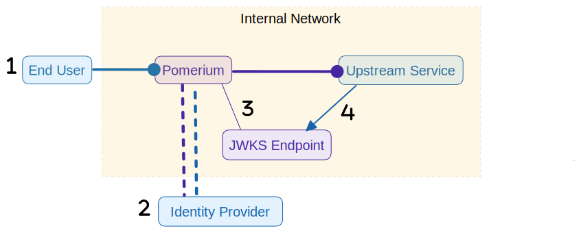
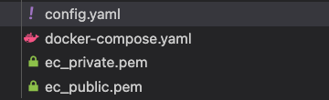
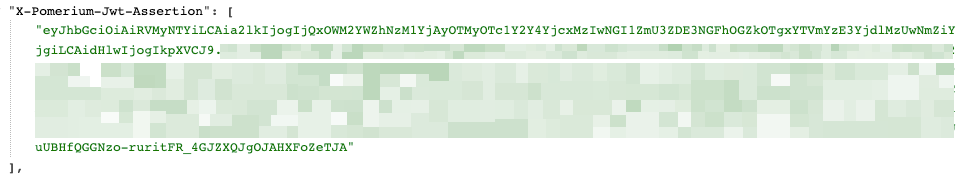
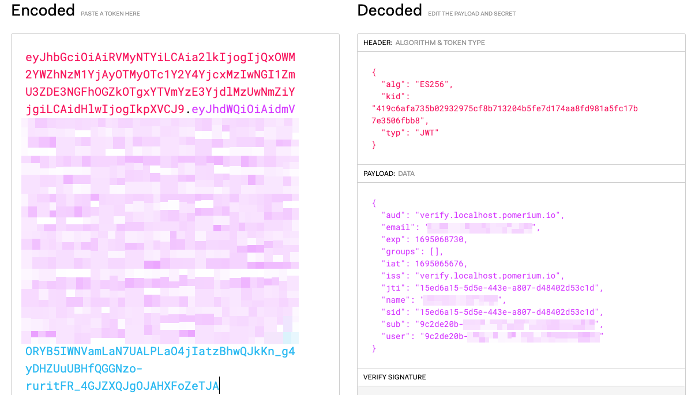
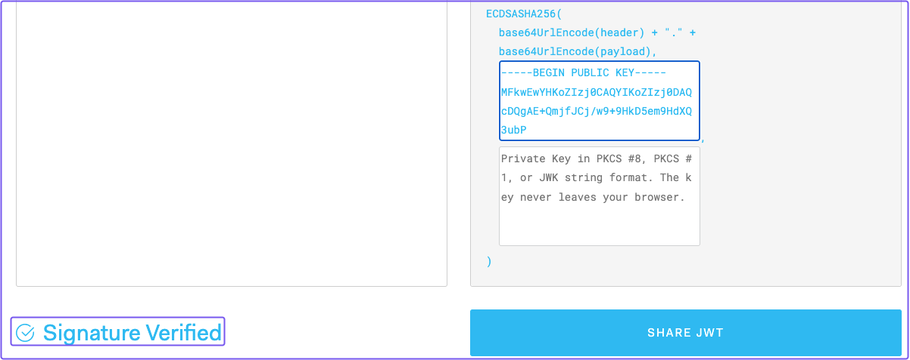

---
# cSpell:ignore ecparam, pubout, mypomerium
id: jwt-verification
title: Identity Verification with JWTs
description: In lesson 4, you’ll learn how to set up Pomerium to verify a user’s identity with JSON Web Tokens (JWTs).
keywords:
  [
    reverse proxy,
    identity verification,
    jwt,
    json web token,
    pomerium,
    assertion header,
    signed header,
    signing key,
  ]
sidebar_label: 4. JWT Verification
sidebar_position: 4
---

# Identity Verification With JWTs

In this tutorial, you’ll learn how to set up Pomerium to verify a user’s identity with JSON Web Tokens (JWTs).

But first, a bit of background on JWTs and their application in Pomerium…

:::note **Before You Start**

Make sure you’ve completed the following tutorials:

- [**Get Started**](/docs/courses/fundamentals/get-started)
- [**Build a Simple Route**](/docs/courses/fundamentals/build-routes)
- [**Build a Simple Policy**](/docs/courses/fundamentals/build-policies)

If you completed these tutorials, you should have:

- 2 routes pointing to Grafana and the Verify service
- 2 policies (one policy per route) to control access to these services

Each tutorial builds on the same configuration files. In this tutorial, you’ll configure Pomerium to send the Pomerium JWT to an upstream service to verify a user’s identity.

:::

## Background

JWT verification (and, by extension, identity verification) **does not** replace Pomerium’s initial authentication flow with an identity provider. Identity verification is just an additional security layer that helps the upstream application verify that Pomerium handled the request and the user’s JWT.

:::info **Simplifying JWTs and Pomerium**

If it helps, think of the upstream app as the airplane at an airport and TLS as the security checkpoint (that long tunnel you walk through). Anyone boarding the airplane must first pass through the security checkpoint. When you get through security, you get a stamp on your boarding pass that authorizes you to board the airplane.

But, what if someone found a way to skip the security checkpoint and went straight to the airplane?

The airplane, like the upstream app, has no way of knowing that a passenger didn’t come through the secure connection — the TLS tunnel — but the airline attendants can check that the passenger has a stamp on their boarding pass.

A user’s signed JWT acts as the stamp: In the event of other network configuration mistakes, the app can still grant or deny users if they don’t have a signed JWT to verify their identity.

:::

## What is a JWT?

If you’re unfamiliar with JWTs, here’s a quick definition sourced from [JWT.io](https://jwt.io/):

“JSON Web Tokens are an open, industry standard [RFC 7519](https://tools.ietf.org/html/rfc7519) method for representing claims securely between two parties.”

Just remember: JWTs are the stamps on an entry ticket which give it more legitimacy, and also can contain more information about the user.

:::info

Check out [**this article**](https://jwt.io/introduction) to learn more about the anatomy of a JWT, how they are used in modern applications for SSO and information exchange, and how signatures work with a public/private key pair.

:::

## How do JWTs work with Pomerium?

You can configure Pomerium to send the user’s JWT as a signed HTTP header in the request to access a service behind Pomerium.

Here’s how the JWT authentication flow looks at a high level:

1. End User connects to Pomerium

2. Pomerium redirects the client to the IdP, the client signs in, and Pomerium gets the user’s ID, Access, and Refresh tokens

3. Two important actions happen here:

   1. Pomerium mints a new **Pomerium JWT**, which includes the original ID token claims and additional Pomerium-based claims (we never leak the original ID token)
   2. Pomerium checks if the user is authorized to access the upstream service, inserts the Pomerium JWT in the JWT Assertion Header, cryptographically signs the header, and then sends the request to the upstream service

4. The upstream service receives the request, fetches the public key from the JWKS endpoint, verifies and validates the signature, and grants the user access



If that’s a lot to take in, don’t worry, Pomerium handles a lot of it for you! This is just for those that are interested in what’s happening behind the scenes.

## Configure identity verification with JWTs

There are two settings that you need to configure to implement identity verification with signed headers:

- [Pass Identity Headers](/docs/reference/routes/pass-identity-headers-per-route)
- [Signing Key](/docs/reference/signing-key)

:::info **Global and Route Settings**

Pomerium provides two types of settings: **Global** and **Route** settings.

Global settings are settings you add _outside_ of your route and policy blocks.

Route settings must be attached to the route itself.

Configuring identity verification is a great example of how you should organize these settings in your configuration files:

- **Signing Key** is a global-level setting. Any time a user sends a request to an upstream service, Pomerium will look for a signing key.
- **Pass Identity Headers** is a route-level setting. It tells Pomerium to send the signed header to a certain route.

In this way, global and route level settings allow you to fine tune your configuration to suit a service’s use case.

:::

### Add pass identity headers

In your Pomerium configuration file, add Pass Identity Headers to your routes:

```yaml title="config.yaml"
routes:
  - from: https://verify.localhost.pomerium.io
    to: http://verify:8000
    pass_identity_headers: true
    policy:
      - allow:
          and:
            - domain:
                is: example.com
  - from: https://grafana.localhost.pomerium.io
    to: http://grafana:3000
    pass_identity_headers: true
    policy:
      - allow:
          and:
            - domain:
                is: example.com
```

You **must** add `pass_identity_headers` to a route for identity verification to work. Otherwise, Pomerium won’t forward the signed JWT Assertion Header in the request.

### Add a signing key

<details>

<summary><b>Public/Private Key Pairs</b></summary>

You might be asking, “What exactly is a signing key?” Put simply, a signing key is the private key counterpart in a public/private key pair. These keys correspond to one another cryptographically. See SmallStep’s [PKI blog post](https://smallstep.com/blog/everything-pki/) for more information on the technologies that power public/private key pairs.

Here’s a few things to keep in mind:

- A private key is assigned to a user, and should not be shared with anyone else
- A user’s private key can function as a signing key to cryptographically sign their JWT
- A public key can be given to anyone (hence the name)
- The public key can verify that a JWT was signed by its corresponding private key without revealing the value of the signing key (this ensures the private key is protected)

</details>

This section covers how you can add a signing key to your configuration file. But, you must generate one first.

To generate a signing key:

1. In your project’s terminal, run the following command:

```bash
openssl ecparam -genkey -name prime256v1 -noout -out ec_private.pem
openssl ec -in ec_private.pem -pubout -out ec_public.pem
```

This command generates a public/private key pair in your project:



2. Next, convert the signing key to a Base64-encoded format:

```bash

cat ec_private.pem | base64

```

Your terminal will output a value like this:

```bash

LS0tLS1CRUdJTiBFQyBQUklWQVRFIEtFWS0tLS0tCk1IY0NBUUVFSUVSNThaeDA2SHJXTW9PUTRaNjlMaDdMZUtFZW5TSmJZcHJvZ3V3TEl0blNvQW9HQ0NxR1NNNDkKQXdFSG9VUURRZ0FFK1FtamZKQ2ovdzkrOUhrRDVlbTlIZFhRM3ViUEhIdWNOMTlNOXJxR05PeEpTRmR3VHgvaAphdVkvcVFSWWR0YVpnVEpEUWZSYVQ2Q1pPYndSYTl2TXNnPT0KLS0tLS1FTkQgRUMgUFJJVkFURSBLRVktLS0tLQo=

```

3. In your configuration file, add the `signing_key:` setting and paste the value of your base64-encoded private key:

```yaml title="config.yaml"
authenticate_service_url: https://authenticate.pomerium.app
# Add your signing key as a global setting:
signing_key: LS0tLS1CRUdJTiBFQyBQUklWQVRFIEtFWS0tLS0tCk1IY0NBUUVFSUVSNThaeDA2SHJXTW9PUTRaNjlMaDdMZUtFZW5TSmJZcHJvZ3V3TEl0blNvQW9HQ0NxR1NNNDkKQXdFSG9VUURRZ0FFK1FtamZKQ2ovdzkrOUhrRDVlbTlIZFhRM3ViUEhIdWNOMTlNOXJxR05PeEpTRmR3VHgvaAphdVkvcVFSWWR0YVpnVEpEUWZSYVQ2Q1pPYndSYTl2TXNnPT0KLS0tLS1FTkQgRUMgUFJJVkFURSBLRVktLS0tLQo=
```

### Update Docker Compose

Next, you need to update your service’s in Docker Compose so they can fetch the public key. This step relies on what’s called a JSON Web Key Set (JWKS) endpoint.

The JWKS endpoint is an internal Pomerium URL that provides the public key the upstream service needs to verify a private key.

In your Docker Compose file, add the following environment variable to your Verify service:

```yaml title="docker-compose"
verify:
  image: cr.pomerium.com/pomerium/verify:latest
  expose:
    - 8000
  environment:
    - JWKS_ENDPOINT=https://pomerium/.well-known/pomerium/jwks.json
```

:::note **Understanding the JWKS endpoint**

Because we're powering our services with Docker, the value of the **hostname** (`pomerium`) in the `JWKS_ENDPOINT` URL above must match the name of your Pomerium container.

For example, if you called the Pomerium service `mypomerium`, the hostname would be `mypomerium` and the URL would look like this: `https://mypomerium/.well-known/pomerium/jwks.json`

Now, when you access the Verify service, Pomerium will provide the corresponding public key at the JWKS endpoint.

:::

### Run Docker Compose

Run Docker Compose and access the [Verify](https://verify.localhost.pomerium.io/) service.

Under **Signed Identity Token**, you should see a list claims:


Pomerium sources these claims from the ID token it gets from your identity provider and uses them to generate a new “Pomerium” JWT. This ensures the original ID token is never leaked.

You’re doing great! Let’s summarize what you’ve configured Pomerium to do so far:

- You accessed the upstream Verify service behind Pomerium
- Pomerium redirected to the identity provider and prompted you to sign in
- After signing in, Pomerium mints a new JWT based on the original ID token
- Because you’ve added a **Signing Key** and **Pass Identity Headers**, Pomerium signs the JWT and forwards it in a JWT Assertion Header to the Verify service

But, how does the upstream service verify the JWT?

Let’s walk through the steps of manually verifying a JWT below.

## Manually verify the JWT

### Get the X-Pomerium-Jwt-Assertion header

With your containers still running, enter `https://verify.localhost.pomerium.io/headers` in the address bar.

This web page shows you the contents of the HTTP request to the Verify service. Search for a header labeled `X-Pomerium-Jwt-Assertion`:



The value of the header is the JWT.

Copy and paste the JWT. Then, head to JWT.io to decode it:



You can see the Payload with the claims listed on the Verify page.

From this JWT, we can see that Pomerium issued the JWT based on the `iss` and `aud` claims.

### Verify the signature

To verify the signature, copy the value of `ec_public.pem`.

For example:

```bash
-----BEGIN PUBLIC KEY-----

MFkwEwYHKoZIzj0CAQYIKoZIzj0DAQcDQgAE+QmjfJCj/w9+9HkD5em9HdXQ3ubP

HHucN19M9rqGNOxJSFdwTx/hauY/qQRYdtaZgTJDQfRaT6CZObwRa9vMsg==

-----END PUBLIC KEY-----
```

In JWT.io under **VERIFY SIGNATURE**, enter the public key. The “Invalid Signature” message should change to “Signature Verified” if done correctly:



Great! With these steps, you can manually verify the JWT’s signature and that the request was handled by Pomerium.

:::note

Pomerium offers [**front- and back-end SDKs**](/docs/guides/verify-jwt) with built-in JWT libraries.

You can use these libraries in your own applications to work easily with Pomerium’s JWT flow, or implement your own solution.

:::

## Summary

In this tutorial You learned how to:

- Configure Pomerium to generate, sign, and forward JWTs with the `X-Pomerium-Jwt-Assertion-Header`
- Manually verify the JWT

Now, you can verify the identities of your users using Pomerium. And, if your upstream service relies on JWTs for authentication or some other use case, you can easily set that flow up with Pomerium.

### Configuration file state

By now, your configuration files should look similar to this:

```yaml
authenticate_service_url: https://authenticate.pomerium.app

signing_key: LS0tLS1CRUdJTiBFQyBQUklWQVRFIEtFWS0tLS0tCk1IY0NBUUVFSUVSNThaeDA2SHJXTW9PUTRaNjlMaDdMZUtFZW5TSmJZcHJvZ3V3TEl0blNvQW9HQ0NxR1NNNDkKQXdFSG9VUURRZ0FFK1FtamZKQ2ovdzkrOUhrRDVlbTlIZFhRM3ViUEhIdWNOMTlNOXJxR05PeEpTRmR3VHgvaAphdVkvcVFSWWR0YVpnVEpEUWZSYVQ2Q1pPYndSYTl2TXNnPT0KLS0tLS1FTkQgRUMgUFJJVkFURSBLRVktLS0tLQo=

routes:
  - from: https://verify.localhost.pomerium.io
    to: http://verify:8000
    pass_identity_headers: true
    policy:
      - allow:
          and:
            - domain:
                is: example.com
  - from: https://grafana.localhost.pomerium.io
    to: http://grafana:3000
    pass_identity_headers: true
    policy:
      - allow:
          and:
            - domain:
                is: example.com
```

Docker Compose

```yaml
services:
  pomerium:
    image: cr.pomerium.com/pomerium/pomerium:latest
    volumes:
      - ./config.yaml:/pomerium/config.yaml:ro
    ports:
      - 443:443
  verify:
    image: cr.pomerium.com/pomerium/verify:latest
    expose:
      - 8000
    environment:
      - JWKS_ENDPOINT=https://pomerium/.well-known/pomerium/jwks.json
  grafana:
    image: grafana/grafana:latest
    ports:
      - 3000:3000
```
