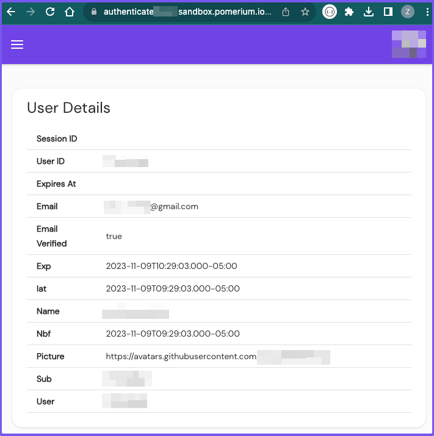

# Self-Hosted Authenticate Service

So far, you’ve been using the Hosted Authenticate service, which provides an authenticate service URL (`authenticate.pomerium.app`) and a hosted identity provider (Cognito) to authenticate users.

We’ve also used the `*.localhost.pomerium.io` URL to host our services locally. (This wildcard domain points to `127.0.0.1`.)

In this tutorial, you’ll replace the Hosted Authenticate service with your own self-hosted authenticate service.

To do this, you must:

- Replace `authenticate_service_url` with a self-hosted URL
- Configure an identity provider (the identity provider will require the authenticate service URL to redirect the user after successful sign-in)
- Update your routes to point to the self-hosted URL

:::note **Before You Start**

Make sure you’ve completed the following tutorials:

- [**Get Started**](/docs/courses/fundamentals/get-started)
- [**Build a Simple Route**](/docs/courses/fundamentals/build-routes)
- [**Build a Simple Policy**](/docs/courses/fundamentals/build-policies)
- [**Identity Verification with JWTs**](/docs/courses/fundamentals/jwt-verification)
- [**Build Advanced Policies**](/docs/courses/fundamentals/advanced-policies)
- [**Build Advanced Routes**](/docs/courses/fundamentals/advanced-routes)
- [**Build TCP Routes**](/docs/courses/fundamentals/tcp-routes)

Each tutorial builds on the same configuration files. In this tutorial, you’ll replace the Hosted Authenticate service with your own self-hosted authenticate service.

:::

## Self-host Pomerium

This next step requires you to set up a VM instance where you will configure and run Pomerium. If you already have a VM instance, or you already know how to set one up, then you can skip this step.

### Create a Virtual Machine Instance

To self-host the authenticate service, you need a domain that you own. You also need to point your domain’s DNS servers to your VM’s public IP address.

One straightforward way to do this is to use Google’s Compute Engine API to spin up a virtual machine (VM):

1. Use Google’s Cloud Domains service to register a domain (the cost varies depending on the domain)

1. Create a VM instance with Google’s Compute Engine service (for this tutorial, choose Debian Bullseye)

1. Enable HTTP and HTTPS traffic as part of your Firewall rules

1. Use Google’s Cloud DNS service to set up a DNS zone with a DNS name

1. In the DNS zone, create a wildcard DNS type A record (for example, `*.example.sandbox.com`)

1. In the **IPv4 Address 1** field, enter your VM’s **External IPv4 Address** (a publicly routable IP)

If set up correctly, you can SSH into the VM and configure Pomerium.

After you’re in the VM, it’s time to set up Pomerium.

:::note **Your VM Setup**

This tutorial will be using a Compute Engine VM instance running Debian 11 (”bullseye”) to self-host Pomerium.

You don’t have to use this environment if you don’t want to, but we will assume you’re running a VM to self-host Pomerium — and that you have a domain you registered and own — going forward.

Certain steps will vary depending on your VM and Cloud provider.

:::

### Install Pomerium

If you set up a VM using Debian, you can use Pomerium’s Debian OS package to install the latest version:

1. Go to [Cloudsmith.io](https://cloudsmith.io/~pomerium/repos/pomerium/groups/) and select the **Set Me Up** dropdown menu

2. Select **Debian**

3. Copy the following curl command and run it in your VM’s terminal:

```sh
curl -1sLf \
'https://dl.cloudsmith.io/public/pomerium/pomerium/setup.deb.sh' \
| sudo -E bash
```

Now, install Pomerium:

```sh
sudo apt install pomerium
```

### Configure an Identity Provider

You can integrate Pomerium with any identity provider (IdP) that supports OAuth2.0 and OIDC protocols. That said, we also provide guides to help you quickly set up the following IdPs:

- Apple
- Auth0
- Azure AD
- Cognito
- GitHub
- GitLab
- Google
- Okta OneLogin
- Ping

For the purposes of this guide, we will use GitHub as the IdP (the configuration is simpler than other IdPs). See our [GitHub](/docs/identity-providers/github) guide for detailed instructions.

:::tip **About the Authorization Callback URL**

Now that you have your own domain, make sure you attach the `/oauth2/callback` path to GitHub’s Authorization URL.

For example, if your domain is `authenticate.domain.com`, the callback URL would look like:

`https://authenticate.domain.com/oauth2/callback`

:::

### Configure Pomerium

Now that you’ve configured your IdP, you can update your Pomerium configuration file.

We will configure Pomerium in a Vim text editor. To do that, run this command:

```bash
$ sudo vim /etc/pomerium/config.yaml
```

In your Vim editor:

1. **Update the `address:` field**

Update `address:` so it specifies port `:443`:

```yaml title="config.yaml"
address: :443
```

1. **Redirect traffic from port** `:80` **to port** `:443`\*\*:

```yaml title="config.yaml"
http_redirect_addr: :80
```

1. **Set the authenticate service URL**

In your configuration file, replace `https://authenticate.pomerium.app` with your authenticate service URL:

```yaml title="config.yaml"
authenticate_service_url: `https://authenticate.domain.com`
```

1. **Remove certificates settings**

In the next tutorial you will add **Autocert** to manage production certificates for your upstream services. For now, comment out or remove these lines.

```yaml title="config.yaml"
# certificates:
#  - cert: /etc/pomerium/cert.pem
#  - key: /etc/pomerium/key.pem
```

1. **Remove cookie secret and shared secret settings**

You only need these settings if you’re setting up the Enterprise Console.  For now, it’s safe to remove them.

1. **Add IdP configuration keys**

If you’re using GitHub as the IdP, you only need the following IdP keys:

```yaml title="config.yaml"
idp_provider: 'github'
idp_client_id: <your_id>
idp_client_secret: <your_secret>
```

1. **Add a signing key**

Copy the signing key from your Docker configuration file and use it in your new configuration, or generate a new one.

1. **Update your routes**

The default configuration has placeholder routes. Update the Verify route here with your new domain.

For example:

```yaml title="config.yaml"
- from: https://verify.domain.com
  to: https://verify.pomerium.com
```

:::note **About the Verify `to:` URL**

In the route above, the internal `to:` URL points to `verify.pomerium.com`. This domain is hosted by Pomerium. While you can deploy your own Verify instance, we will use the hosted instance in this tutorial so you don’t have to configure one yourself.

:::

1. **Update your policy**

Add a simple policy so you can test your configuration:

```yaml title="config.yaml"
policy:
  allow:
    or:
      - email:
        is: user@example.com
```

Save and quit the Vim editor (run `:wq` if you’re not familiar).

1. **Edit Pomerium service file**

You need to adjust the Pomerium service file so Linux will allow you to use port 443 without root.

Edit the service file:

```sh
sudo systemctl edit pomerium.service
```

Add the following lines:

```sh
[Service]
AmbientCapabilities=CAP_NET_BIND_SERVICE
```

Save and leave the file.

## Run Pomerium

Now, run Pomerium to test that the authenticate service works:

```sh
$ sudo systemctl daemon-reload && sudo systemctl restart pomerium.service
```

If you access your authenticate service URL, Pomerium will redirect you to your IdP (GitHub) to sign in.

After signing in, Pomerium will redirect you to the **User Details** page:



Awesome! You’ve successfully configured Pomerium to run in a Compute Engine VM instance running Debian.

## Summary

If you got this far, then you learned how to successfully run Pomerium in a VM!

This means your Pomerium instance is hosted in a private network. Because you have a domain with a wildcard DNS record that points to your VM’s _public_ IPv4 address, you can now configure Pomerium to run an **automated certificate management environment** (ACME) with Autocert.

This setting will secure connections between Pomerium and the upstream service, and it’s the final piece you need to self-host a production-ready Pomerium deployment.

**Next up**: [Production Certificates With Autocert](/docs/courses/fundamentals/production-certificates)
