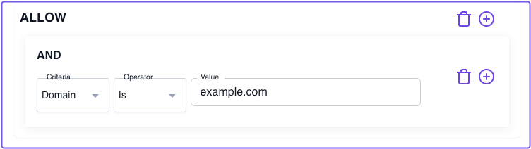
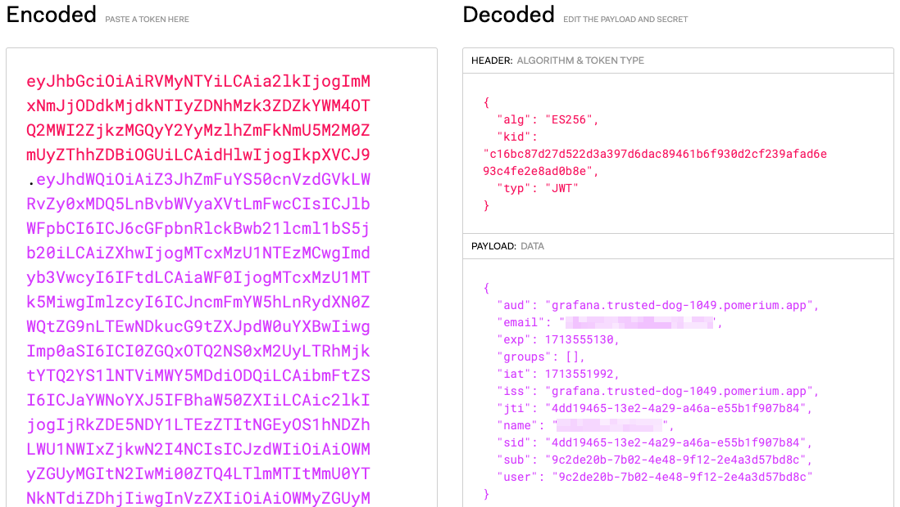
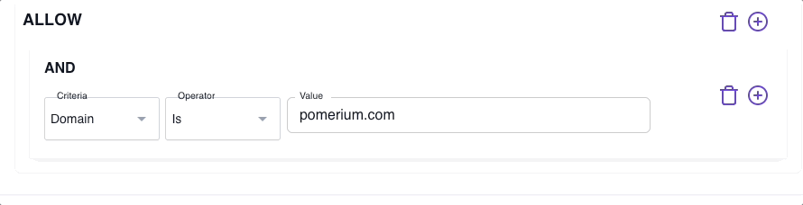

import Tabs from '@theme/Tabs';
import TabItem from '@theme/TabItem';

# Build Advanced Policies

In this guide, you’ll learn how to build **Advanced Policies** with Pomerium.

:::note **Before You Start**

Make sure you’ve completed the following guides:

- [**Build a Simple Route**](/docs/courses/zero-fundamentals/build-routes)
- [**Build a Simple Policy**](/docs/courses/zero-fundamentals/build-policies)
- [**Single Sign-on (SSO)**](/docs/courses/zero-fundamentals/single-sign-on)

Each tutorial builds on the same configuration files. In this tutorial, you’ll add complexity to your authorization policy.

:::

## What’s an advanced policy?

An “advanced policy” usually means the policy includes:

- Chaining policy blocks
- Additional operators, criteria, and matchers

For example, the policy below will only grant access if a user’s email address includes an `example.com` domain:

<Tabs>
<TabItem value="zero-ppl-builder" label="Zero PPL Builder">



</TabItem>
<TabItem value="zero-ppl-editor" label="Zero PPL Editor">

```yaml showLineNumbers
  allow:
    and:
      - domain:
          is: example.com
```

</TabItem>
</Tabs>

But, with Pomerium Policy Language (PPL), you can build richer policies that use all sorts of context to control access to upstream applications.

### Evaluate claims

Let’s extend the policy above to include a claim from your JWT. If a user doesn’t have the matching claim in their JWT, Pomerium will deny the user access.

1. **Get the value of the** `Name` **claim**

    While running your Docker containers, enter one of your routes in the browser and append `/.pomerium/jwt` to it.

    For example, `grafana.my-cluster-1799.pomerium.app/.pomerium/jwt`

    This will download your JWT. If you open the file in a text editor or IDE, you can copy the value of the JWT.

    Go to [JWT.io](https://jwt.io) and enter the JWT in the **Encoded** field. In the **Decoded** field, you'll see the values of the JWT claims:

    

    Find the **Name** claim and copy the value.

2. **Update your policy**

    Right now, your policy consists of one `allow` block with the `and` logical operator.

    Change `and` to `or`:

    <Tabs>
    <TabItem value="zero-ppl-builder" label="Zero PPL Builder">

    

    </TabItem>
    <TabItem value="zero-ppl-editor" label="Zero PPL Editor">
      ```yaml showLineNumbers
        allow:
          or:
            - domain:
                is: example.com
      ```
    </TabItem>
    </Tabs>

    The `or` operator grants access if either of two criteria are true.

    Right now, you only have one criterion: `domain`.

## RESUME HERE

    Let’s add a second criterion, `claim`, and add it to the same policy block:

    ```yaml
    policy:
      allow:
        or:
          - domain:
              is: example.com
          - claim/Name: <"Your Name">
    ```

The `claim` operator requires a sub-path and the value of a JWT claim.

You use `/` to delimit the beginning of the sub-path. In this case, the claim we want is `Name`. The value of `Name` is the name included in your JWT.

Replace `Your Name` with the value in your JWT.

Now, if a user’s email address includes `example.com` _or_ their claim matches the `Name` claim, Pomerium will grant the user access.

### Add a deny rule

Now, let’s add a second `deny` block to this policy. We will write a policy that denies access if a user’s email starts with `admin`.

```yaml
policy:
  allow:
    or:
      - domain:
          is: example.com
      - claim/Name: <"Your Name">
  deny:
    and:
      - email:
          starts_with: admin
```

As is, this policy will deny access if a user’s email starts with `admin` (of course, you can change this value to whatever you want).

Swap out the value with the beginning of your email address to test it out. This policy will still deny you access, even if your email’s domain and your JWT claim satisfy the `allow` block’s criteria.

## Summary

In this tutorial, you built more advanced policies that require multiple rules, logical operators, matchers, and criteria. Then, you attached these policies to your routes.

Now, your Pomerium instance can evaluate claims and grant or deny access based on additional policies you’ve built! We’re teaching Pomerium to do exactly what you want it to do: Verify authorization whenever someone accesses a route.

Organizations with multiple applications and services will want to know how they can scale Pomerium for their needs.

In the next tutorial, you’ll learn how to build more complex routes!

