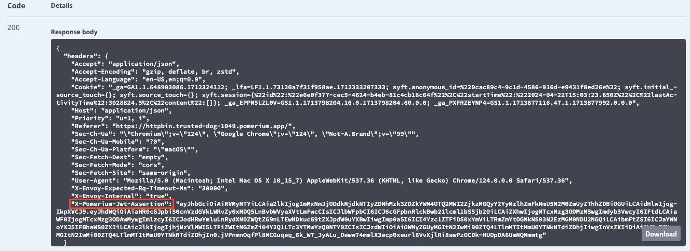
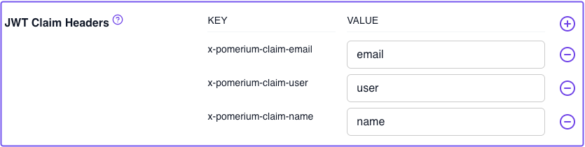
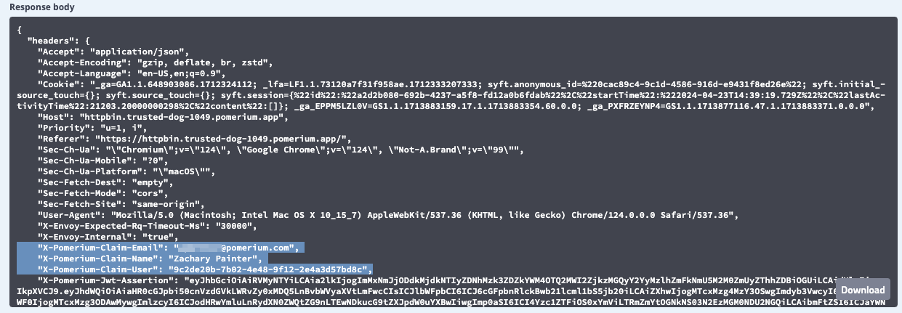
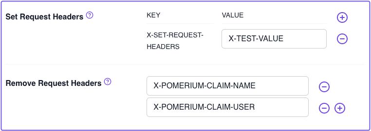
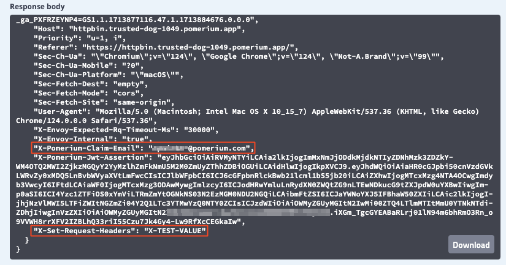

# Build Advanced Routes

In this guide, you'll build advanced routes in the Zero Console. To do that, you'll configure route settings in Pomerium Zero and test them against an upstream service called HTTPbin.

:::note **Before You Start**

Make sure you’ve completed the following guides:

- [**Build a Simple Route**](/docs/courses/zero-fundamentals/build-routes)
- [**Build a Simple Policy**](/docs/courses/zero-fundamentals/build-policies)
- [**Single Sign-on with JWTs**](/docs/courses/zero-fundamentals/single-sign-on)
- [**Build Advanced Policies**](/docs/courses/zero-fundamentals/advanced-policies)

Each tutorial builds on the same configuration files. In this tutorial, you’ll build new routes with some of Pomerium’s route-level settings.

:::

## Advanced route configuration settings

Pomerium provides route-level settings that allow you to customize how the Proxy service handles requests. More advanced configurations allow identity header pass-through, path and prefix rewrites, and request and response header modifications.

For the purposes of this guide, we will only review select settings from the list below to give you an idea of how you can further configure routes for your use case:

- **Headers**
- **Path Matching**
- **Path Rewriting**
- **Prefix & Prefix Rewrite**
- **Redirects**
- **Direct Response**

### Configure HTTPBin

To test these settings, we will configure Pomerium Zero and Docker Compose to host an HTTPBin server. If you’re not familiar with [HTTPBin](https://httpbin.org/), it’s a call-and-response HTTP server you can use to test (you guessed it) HTTP requests and responses.

Add the `httpbin` service to your Docker Compose file:

```yaml title="docker-compose.yaml"
httpbin:
  image: kennethreitz/httpbin
  ports:
    - 80:80
```

Add the `httpbin` route in the Zero Console:

1. Create a new route
1. Add **From** and **To** URLs
1. For **Policies**, select `Any Authenticated User`

Save your route and apply your changeset.

## Test Headers settings

### Pass identity headers (per route)

[Pass Identity Headers](/docs/reference/routes/pass-identity-headers-per-route) is a route-level setting that forwards the user's JWT to the upstream application in a signed HTTP header. The HTTP header must use the (case insensitive) `x-pomerium-jwt-assertion` format. You configured this setting in the [previous guide](/docs/courses/zero-fundamentals/single-sign-on), but let's see how it looks as a request header.

In the Zero Console:

1. Edit your HTTPBin route
1. Select **Headers**
1. Apply the **Pass Identity Headers** setting
1. Save your route and apply the changeset

Access the HTTPBin route and send a request. To send a request, on the HTTPBin page:

1. Open the **Request inspection** dropdown menu
1. In **GET /headers**, select **Try it out**
1. Select **Execute** to send the request

In the **Response body** field, you'll see the JWT assertion header:



:::info JWTs and SDKs

Read the following documentation to learn more about identity verification in Pomerium:

- [**Identity verification**](/docs/capabilities/getting-users-identity)
- [**Manually verifying the JWT**](/docs/capabilities/getting-users-identity#manual-verification)

We also provide SDKs for JWT verification in the following languages:

- [**Go**](https://github.com/pomerium/sdk-go)
- [**Node.js and Express**](https://github.com/pomerium/js-sdk/tree/main/examples/express)
- [**JavaScript**](https://github.com/pomerium/js-sdk)

:::

### JWT Claim Headers

The pass identity headers setting can also forward _unsigned_ identity headers as additional [JWT Claim Headers](/docs/reference/jwt-claim-headers).

To add JWT claim headers in the Zero Console:

1. Select the **Settings** tab in the main sidebar
1. In **Editing Cluster Settings**, select **Headers**
1. In the **JWT Claim Headers** field, enter the values below:

    | **KEY** | **VALUE** |
    | :--- | :--- |
    | `x-pomerium-claim-email` | `email` |
    | `x-pomerium-claim-user` | `user` |
    | `x-pomerium-claim-name` | `name` |

    For example:

    


After you save your changes, apply your changeset, and access your HTTPBin route, inspect the request. You'll see these additional, unsigned HTTP headers added to the response body:



### Set and remove request headers

Now, configure [**Set Request Headers**](/docs/reference/routes/headers#set-request-headers) to add static custom HTTP headers to your request:

1. Go back to the HTTPBin headers settings
1. In **Property Name**, enter `X-SET-REQUEST-HEADERS`
1. In **Property Value**, enter `X-TEST-VALUE`

    Next, configure [**Remove Request Headers**](/docs/reference/routes/headers#remove-request-headers) to remove two of the JWT claim headers you set in the previous section.

1. In the **Remove Request Headers** field, enter `X-POMERIUM-CLAIM-NAME` and `X-POMERIUM-CLAIM-USER`.

    

Apply your changeset and test the request again. You'll notice that the set request header was added to the request, and the specified JWT claim headers were removed:

    

### Rewrite Host header to a literal value

You may need to modify the value of the Host header. For example, some servers may only accept Host headers with a value that matches the [Origin](https://developer.mozilla.org/en-US/docs/Web/HTTP/Headers/Origin) of the request. The [Host Rewrite](/docs/reference/routes/headers#2-host-rewrite) setting allows you to modify the Host header in the HTTP request to a literal value.

If you don't tamper with this setting, the value of the Host header will be the hostname of our upstream service: `"Host": "httpbin"`.

Now, go back to the **Headers** tab for the HTTPBin route. In the **Host Rewrite to Literal** field, enter your HTTPBin route.

For example, `httpbin.righteous-gemstone-1734.pomerium.app`


After applying your changeset, check the request headers in HTTPBin again. You'll notice Pomerium rewrites the Host header to the domain you entered in the Zero Console:

`"Host": "httpbin.righteous-gemstone-1734.pomerium.app"`

## Redirects and Direct Response

RESUME HERE


[
  Goals:
  - Build advanced routes
  - Request headers
  - Response headers
  - Host headers
  - Redirects
  - Direct response
  - Prefix and Path settings
]
