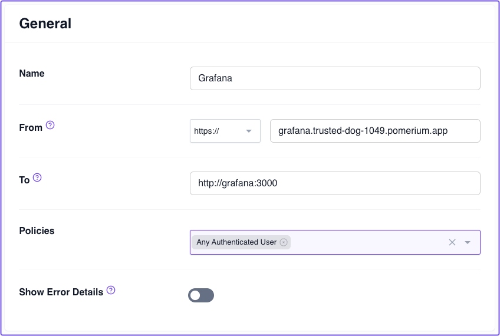
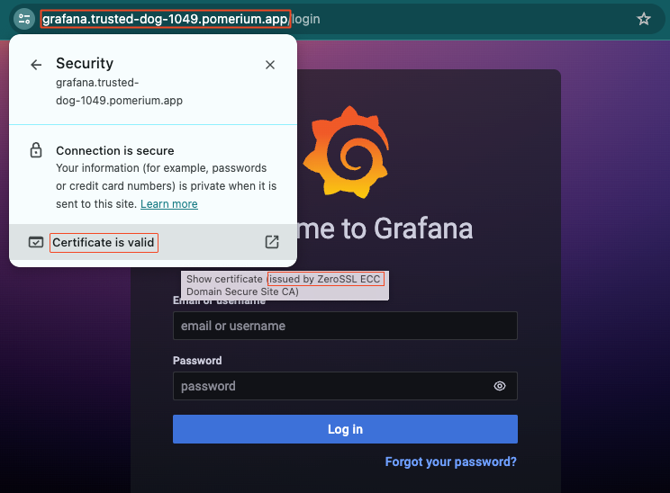

# Zero Fundamentals: Build Routes

This guide shows you how to build a route to Grafana in Pomerium Zero. Watch the video to see the steps in action, or read the guide below.

<iframe
  width="100%"
  height="500"
  src="https://www.youtube.com/embed/-wAKnj_cY-E?si=t2zvG0q23swfCIQM"
  title="YouTube video player"
  frameborder="0"
  allow="accelerometer; autoplay; clipboard-write; encrypted-media; gyroscope; picture-in-picture; web-share"
  referrerpolicy="strict-origin-when-cross-origin"
  allowfullscreen></iframe>

:::note

This guide assumes you've completed the [**Pomerium Zero Quickstart**](/docs/quickstart). If you haven't, you must have a connected Pomerium cluster instance running in a Docker container before continuing.

:::

## Routing in Pomerium

In Pomerium, **Routing** tells the Proxy service where to listen for incoming requests from the client so it can direct the request to the upstream origin server.

When the origin server sends its response back to the client, the Proxy service receives the request, and looks for routing instructions so it knows where to direct the response to.

In simpler terms, routing makes it possible for Pomerium to manage requests and responses between a client and an upstream service.

:::info How routing works

A Pomerium-managed route consists of two URLs defined by their **From** and **To** values:

- **From** defines the external, publically accessible URL of a proxied request. It tells the Proxy service to listen for requests from this location.
- **To** defines the destination URL of the proxied request. It can be an internal or external resource.

:::

## How to build routes in Pomerium Zero

To learn how to build routes, you'll follow these steps:

1. Configure a service in Docker Compose
1. Build a route to the service in the Zero Console
1. Access your secured service behind Pomerium

### Configure Grafana

The service you'll secure is [Grafana](https://grafana.com/), an open-source observability platform. In the same `docker-compose.yaml` file where you're running Pomerium Zero, add the Grafana configuration below:

```yaml
  grafana:
    image: grafana/grafana:latest
    ports:
      - 3000:3000
    networks:
      main: {}
    volumes:
      - ./grafana-storage:/var/lib/grafana
```

### Build a route

In the Zero Console:

1. Select **Routes** from the sidebar, create a new route, and name it something obvious, like **Grafana**.

1. In the **From** field, select **https://** from the protocol dropdown. In the next field, enter the external URL. It should follow this format:

    `grafana.<CLUSTER_STARTER_DOMAIN>.pomerium.app`
1. In the **To** field, enter the destination URL: `http://grafana:3000`

1. In the **Policies** field, select **Any Authenticated User**.

    

Save your route and **apply the changeset**.

## Access the route

Now, in your browser, navigate to the external From URL you just saved. You'll notice your accessing Grafana over the external URL. This means you've successfully configured Pomerium to proxy requests to Grafana.

If you look at the route's TLS certificate, you'll notice the certificate was issued by ZeroSSL on behalf of your cluster domain:



This means the connection between you and Grafana is secured over a TLS.

## Up Next: Build Policies

Great job! You successfully built a route in Pomerium Zero. Next, you'll learn how to build authorization policies.

Go to [Build Policies](/docs/courses/zero-fundamentals/build-policies).


#### Configuration file state

At this point, your Docker Compose file should look like this:

```yaml title="docker-compose.yaml"
services:
  pomerium:
    image: pomerium/pomerium:v0.25.1
    ports:
      - 443:443
    restart: always
    environment:
      POMERIUM_ZERO_TOKEN: <YOUR_CLUSTER_TOKEN>
      XDG_CACHE_HOME: /var/cache
    volumes:
      - pomerium-cache:/var/cache
    networks:
      main:
        aliases:
        - verify.<YOUR_CLUSTER_SUBDOMAIN>.pomerium.app
  verify:
    image: cr.pomerium.com/pomerium/verify:latest
    networks:
      main:
        aliases:
        - verify
  grafana:
    image: grafana/grafana:latest
    ports:
      - 3000:3000
    networks:
      main: {}
    volumes:
      - ./grafana-storage:/var/lib/grafana

networks:
  main: {}

volumes:
  pomerium-cache:
```

