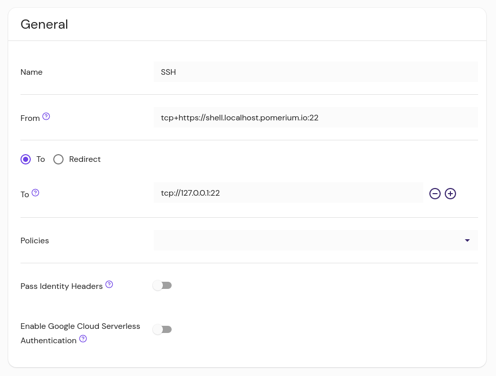

import Tabs from '@theme/Tabs';
import TabItem from '@theme/TabItem';
import LongLivedConnections from '@site/content/docs/admonitions/_long-lived-connections.mdx';

# Pomerium Clients for Tunneling Non-HTTP Protocols

Pomerium can secure non-HTTP protocols such as SSH, RDP, MySQL, Redis, or DNS with the same identity-aware policy enforcement used for HTTP. This document merges several references to provide a comprehensive guide covering:

- **TCP Over HTTP** and **UDP Over HTTP** capabilities
- How to configure **routes** for TCP and UDP
- **Pomerium CLI** and **Desktop** usage and installation details
- Advanced configurations, best practices, and enterprise considerations

<iframe
  width="100%"
  height="450"
  src="https://www.youtube.com/embed/-ZkkkYN50iM"
  title="YouTube video player"
  frameborder="0"
  allow="accelerometer; autoplay; clipboard-write; encrypted-media; gyroscope; picture-in-picture; web-share"
  allowfullscreen></iframe>

Pomerium's non-HTTP proxying allows you to secure SSH, MySQL, DNS, or any other TCP/UDP-based service behind Pomerium's identity-aware access control. When a user connects through **Pomerium CLI** or **Pomerium Desktop**, they:

1. Are redirected to the IdP to authenticate (if they aren't already).
2. Receive an authorized tunnel for the requested port/protocol.
3. Enjoy zero trust-style security without needing a separate VPN or dedicated tunnels.

### Why Use Pomerium for TCP and UDP?

- **Single Sign-On (SSO)**: Unified authentication with your existing IdP.
- **Granular Authorization**: Leverage Pomerium's policies (e.g. allow by email, group membership).
- **Audit & Visibility**: Centralize logs and control for non-HTTP traffic.
- **Consistent Security**: Enforce the same policies for both HTTP and non-HTTP connections.

## Install Pomerium CLI and Desktop

Pomerium offers a command-line interface (CLI) and a graphical Desktop client for connecting to non-HTTP routes.

### CLI Installation

<Tabs>
<TabItem value="binaries" label="Binaries">

```bash
ARCH=[your-arch]
OS=[your-os]
VERSION=[desired-version]
curl -L https://github.com/pomerium/cli/releases/download/${VERSION}/pomerium-cli-${OS}-${ARCH}.tar.gz \
    | tar -z -x
```

See [GitHub Releases](https://github.com/pomerium/cli/releases) for a full list.

</TabItem>

<TabItem value="packages" label="Packages (RPM/DEB)">

Install from [Cloudsmith](https://cloudsmith.io/~pomerium/repos/pomerium/packages/) or GitHub:

```abnf title="/etc/yum.repos.d/pomerium-cli.repo"
[pomerium-pomerium]
name=pomerium-pomerium
baseurl=https://dl.cloudsmith.io/public/pomerium/pomerium/rpm/el/$releasever/$basearch
repo_gpgcheck=1
enabled=1
gpgkey=https://dl.cloudsmith.io/public/pomerium/pomerium/gpg.6E388440B94E1407.key
gpgcheck=1
sslverify=1
pkg_gpgcheck=1
```

</TabItem>

<TabItem value="homebrew" label="Homebrew (macOS)">

```bash
brew tap pomerium/tap
brew install pomerium-cli
```

</TabItem>

<TabItem value="docker" label="Docker">

```bash
docker run pomerium.com/pomerium/cli:latest --version
```

</TabItem>

<TabItem value="source" label="Source Build">

```bash
git clone https://github.com/pomerium/cli.git
cd cli
make build
./bin/pomerium-cli --help
```

</TabItem>
</Tabs>

### Desktop Installation

<Tabs>
<TabItem value="windows" label="Windows">

Download the `.exe` from [Desktop Releases](https://github.com/pomerium/desktop-client/releases).  
Run the installer. Right-click the tray icon to manage connections.

</TabItem>
<TabItem value="macos" label="macOS">

```bash
brew tap pomerium/tap
brew install pomerium-desktop
```

Or download the `.dmg` and drag it into Applications. Interact with it via the menu bar icon.

</TabItem>
<TabItem value="linux" label="Linux">

Download the `.AppImage` from [Desktop Releases](https://github.com/pomerium/desktop-client/releases).  
Execute it in place or use [AppImageLauncher](https://github.com/TheAssassin/AppImageLauncher). Manage connections from the system tray icon.

</TabItem>
</Tabs>

## Create TCP Routes

<iframe
  width="100%"
  height="450"
  src="https://www.youtube.com/embed/Y-5zDeOTDWw"
  title="YouTube video player"
  frameborder="0"
  allow="accelerometer; autoplay; clipboard-write; encrypted-media; gyroscope; picture-in-picture; web-share"
  allowfullscreen></iframe>

Use `tcp+https://` in the route **From** field and `tcp://` in **To**. Example:

```yaml
routes:
  - from: tcp+https://redis.corp.example.com:6379
    to: tcp://redis.internal.example.com:6379
    policy:
      - allow:
          or:
            - email:
                is: contractor@notexample.com
            - claim/groups: 'datascience@example.com'
```

Points to remember:

- HTTP-specific settings (like `regex_rewrite_pattern`) do not apply to TCP routes.
- Pomerium encrypts traffic from user to proxy. If you want full end-to-end encryption, ensure the upstream also runs TLS or mTLS.
- The port in **From** (e.g., `:6379`) differentiates multiple routes on the same domain, even though requests typically arrive on port `443`.

<Tabs>
<TabItem value="pomerium-enterprise" label="Pomerium Enterprise">

Create a **New Route** and select **TCP**. Fill in **From** (for example, `tcp+https://ssh.example.com:22`) and **To** (`tcp://127.0.0.1:22`), then define policy. Click **Publish** to apply changes.



</TabItem>
<TabItem value="pomerium-zero" label="Pomerium Zero">

Set **From** = `tcp+https://`..., define a port (e.g. `:22`).  


</TabItem>
<TabItem value="pomerium-core" label="Pomerium Core">

```yaml
- from: tcp+https://ssh.localhost.pomerium.io:22
  to: tcp://127.0.0.1:22
  policy:
    - allow:
        or:
          - email:
              is: user@yourcompany.com
```

</TabItem>
</Tabs>

:::info

Long-lived

connections

<LongLivedConnections />
:::

### Advanced TCP Usage

<iframe
  width="100%"
  height="450"
  src="https://www.youtube.com/embed/wDzDWcbpcAM"
  title="YouTube video player"
  frameborder="0"
  allow="accelerometer; autoplay; clipboard-write; encrypted-media; gyroscope; picture-in-picture; web-share"
  allowfullscreen></iframe>

#### Listen configuration

When using the CLI, specify `--listen` to set a custom local address/port. If you use `-`, the CLI pipes STDIN/STDOUT directly (useful for `ssh -o ProxyCommand`).

#### Bastion host style

If the route is not publicly resolvable or Pomerium is on a non-standard port:

```yaml
from: tcp+https://proxy.corp.example.com:8443/redis.internal.example.com:6379
```

Then:

```bash
pomerium-cli tcp tcp+https://proxy.corp.example.com:8443/redis.internal.example.com:6379
```

#### Proxy chaining

If you want Pomerium to send an HTTP CONNECT to another proxy, use an HTTP scheme in **To**:

```yaml
routes:
  - from: tcp+https://example.corp.com:10002
    to: http://another-proxy.corp.com:10003
```

## Create UDP Routes

Starting with v0.29, Pomerium supports UDP. Use `udp+https://` in **From** and `udp://` in **To**:

```yaml
routes:
  - from: udp+https://time.corp.example.com:13
    to: udp://time.internal.example.com:13
    policy:
      - allow:
          or:
            - email:
                is: contractor@notexample.com
            - claim/groups: 'datascience@example.com'
```

- `CONNECT-UDP` is used internally, so no HTTP-specific settings apply.
- The port in **From** (e.g. `:13`) is for route selection; inbound traffic is usually on `443`.
- Latency can matter for DNS or real-time apps. Keep Pomerium near users to minimize round-trip times.

## Connecting via Pomerium CLI

### TCP Example

```bash
pomerium-cli tcp ssh.example.com:22
# listening on 127.0.0.1:52672
ssh 127.0.0.1 -p 52672
```

Or set your own local port:

```bash
pomerium-cli tcp ssh.example.com:22 --listen :2222
ssh 127.0.0.1 -p 2222
```

If you are not logged in yet, your browser opens for IdP authentication.

#### SSH ProxyCommand

```bash
ssh -o ProxyCommand='pomerium-cli tcp --listen - %h:%p' ssh.example.com
```

### UDP Example

```bash
pomerium-cli udp dns.example.com:53
# listening on 127.0.0.1:52544
dig @127.0.0.1 -p 52544 google.com
```

```shell
pomerium-cli tcp [destination] [flags]
```

### Flags

| Flags | Description | Type |
| :-- | :-- | --- |
| <a className="entRef-anchor" id="--alternate-ca-path">#</a><a href='#--alternate-ca-path'>--alternate-ca-path</a> | Path to CA certificate to use for HTTP requests. | string |
| <a className="entRef-anchor" id="--browser-cmd">#</a><a href='#--browser-cmd'>--browser-cmd</a> | Custom browser command to run when opening a URL. | string |
| <a className="entRef-anchor" id="--ca-cert">#</a><a href='#--ca-cert'>--ca-cert</a> | Path to CA certificate to use for HTTP requests. | string |
| <a className="entRef-anchor" id="--client-cert">#</a><a href='#--client-cert'>--client-cert</a> | (optional) PEM-encoded client certificate. | string |
| <a className="entRef-anchor" id=" --client-key">#</a><a href='# --client-key'> --client-key</a> | (optional) PEM-encoded client certificate key. | string |
| <a className="entRef-anchor" id="--client-cert-from-store">#</a><a href='#--client-cert-from-store'> --client-cert-from-store</a> | (optional) If provided, pomerium-cli will attempt to use a client certificate from the system trust store (macOS and Windows only), searching for a certificate based on the trusted CA names advertised by Pomerium in the TLS handshake. | none |
| <a className="entRef-anchor" id="--client-cert-issuer">#</a><a href='#--client-cert-issuer'> --client-cert-issuer</a> | (optional) When used in combination with --client-cert-from-store, restricts the client certificate search based on a particular attribute of the certificate's [Issuer name](#certificate-name-filters). | string |
| <a className="entRef-anchor" id="--client-cert-subject">#</a><a href='#--client-cert-subject'> --client-cert-subject</a> | (optional) When used in combination with --client-cert-from-store, restricts the client certificate search based on a particular attribute of the certificate's [Subject name](#certificate-name-filters). | string |
| <a className="entRef-anchor" id=" --disable-tls-verification">#</a><a href='# --disable-tls-verification'>--disable-tls-verification</a> | Disables TLS verification. | none |
| <a className="entRef-anchor" id="--help">#</a><a href='#--help'>-h, --help</a> | Help for tcp. | none |
| <a className="entRef-anchor" id="--listen">#</a><a href='#--listen'>--listen</a> | Local address to start a listener on (default "127.0.0.1:0"). | string |
| <a className="entRef-anchor" id="--pomerium-url">#</a><a href='#--pomerium-url'>--pomerium-url</a> | The URL of the Pomerium server to connect to. | string |
| <a className="entRef-anchor" id="--version">#</a><a href='#--version'>-v, --version</a> | Version for pomerium-cli. | none |

#### Certificate name filters

The certificate name filter syntax is `attribute=value`. A name filter can accept only one name attribute. The value must be an exact match (not a substring match). Make sure to quote name filters as appropriate for your shell.

For example, `--client-cert-issuer "CN=My Trusted CA"` would filter for a certificate directly issued by a CA with the Common Name "My Trusted CA".

Or, `--client-cert-subject "OU=My Department"` would filter for a certificate whose Subject name contains the Organizational Unit Name "My Department".

The supported name attributes are:

- commonName (CN)
- countryName (C)
- localityName (L)
- organizationName (O)
- organizationalUnitName (OU)
- postalCode
- serialNumber
- stateOrProvinceName (ST)
- streetAddress (STREET)

Either the long or abbreviated attribute name may be used (for example, `localityName=New York` or `L=New York`).

Values are case sensitive: `L=new york` will not match the Locality Name "New York".

### Desktop client steps

If you haven't, install [Pomerium Desktop](/docs/deploy/clients).

Then, add a connection by filling in the fields defined below:

- **Name**: A local name for the route
- **Destination**: Matches the [From](/docs/reference/routes/from) value of the route, without the protocol. Always include the port specified in the route, and do not include the `https://` protocol.
- **Local Address**: The local address and port number from which to access the service locally. If left blank, the client will choose a random port to listen to on the loopback address.
- **Tags**: Customizable tags to sort and organize TCP routes


#### Advanced Settings

- **Pomerium URL**: The Pomerium Proxy service address. This is required if the **Destination URL** can't be resolved from DNS or a local `hosts` entry, or if the Proxy service uses a non-standard port.
- **Disable TLS Verification**: Allows untrusted certificates from the Pomerium gateway
- **Client Certificates**: For routes that enforce [mTLS](/docs/internals/mutual-auth), you can **set a client certificate manually** or automatically [**search the OS certificate store**](/docs/capabilities/non-http#client-certificates) for a trusted certificate (note: macOS and Windows only).


### Pomerium CLI steps

If you haven't, install [Pomerium CLI](/docs/deploy/clients).

Then, connect to a TCP route:

1. Invoke `pomerium-cli` with the `tcp` option, and provide the route to your service (as defined in [`from`](/docs/reference/routes/from) in your Route specification).

   ```shell-session
   $ pomerium-cli tcp ssh.localhost.pomerium.io:22
   2023/10/02 11:29:22 listening on 127.0.0.1:53656
   ```

   You can optionally supply an address and/or port to the `listen` flag:

   ```shell-session
   $ pomerium-cli tcp ssh.localhost.pomerium.io:22 --listen :2222
   2023/10/02 11:30:03 listening on [::]:2222
   ```

1. Connect to your service using the local address and port specified in the output of `pomerium-cli`:

   ```bash
   ssh 127.0.0.1 -p 2222
   ```

1. When the connection starts, the CLI will open your browser and direct you to your Identity Provider to authenticate your session. Once authenticated, the connection will continue and you can close the browser window.

1. In this example, since we are using SSH we can consolidate the TCP and SSH connections into a single command:

   ```bash
   ssh -o ProxyCommand='pomerium-cli tcp --listen - %h:%p' ssh.localhost.pomerium.io
   ```

## Best Practices

- **mTLS**  
  If the upstream requires mutual TLS, both CLI and Desktop can supply client certs.
- **Multiple services on one domain**  
  Use different ports in **From** (e.g. `:22`, `:6379`, `:3306`, `:53`).
- **Performance**  
  For latency-sensitive protocols (like DNS over UDP), minimize round trips by placing Pomerium near users.
- **Logging and Audit**  
  Pomerium logs each connection attempt, including identity. This provides an audit trail.
- **Long-lived sessions**  
  Non-HTTP connections remain open as long as your Pomerium session is valid.

## Further Reading

- [TCP Non-HTTP Reference](/docs/capabilities/non-http/tcp)
- [UDP Non-HTTP Reference](/docs/capabilities/non-http/udp)
- [Mutual Authentication](/docs/internals/mutual-auth)
- [CLI Releases](https://github.com/pomerium/cli/releases)
- [Desktop Releases](https://github.com/pomerium/desktop-client/releases)

Pomerium unifies access for HTTP, TCP, and UDP behind a single identity-based control plane. This gives you SSO, granular authorization, and consistent security logs for all your applications and services, without needing a separate VPN or manual tunnels.
