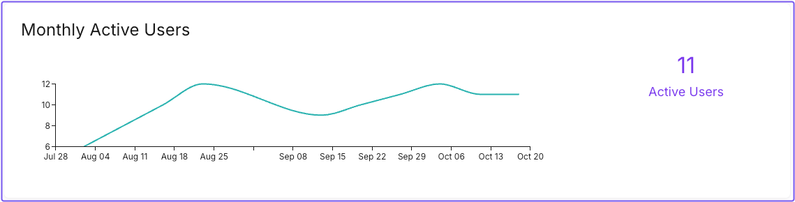
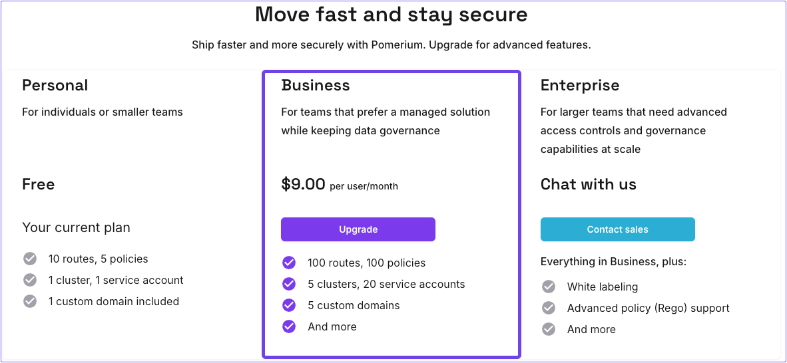
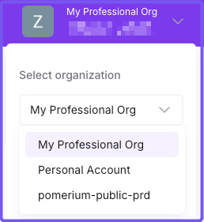

Learn how billing works in Pomerium Zero.

## Overview

Pomerium Zero provides a self-service billing dashboard where you can manage your subscription and payment information. Billing applies only to **Professional** organizations, not **Personal** **Account** organizations. You can upgrade your account at any time.

- For questions about billing, see [**How billing works.**](#how-billing-works)
- For questions about upgrading or downgrading subscriptions, see [**Manage subscriptions**](#manage-subscriptions).

## Billing definitions

- **Quota**: the amount of a given entity you can define in Pomerium Zero based on your subscription type
- **Entity**: a route, policy, certificate, service account, custom domain, API user, replica, or cluster

## Organizations

Pomerium Zero assigns accounts to organizations. There are two types of organizations:

- **Personal Account**: assigned to you by default when you register for an account
- **Professional**: available only if you upgrade from a **Free** plan to a **Business** plan

### Plans and subscriptions

Pomerium Zero provides two types of plans:

- **Free**: intended for testing purposes, hobbyists, and small teams. Personal accounts subscribe to the Free plan by default.
- **Business**: intended for large teams. Professional organizations subscribe to the Business plan.

### Quotas

Personal and professional organizations are allocated different quotas. Personal accounts have lower quotas, and professional organizations have much higher quotas.

The table below breaks down quotas by organization type:

| Entity | Personal account quota | Professional org quota |
| --- | --- | --- |
| Routes | 10 | 100 |
| Policies | 5 | 100 |
| Certificates (user uploaded) | 10 | 100 |
| Custom domains | 1 | 5 |
| Service accounts | 2 | 20 |
| API users | 2 | 1,000 |
| Clusters | 1 | 5 |
| Replicas | 3 | 5 (per cluster) |

User quotas differ also based on the organization type:

| User Type   | Personal account | Professional org |
| ----------- | ---------------- | ---------------- |
| Admin users | 1                | 20               |
| Users       | 10               | 1,000            |

:::note

See the [Pricing page](https://www.pomerium.com/pricing) for a thorough breakdown of features and quotas in Pomerium Zero.

:::

### Quota thresholds

At some point, you may require higher quotas to accommodate your use case.

If you're using a professional account and you need to increase the quota for a given entity, [contact us](/docs/community). We will increase quotas on an as-needed basis.

If you're using a personal account, you must upgrade to increase quotas.

## How billing works

Pomerium charges your account monthly based on usage during a billing period. The billing period starts the day you sign up and ends the same day the next month (or, if that's not possible, the last day of the month closest to the anchor date).

Pomerium starts monitoring your usage when you upgrade and charges you for total usage at the end of the billing period.

### Usage

Pomerium calculates usage based on the total number of monthly active users (MAU) during a billing period. An “active user” includes Pomerium Zero users and Pomerium Core users.

:::info How Pomerium counts unique users

An admin user signing into the Zero dashboard counts as a user in Pomerium Zero. Any user accessing a Pomerium-managed route counts as a user in Pomerium Core.

If a user in Zero and Core shares the same user ID, it counts as one user.

:::

Pomerium reports active users daily. At the end of the billing period, Pomerium adds the number of active users for the month and multiplies the total against the billing rate.

For example:

- Usage = 200 MAU

- Billing rate = $9 per user/month

- Usage x Billing rate = $1,800

Based on usage, your monthly invoice would be $1,800.

:::tip

You can monitor MAU in the **Usage** dashboard in Pomerium Zero:

:::

## Manage subscriptions

You can manage subscriptions in the Zero billing dashboard.

To get to the billing dashboard:

1. In the navigation bar, select the account avatar.
1. In the dropdown menu, select **Organization**.
1. In the **Organization Settings** page, select the **Billing** tab.
1. Select **Manage Subscription**.

From here, you can:

- [Upgrade your subscription](#upgrade-subscription) to a Business plan.
- [Downgrade your subscription](#downgrade-subscription) to a Free plan.
- Review your payment information and billing history.

### Upgrade subscription

When you upgrade your subscription from a Free plan to a Business plan, your account type is converted from a personal organization to a professional organization with professional quotas.

To upgrade your account in Pomerium Zero, you must exceed a quota. When you do, Pomerium presents a pay wall where you can choose to upgrade your subscription.

Alternatively, you can upgrade your subscription on the [Pricing](https://www.pomerium.com/pricing) page.

Upgrading does not replace your personal account. It creates an additional professional organization separate from your personal account.

### Downgrade subscription

You can downgrade your subscription from a Business plan to a Free plan. If you do, you'll be charged at the end of the billing period for any usage up to the time you downgraded.

### Missed payments

If you can't pay your bill for any reason, your subscription will lapse and Pomerium Zero will switch into read-only mode. In read-only mode, your clusters will continue to work, but you won't be able to make changes to your configuration.

When Pomerium receives full payment for any outstanding bills under your account, you can resume using Pomerium Zero as normal.
