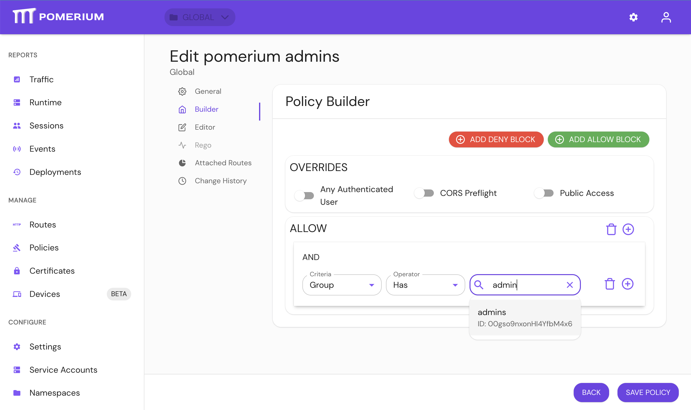

---
# cSpell:ignore privkey cooldown certbot httpchk autocache forwardauth signin healthcheck GITHASH

title: Upgrading
description: >-
  This page contains the list of deprecations and important or breaking changes for Pomerium. Please read it carefully.


pagination_prev: null
pagination_next: null
sidebar_position: 10
---

# Upgrade guide

## Since 0.22.0

### New

#### Hosted Authenticate Service

- [Hosted Authenticate Service](/docs/capabilities/hosted-authenticate-service.md) will now be used by default to handle single-sign-on. Pomerium hosts this service as a convenience to its users; no identity provider configuration or authenticate service URL needs to be specified if the hosted authenticate service is used. The [Self-Hosted Authenticate Service](/docs/capabilities/self-hosted-authenticate-service), which requires a self-hosted authenticate service URL and identity provider, is still supported for users that prefer to host these services themselves.

#### Wildcard From Routes

- [Wildcard From Routes](/docs/reference/routes/from#wildcard-from-routes) is a Beta support feature that allows you to define a wildcard route that points matching external routes to a single destination.

#### Better Memory performance

- Internal [RDS changes](https://github.com/pomerium/pomerium/pull/4098) reduce memory consumption, especially for environments where configuration changes rapidly.

## Since 0.20.0

### Upgrading

There are several data model changes in this release that are not backward compatible. Please make sure you back up your Postgres database before performing an upgrade.

### Breaking

#### Devices need be re-enrolled

The [Device Identity (beta)](/docs/capabilities/device-identity) data model had an internal change that is not forward compatible. Your enrolled devices will need be re-registered. Your existing policies may need to be updated.

#### Forward Auth (deprecated, removed in this release)

Forward auth was introduced in early versions of Pomerium to provide a gradual migration path for users of other reverse proxies to Pomerium. Since then, Pomerium has come a long way - it is now based around first class reverse proxy core (Envoy) and has been battle tested for many years. Unfortunately, supporting forward authentication mode provides a subpar experience in security (cookies cannot be stripped from upstream requests), configuration (misconfiguration issues are common and hard to troubleshoot), and it is not compatible with many of Pomerium's newer features and deployment scenarios.

### New

#### Bastion Host support for TCP routes

See [Bastion Host](/docs/capabilities/tcp#bastion-host)

#### Internal TLS by default

If you run Pomerium Enterprise, you may set up a secure HTTPS connection between Pomerium Core and Enterprise without need to explicitly supply certificates. See [`tls_derive`](/docs/reference/tls-derive)

## Since 0.19.0

### Breaking

#### IdP Groups Policy

A deprecated `routes.allowed_groups` and `groups` PPL criteria were removed.

For Open Source, please use IdP Claims passed by your IdP.

- Please visit your IdP provider admin console to adjust group membership propagation to Claims.
  - [Okta](https://developer.okta.com/docs/guides/customize-tokens-groups-claim/main)
  - [Auth0](https://auth0.com/docs/customize/extensions/authorization-extension/configure-authorization-extension#add-authorization-information-to-the-token-issued)
  - [Azure](https://learn.microsoft.com/en-us/azure/active-directory/hybrid/how-to-connect-fed-group-claims)
  - [Cognito](/docs/identity-providers/cognito.html#group-based-policies)
- You may need adjust requested scopes via `idp_scopes` config option.
- visit your authenticate endpoint `/.pomerium` route to check the group claims are passed by your IdP.
- use `claim/` [PPL criteria](/docs/capabilities/ppl.html#criteria)

```yaml
routes:
  - from: https://httpbin.localhost.pomerium.io
    to: https://httpbin.org
    pass_identity_headers: true
    policy:
      allow:
        and:
          - claim/groups: admins
```

For Enterprise, use PPL Builder 

### IdP Directory Sync

IdP directory sync has been moved to https://github.com/pomerium/datasource and becomes part of the [External Data Sources integration](/docs/integrations/), in order to provide unification with other external data sources, consolidate job scheduling and monitoring.

Setting the below options in Pomerium config file would now result in an error. In Pomerium Enterprise Console, please navigate to Settings > Identity Provider and configure directory sync there.

- `idp_service_account`: use IdP provider specific options in the UI.
- `idp_refresh_directory_timeout`: use [Polling Min Delay](/docs/deploy/enterprise/configure#polling-minmax-delay).
- `idp_refresh_directory_interval`: replaced by [Polling Max Delay](/docs/deploy/enterprise/configure#polling-minmax-delay).
- `idp_qps`: not required, IdP providers adjust their qps rate.

Pomerium Core would only perform user authentication and session refresh with the IdP provider, and would not try to synchronize user details and groups, which is now part of [External Data Sources](/docs/integrations/).


## Since 0.16.0

### New

#### Per Route OIDC Credentials

This release of Pomerium adds the ability to bind a route to unique OIDC credentials. This allows Identity Provider administrators to view Pomerium protected applications individually rather than as a single shared application.

See [idp_client_id](/docs/reference/routes/identity-provider-client-id-per-route) and [idp_client_secret](/docs/reference/routes/identity-provider-client-secret-per-route) for configuration details.

#### Updated User Info Page

The `.pomerium` user info page has been redesigned to better structure data around user identity, group, and device information.

#### External Google Groups

Pomerium policy now supports group members from outside of your organization.

## Since 0.15.0

### New

#### Policy for Device Identity

This release of Pomerium adds the ability to set policy based on system registration via [WebAuthN](https://en.wikipedia.org/wiki/WebAuthn).

See [Device Identity](/docs/concepts/device-identity) for more details.

#### HTTP PPL Criteria

`http_path` and `http_method` are now supported for matching HTTP requests in policies. See [Pomerium Policy Language](/docs/capabilities/ppl#criteria) for more details.

### Breaking

#### Self-signed fallback certificates

When selecting a TLS certificate for a listener, Pomerium attempts to locate one by iterating through the provided certs and searching for a SAN match. This applies to all listeners, including internal service URLs like `databroker_service_url` and public endpoints like `authenticate.example.com`.

Previously, when no match was found, Pomerium would select the "first" certificate in the list. However, the definition of "first" might change based on runtime configuration, so the certificate selection was non-deterministic.

Starting in v0.16, Pomerium will instead generate a self-signed certificate if it cannot locate an appropriate certificate from the provided configuration or system key/trust store. If you discover that you are receiving a self-signed certificate rather than a certificate from [`certificate`/`certificates`/`certificate_file`](/docs/reference/certificates) or the trust store, you have a mismatch between your service URL and the names covered in your certificates.

#### OIDC flow no longer sets default uri params

Previously, Pomerium would default to setting the uri param `access_type` to `offline` for all OpenID Connect based identity providers. However, using uri params to ensure offline access (e.g. `refresh_tokens` used to keep user's sessions alive) [is unique to Google](https://developers.google.com/identity/protocols/oauth2/web-server#offline). Those query params will now only be set for Google. Other OIDC based IdP's should continue to work using [OIDC's](https://openid.net/specs/openid-connect-core-1_0.html#OfflineAccess) `offline_access` scope.

#### Removed options

The deprecated `headers` option has been removed. Use [`set_response_headers`](/docs/reference/set-response-headers) instead.

The `signing_key_algorithm` option has been removed and will now be inferred from `signing_key`.

#### Changed GitHub Team IDs

To improve performance, IdP directory synchronization for GitHub now uses the GraphQL API. This API returns the same information as the REST API, except that the GraphQL node IDs are different. Where we previously used the team integer ID from the REST API, we now use the team slug instead. Most policies should already use the team slug for group based rules, which should continue to work. However, if the integer ID is used it will no longer work. Update those policies to use the team slug instead.

#### CLI Source and Packaging Update

`pomerium-cli` has been factored out of the core repository and now resides at <https://github.com/pomerium/cli>. If you currently install the CLI tool from [Packages](/docs/deploy/core#packages-2) or [Homebrew](/docs/deploy/core#homebrew), no changes should be required to your process. However, users of docker images or direct github release downloads will need to update their references.

Please see the [updated install instructions](/docs/deploy/core/clients/pomerium-cli) for additional details.

## Since 0.14.0

### Breaking

#### Removed options

The unused `grpc_server_max_connection_age`, `grpc_server_max_connection_age_grace` and `refresh_cooldown` options were removed.

#### Removed support for Ed25519 Signing Keys

Ed25519 is no longer supported for `signing_key` since OPA Rego only supports ECDSA and RSA.

### New

#### Updated and expanded policy syntax

Routes and policies may now be configured under a new top level key - `routes`

- This more closely aligns to how policies and routes are conceptually related
- The `routes` block supports a more powerful syntax for defining policies with conditionals and various criteria

#### Support environmental proxy settings

`pomerium-cli` now respects proxy related environmental variables.

## Since 0.13.0

### New

#### Ping Identity

[Ping Identity](https://www.pingidentity.com/) is supported as a directory provider. See [the documentation](https://www.pomerium.com/docs/identity-providers/ping.html) for details.

#### Customized Identity Headers

With the v0.14 release, the names of `X-Pomerium-Claim-{Name}` headers can now be [customized](https://www.pomerium.com/reference/#jwt-claim-headers). This enables broader 3rd party application support for Pomerium's identity headers.

#### Redis High Availability

Databroker now supports redis [sentinel](https://redis.io/topics/sentinel) and [cluster](https://redis.io/topics/cluster-spec) for increased availability. See the databroker [documentation](https://www.pomerium.com/reference/#data-broker-storage-connection-string) for details.

#### Rewrite Response Headers

Policies may now [rewrite response headers](https://www.pomerium.com/reference/#rewrite-response-headers) from upstream services. This can be especially useful when upstream servers attempt to redirect users to unreachable internal host names.

### Breaking

#### Programmatic login domain whitelist

Programmatic login now restricts the allowed redirect URL domains. By default this is set to `localhost`, but can be changed via the `programmatic_redirect_domain_whitelist` option.

#### `allowed_users` ID format

When specifying `allowed_users` by ID, the identity provider is no longer part of the ID format. This does not impact users specified by e-mail.

To update your policies for v0.14, please remove any identity provider prefix. Example: `okta/00usi7mc8XC8SwFxT4x6` becomes `00usi7mc8XC8SwFxT4x6`.

## Since 0.12.0

### New

#### Upstream load balancing

With the v0.13 release, routes may contain [multiple `to` URLs](/docs/reference/routes/to), and Pomerium will load balance between the endpoints. This allows Pomerium to fill the role of an edge proxy without the need for additional HTTP load balancers.

- Active [health checks](/docs/reference/routes/health-checks) and passive [outlier detection](/docs/reference/routes/outlier-detection)
- Configurable [load balancing policies](/docs/reference/routes/load-balancing-policy)
- Configurable [load balancing weight](/docs/reference/routes/to)

See [Load Balancing](@site/content/docs/capabilities/load-balancing.md) for more information on using this feature set.

#### Dynamic certificate updates

With the v0.13 release, all TLS files referenced from Pomerium's configuration are reloaded automatically when updating. This improves availability in environments which automate short lived TLS certificate rotation via [certbot](https://certbot.eff.org/) or similar tools.

#### Proxy Protocol support

The Pomerium HTTP listener now [supports](/docs/reference/use-proxy-protocol) HAPROXY's [proxy protocol](https://www.haproxy.org/download/1.9/doc/proxy-protocol.txt) to update `X-Forwarded-For` accurately when behind another proxy service.

### Breaking

#### Sign-out endpoint requires CSRF Token

The frontchannel-logout endpoint will now require a CSRF token for both `GET` and `POST` requests.

#### User impersonation removed

Prior to the v0.13 release, it was possible for an administrative user to temporarily impersonate another user. This was done by adding an additional set of claims to that user's session token. Having additional identity state stored client-side significantly expands the attack surface of Pomerium and complicates policy enforcement by having multiple sources of truth for identity. User impersonation was removed from Pomerium Core to shrink that attack surface and simplify policy enforcement. Pomerium now stores all identity state server-side and encrypted in the databroker.

Pomerium Enterprise customers can still impersonate users with Service Accounts and the web interface. See the [Management API](/docs/capabilities/enterprise-api#create-a-service-account) and [Service Accounts](/docs/capabilities/service-accounts) capabilities pages for more information on impersonating users with Service Accounts.

#### Client-side service accounts removed

Prior to the v0.13 release, it was possible to create service accounts via Pomerium's CLI tool. These service accounts were signed with Pomerium's shared secret key. As with user impersonation, having session state stored client-side significantly expands the attack surface of Pomerium and complicates policy enforcement. Client side service accounts were removed to shrink that attack surface area, and to simplify policy enforcement.

#### Administrators option removed

The `administrators` configuration option has been removed.

## Since 0.11.0

### New

#### TCP Proxying

Pomerium can now be used for non-HTTP services. See [documentation](/docs/capabilities/tcp) for more details.

#### Datadog Tracing

Datadog has been added as a natively supported [tracing backend](/docs/reference/tracing#datadog)

## Since 0.10.0

### Breaking

#### User impersonation disabled by default

With the v0.11.0 release, the ability to do user user impersonation is **disabled by default**. To enable user impersonation, set `enable_user_impersonation` to true in the configuration options.

#### `cache_service_url` has been renamed to `databroker_service_url`

The `cache_service_url` parameter has been deprecated since v0.10.0 and is now removed. Please replace it with `databroker_service_url` in your yaml configuration, or `DATABROKER_SERVICE_URL` as an environment variable.

### New

#### Docker Multi-Arch Images

With the v0.11.0 release, Pomerium docker images are multi-arch for `arm64` and `amd64`. Individual images for each architecture will continue to be published.

## Since 0.9.0

### Breaking

#### Service accounts required for groups and directory data

With the v0.10.0 release, Pomerium now queries group information asynchronously using a service account. While a service account was already required for a few identity providers like Google's GSuite, an Identity Provider Service Account is now required for all other providers as well. The format of this field varies and is specified in each identity provider's documentation.

:::warning

If no Identity Provider Service Account is supplied, policies using groups (e.g. `allowed_groups` will not work).

:::

#### Cache service builds stateful context

With the v0.10 release, Pomerium now asynchronously fetches associated authorization context (e.g. identity provider directory context, groups, user-data, session data, etc) in the `cache` service. In previous versions, Pomerium used session cookies to associated identity state which authorization policy was evaluated against. While using session tokens had the advantage of making Pomerium a relatively stateless application, that approach has many shortcomings which is more extensively covered in the [data storage docs](/docs/internals/data-storage).

There are two [storage backend types] available: `memory` or `redis`. You can see the existing [storage backend configuration settings in the docs][cache service docs].

#### Memory Storage Backend

For `memory` storage, restarting the cache service will result in all users having to re-login. Code for the in-memory database used by the cache service can be found here: [internal/databroker/memory](https://github.com/pomerium/pomerium/tree/main/internal/databroker/memory).

:::warning

Running more than one instance of the `memory` type cache service is not supported.

:::

#### Redis Storage Backend

In production deployments, we recommend using the `redis` storage backend. Unlike the `memory` backend, `redis` can be used for persistent data.

#### Implementing your own storage backend

Please see the following interfaces for reference to implement your storage backend interface.

- [databroker gRPC interface](https://github.com/pomerium/pomerium/blob/main/pkg/grpc/databroker/databroker.proto)
- [storage backend interface](https://github.com/pomerium/pomerium/blob/main/pkg/storage/storage.go)

### Identity headers

With this release, pomerium will not insert identity headers (X-Pomerium-Jwt-Assertion/X-Pomerium-Claim-\*) by default. To get pre 0.9.0 behavior, you can set `pass_identity_headers` to true on a per-policy basis.

## Since 0.8.0

### Breaking

#### Default log level

With this release, default log level has been changed to INFO.

#### HTTP 1.0

HTTP 1.0 (not to be confused with HTTP 1.1) is not supported anymore. If you relied on it make sure to upgrade to HTTP 1.1 or higher.

Example for HAProxy health check, in pre `0.9.0`:

```sh
shell script option httpchk GET /ping
```

In `0.9.0`:

```sh
option httpchk GET /ping HTTP/1.1\r\nHost:pomerium
```

#### `preserve_host_header` option

With this release, Pomerium uses an embedded envoy proxy instead hand-written one. Thus, we defer the preserve host header functionality to [envoys auto_host_rewrite](https://www.envoyproxy.io/docs/envoy/latest/api-v3/config/route/v3/route_components.proto#envoy-v3-api-field-config-route-v3-routeaction-auto-host-rewrite), which does not affect if the policy routes to a static IP.

To preserve 0.8.x behavior, you can use the `set_request_headers` option to explicitly set the Host header.

#### Unsupported platforms

- With this release we now use an embedded [envoy](https://www.envoyproxy.io/) binary as our proxy server. Due to this change we now only build and support Linux and MacOS binaries with the AMD64 architecture. We plan on supporting more platforms and architectures in future releases.

#### Observability

- The `service` label on metrics and tracing no longer reflects the `Services` configuration option directly. `pomerium` will be used for all-in-one mode, and `pomerium-[service]` will be used for distributed services

#### Tracing

- Jaeger tracing support is no longer end-to-end in the Proxy service. We recommend updating to the Zipkin provider for proper tracing support. Jaeger will continue to work but will not have coverage in the data plane.
- Option `tracing_debug` is no longer supported. Use `tracing_sampling_rate` instead. [Details](/docs/reference/tracing#shared-tracing-settings).

#### Metrics

With this release we now use an embedded [envoy](https://www.envoyproxy.io/) binary as our proxy server.

- Due to this change, data plane metric names and labels have changed to adopt envoy's internal data model. [Details](https://www.pomerium.io/configuration/#envoy-proxy-metrics)

## Since 0.7.0

### Breaking

#### Using paths in from URLs

Although it's unlikely anyone ever used it, prior to 0.8.0 the policy configuration allowed you to specify a `from` field with a path component:

```yaml
policy:
  - from: 'https://example.com/some/path'
```

The proxy and authorization server would simply ignore the path and route/authorize based on the host name.

With the introduction of `prefix`, `path` and `regex` fields to the policy route configuration, we decided not to support using a path in the `from` url, since the behavior was somewhat ambiguous and better handled by the explicit fields.

To avoid future confusion, the application will now declare any configuration which contains a `from` field with a path as invalid, with this error message:

```
config: policy source url (%s) contains a path, but it should be set using the path field instead
```

If you see this error you can fix it by simply removing the path from the `from` field and moving it to a `prefix` field.

In other words, this configuration:

```yaml
policy:
  - from: 'http://example.com/some/path'
```

Should be written like this:

```yaml
policy:
  - from: 'http://example.com'
    prefix: '/some/path'
```

## Since 0.6.0

### Breaking

#### Getting user's identity

:::warning

This changed was partially reverted in v0.7.2\. Session details like `user`, `email`, and `groups` can still be explicitly extracted by setting the [jwt_claims_header](/docs/reference/jwt-claim-headers) configuration option.

:::

User detail headers ( `x-pomerium-authenticated-user-id` / `x-pomerium-authenticated-user-email` / `x-pomerium-authenticated-user-groups`) have been removed in favor of using the more secure, more data rich attestation jwt header (`x-pomerium-jwt-assertion`).

If you still rely on individual claim headers, please see the `jwt_claims_headers` option [here](https://www.pomerium.io/configuration/#jwt-claim-headers).

#### Non-standard port users

Non-standard port users (e.g. those not using `443`/`80` where the port _would_ be part of the client's request) will have to clear their user's session before upgrading. Starting with version v0.7.0, audience (`aud`) and issuer (`iss`) claims will be port specific.

## Since 0.5.0

### Breaking

#### New cache service

A back-end cache service was added to support session refreshing from [single-page-apps](https://en.wikipedia.org/wiki/Single-page_application).

- For all-in-one deployments, _no changes are required_. The cache will be embedded in the binary. By default, autocache an in-memory LRU cache will be used to temporarily store user session data. If you wish to persist session data, it's also possible to use bolt or redis.
- For split-service deployments, you will need to deploy an additional service called cache. By default, pomerium will use autocache as a distributed, automatically managed cache. It is also possible to use redis as backend in this mode.

For a concrete example of the required changes, consider the following changes for those running split service mode,:

```diff
...
  pomerium-authenticate:
    environment:
      - SERVICES=authenticate
+      - CACHE_SERVICE_URL=http://pomerium-cache:443
...
+  pomerium-cache:
+    image: pomerium/pomerium
+    environment:
+      - SERVICES=cache
+    volumes:
+      - .config/config.example.yaml:/pomerium/config.yaml:ro
+    expose:
+      - 443
```

Please see the updated examples, and [cache service docs] as a reference and for the available cache stores. For more details as to why this was necessary, please see [PR438](https://github.com/pomerium/pomerium/pull/438) and [PR457](https://github.com/pomerium/pomerium/pull/457).

## Since 0.4.0

### Breaking

#### Subdomain requirement dropped

- Pomerium services and managed routes are no longer required to be on the same domain-tree root. Access can be delegated to any route, on any domain (that you have access to, of course).

#### Azure AD

- Azure Active Directory now uses the globally unique and immutable`ID` instead of `group name` to attest a user's [group membership](https://docs.microsoft.com/en-us/graph/api/group-get?view=graph-rest-1.0&tabs=http). Please update your policies to use group `ID` instead of group name.

#### Okta

- Okta no longer uses tokens to retrieve group membership. [Group membership](https://developer.okta.com/docs/reference/api/groups/) is now fetched using Okta's API.
- Okta's group membership is now determined by the globally unique and immutable ID field. Please update your policies to use group `ID` instead of group name.
- Okta now requires an additional set of credentials to be used to query for group membership set as a service account.

#### OneLogin

- OneLogin [group membership](https://developers.onelogin.com/openid-connect/api/user-info) is now determined by the globally unique and immutable ID field. Please update your policies to use group `ID` instead of group name.

#### Force Refresh Removed

Force refresh has been removed from the dashboard. Logging out and back in again should have the equivalent desired effect.

#### Programmatic Access API changed

Previous programmatic authentication endpoints (`/api/v1/token`) has been removed and has been replaced by a per-route, oauth2 based auth flow. Please see updated [programmatic documentation](/docs/capabilities/programmatic-access) how to use the new programmatic access api.

#### Forward-auth route change

Previously, routes were verified by taking the downstream applications hostname in the form of a path `(e.g. ${forwardauth}/.pomerium/verify/verify.some.example`) variable. The new method for verifying a route using forward authentication is to pass the entire requested url in the form of a query string `(e.g. ${forwardauth}/.pomerium/verify?url=https://verify.some.example)` where the routed domain is the value of the `uri` key.

Note that the verification URL is no longer nested under the `.pomerium` endpoint.

For example, in nginx this would look like:

```diff
-    nginx.ingress.kubernetes.io/auth-url: https://forwardauth.corp.example.com/.pomerium/verify/verify.corp.example.com?no_redirect=true
-    nginx.ingress.kubernetes.io/auth-signin: https://forwardauth.corp.example.com/.pomerium/verify/verify.corp.example.com
+    nginx.ingress.kubernetes.io/auth-url: https://forwardauth.corp.example.com/verify?uri=$scheme://$host$request_uri
+    nginx.ingress.kubernetes.io/auth-signin: https://forwardauth.corp.example.com?uri=$scheme://$host$request_uri
```

## Since 0.3.0

### Breaking

#### Authorize Service URL no longer used in all-in-one mode

Pomerium no longer handles both gRPC and HTTPS traffic from the same network listener (port). As a result, all-in-one mode configurations will default to serving gRPC traffic over loopback on port `5443` and will serve HTTPS traffic as before on port `443`. In previous versions, it was recommended to configure authorize in this mode which will now break. The error will typically look something like:

```
rpc error: code = DeadlineExceeded desc = latest connection error: connection closed
```

To upgrade, simply remove the `AUTHORIZE_SERVICE_URL` setting.

#### Removed Authenticate Internal URL

The authenticate service no longer uses gRPC to do back channel communication. As a result, `AUTHENTICATE_INTERNAL_URL`/`authenticate_internal_url` is no longer required.

#### No default certificate location

In previous versions, if no explicit certificate pair (in base64 or file form) was set, Pomerium would make a last ditch effort to check for certificate files (`cert.key`/`privkey.pem`) in the root directory. With the introduction of insecure server configuration, we've removed that functionality. If there settings for certificates and insecure server mode are unset, pomerium will give a appropriate error instead of a failed to find/open certificate error.

#### Authorize service health-check is non-http

The Authorize service will no longer respond to `HTTP`-based healthcheck queries when run as a distinct service (vs all-in-one). As an alternative, you can used on TCP based checks. For example, if using [Kubernetes](https://kubernetes.io/docs/tasks/configure-pod-container/configure-liveness-readiness-startup-probes/#define-a-tcp-liveness-probe):

```yaml
---
readinessProbe:
  tcpSocket:
    port: 443
  initialDelaySeconds: 5
  periodSeconds: 10
livenessProbe:
  tcpSocket:
    port: 443
  initialDelaySeconds: 15
  periodSeconds: 20
```

### Non-breaking changes

#### All-in-one

If service mode (`SERVICES`/`services`) is set to `all`, gRPC communication with the Authorize service will by default occur over localhost, on port `:5443`.

## Since 0.2.0

Pomerium `v0.3.0` has no known breaking changes compared to `v0.2.0`.

## Since 0.1.0

Pomerium `v0.2.0` has no known breaking changes compared to `v0.1.0`.

## Since 0.0.5

This page contains the list of deprecations and important or breaking changes for pomerium `v0.1.0` compared to `v0.0.5`. Please read it carefully.

### Semantic versioning changes

Starting with `v0.1.0` we've changed our [releases](https://semver.org/) are versioned (`MAJOR.MINOR.PATCH+GITHASH`). Planned, monthly releases will now bump `MINOR` and any security or stability releases required prior will bump `PATCH`.

Please note however that we are still pre `1.0.0` so breaking changes can and will happen at any release though we will do our best to document them.

### Breaking: Policy must be valid URLs

Previously, it was allowable to define a policy without a schema (e.g. `http`/`https`). Starting with version `v0.1.0` all `to` and `from` [policy] URLS must contain valid schema and host-names. For example:

```yaml
policy:
  - from: verify.corp.domain.example
    to: http://verify
    allowed_domains:
      - pomerium.io
  - from: external-verify.corp.domain.example
    to: https://verify.pomerium.com
    allow_public_unauthenticated_access: true
```

Should now be:

```yaml
policy:
  - from: https://verify.corp.domain.example
    to: http://verify
    allowed_domains:
      - pomerium.io
  - from: https://external-verify.corp.domain.example
    to: https://verify.pomerium.com
    allow_public_unauthenticated_access: true
```

## Since 0.0.4

This page contains the list of deprecations and important or breaking changes for pomerium `v0.0.5` compared to `v0.0.4`. Please read it carefully.

### Breaking: POLICY_FILE removed

Usage of the POLICY_FILE envvar is no longer supported. Support for file based policy configuration has been shifted into the new unified config file.

### Important: Configuration file support added

- Pomerium now supports an optional -config flag. This flag specifies a file from which to read all configuration options. It supports yaml, json, toml and properties formats.
- All options which can be specified via MY_SETTING style envvars can now be specified within your configuration file as key/value. The key is generally the same as the envvar name, but lower cased. See Reference Documentation for exact names.
- Options precedence is `environmental variables` > `configuration file` > `defaults`
- The options file supports a policy key, which contains policy in the same format as `POLICY_FILE`. To convert an existing policy.yaml into a config.yaml, just move your policy under a policy key.

  Old:

  ```yaml
  - from: verify.localhost.pomerium.io
    to: http://verify
    allowed_domains:
      - pomerium.io
    cors_allow_preflight: true
    timeout: 30s
  ```

  New:

  ```yaml
  policy:
    - from: verify.localhost.pomerium.io
      to: http://verify
      allowed_domains:
        - pomerium.io
      cors_allow_preflight: true
      timeout: 30s
  ```

### Authenticate Internal Service Address

The configuration variable [Authenticate Internal Service URL] must now be a valid [URL](https://golang.org/pkg/net/url/#URL) type and contain both a hostname and valid `https` schema.

[authenticate internal service url]: /docs/reference/authenticate-service-url
[cache service docs]: /docs/reference/data-broker-service
[policy]: /docs/reference/routes/policy
[storage backend configuration here]: /docs/reference/data-broker-service
[storage backend types]: /docs/reference/data-broker-storage-type
