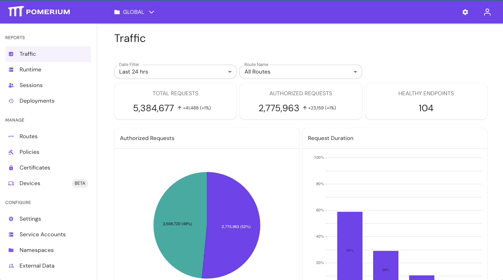
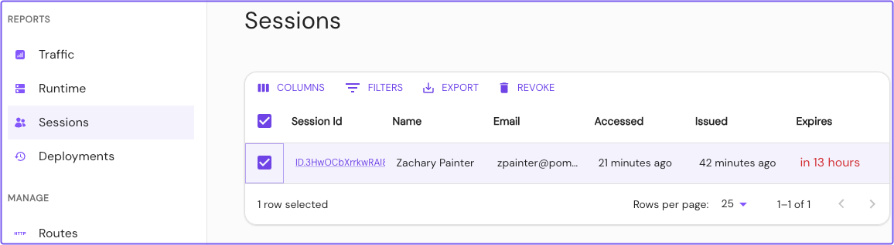
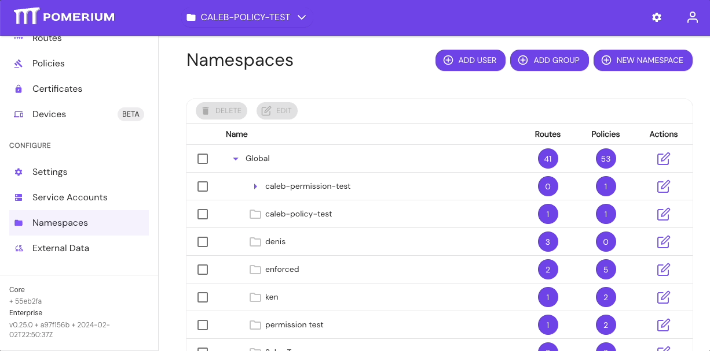
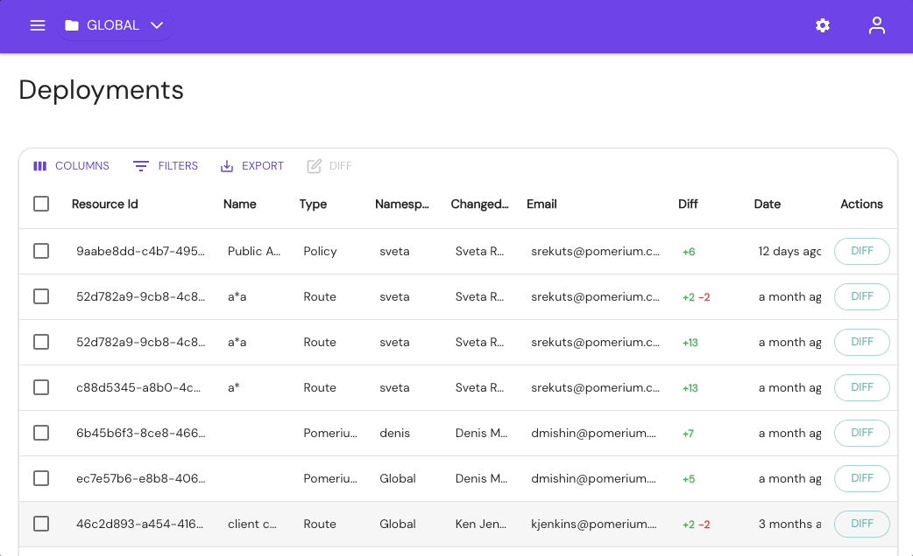
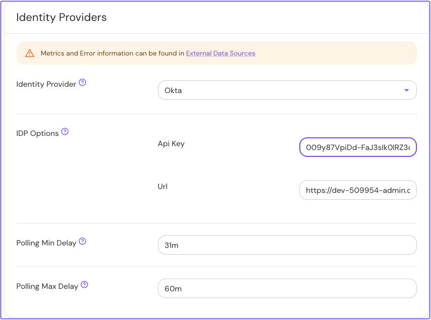
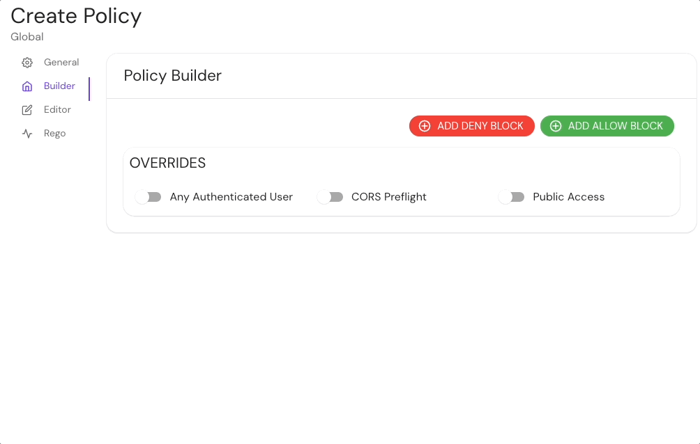

import ClearIcon from '@mui/icons-material/Clear';

# Pomerium Enterprise

Pomerium Enterprise is built on our open-source Pomerium Core offering. Pomerium Enterprise makes Pomerium easier to manage at scale, and adds additional functionality aimed at organizations with auditing, compliance, governance, and risk management needs.

## Pomerium Enterprise Features

Pomerium Enterprise comes with all the capabilities in Pomerium Core, plus the following features:

### Enterprise Console

The **Enterprise Console** provides a dashboard where you can view traffic and logs, manage routes and policies, import external data, configure global and namespaced settings, and more.

### Enterprise API

The **Enterprise API** helps you manage your configuration with your preferred programming language or infrastructure management tool. 

Everything that is manageable in the Enterprise Console can also be driven programmatically through the [Enterprise API](/docs/capabilities/enterprise-api).

### Session Management

The **Sessions** dashboard allows you to view and manage sessions within your organization. Admin members can export session data and revoke sessions in real time.

:::enterprise

Ready to upgrade to Pomerium Enterprise? [**Sign up**](https://www.pomerium.com/enterprise-sales/) today and get a **free 30-day trial**.

:::

### Namespaces and Self-Service

The **Namespaces** dashboard is where you configure user roles and permissions for routes, policies, and the Enterprise Console itself. Once you’ve configured a [Namespace](/docs/capabilities/namespacing), members of that namespace can self-manage access to the infrastructure they build from or depend on.

Pomerium Enterprise allows you to import groups defined by your identity provider. This allows you to build stable policies that don’t require adjustments as your company changes.

### Deployment History and Audit Logs

The **Deployments** dashboard allows you to view and export change and access logs from the Enterprise Console. Within the Deployments dashboard, you can select a change to view its logs. 

This way, you can review which users applied a change and when.

### Directory Sync

Pomerium Enterprise's **Directory Sync** feature allows you to import your identity provider's directory data. After a successful sync, you can use your internal groups and teams data when building policies.
  

### External Data Sources

In the **External Data** dashboard, you can import, view, and manage [external data sources](/docs/integrations). After a successful sync, you can use data unique to your organization to serve as context in your authorization policies.
  

## Pomerium Enterprise features comparison

| Features | Pomerium Core | Pomerium Enterprise |
| :--- | :--- | :--- |
| Enterprise Console | <ClearIcon /> |  |
| [Enterprise API](/docs/capabilities/programmatic-access) | <ClearIcon /> |  |
| [Session Management](/docs/capabilities/reports#sessions) | <ClearIcon /> |  |
| [Namespaces](/docs/capabilities/namespacing) | <ClearIcon /> |  |
| [Directory Sync](/docs/integrations) | <ClearIcon /> |  |
| [User Impersonation](/docs/capabilities/impersonation) | <ClearIcon /> |  |
| [Deployment History](/docs/capabilities/reports#deployments) | <ClearIcon /> |  |
| [Device Identity](/docs/capabilities/device-identity) | <ClearIcon /> |  |
| [Custom Branding](/docs/capabilities/branding) | <ClearIcon /> |  |
| [Service Accounts](/docs/capabilities/service-accounts) | <ClearIcon /> |  |
| [Metrics](/docs/capabilities/metrics) | <ClearIcon /> |  |
| [External Data Sources](/docs/integrations) | <ClearIcon /> |  |
| Identity-based Access |  |  |
| SSO Support |  |  |
| Declarative Authorization Policy |  |  |
| TCP Support |  |  |

## Next Steps

:::enterprise

Already upgraded to Pomerium Enterprise, but need some help setting up the Enterprise Console? 

The following docs can help:

- [**Install Pomerium Enterprise**](/docs/deploy/enterprise/install)
- [**Pomerium Enterprise Configuration**](/docs/deploy/enterprise/configure) 
- [**Pomerium Enterprise Quickstart**](/docs/deploy/enterprise/quickstart)

:::
