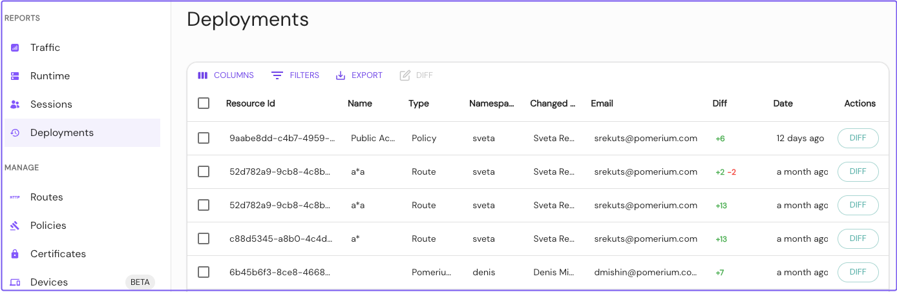
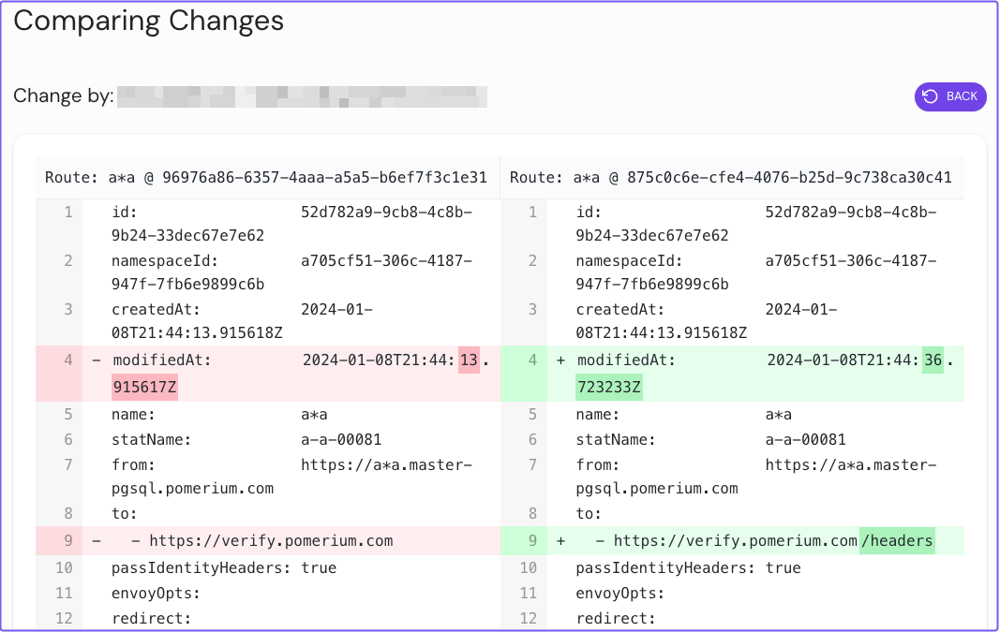

import ClearIcon from '@mui/icons-material/Clear';

# Pomerium Enterprise

Pomerium Enterprise is built on our open-source Pomerium Core offering. Pomerium Enterprise makes Pomerium easier to manage at scale, and adds additional functionality aimed at organizations with auditing, compliance, governance, and risk management needs.

## Key Pomerium Enterprise features

Pomerium Enterprise comes with all the capabiltiies in Pomerium Core. In addition to these capabilities, Pomerium Enterprise also provides the following features:

### Enterprise Console

The Enterprise Console dashboard is where you can view traffic and logs, manage routes and policies, import external data, and configure global and namespace settings.

### Enterprise API

Integrate Pomerium into your workflows by managing configuration from the programming language or infrastructure management tool of your choice. Everything that is manageable in the Enterprise Console can also be driven programmatically through the [Enterprise API](/docs/capabilities/programmatic-access).

### Session management

Quickly view who is logged in your infrastructure, with easy access to revoke sessions.

### Self-Service & Governance

Easily define who can control access to what areas of your infrastructure. Our [Namespaces](/docs/capabilities/namespacing) make it easy to allow teams to self-manage access to the infrastructure they build from or depend on.

[User roles](/docs/capabilities/namespacing#rbac-for-enterprise-console-users) are granted along Namespace hierarchy, with inheritance from parents.

Pomerium Enterprise uses teams and groups defined by your identity provider (**IdP**), so you can build stable policies that don't need to be adjusted as your company changes.

See [Self-Service Capabilities](/docs/capabilities/namespacing#self-service-capabilities) for more information.

### Deployment History and Audit Logs

View and export change and access logs from the Enterprise Console. Pomerium Enterprise gives you a complete view of who's using it and how access is adjusted.

## Pomerium Enterprise features comparison

| Features | Pomerium Core | Pomerium Enterprise |
| :--- | :--- | :--- |
| Enterprise Console | <ClearIcon /> |  |
| [Enterprise API](/docs/capabilities/programmatic-access) | <ClearIcon /> |  |
| [Session Management](/docs/capabilities/reports#sessions) | <ClearIcon /> |  |
| [Namespaces](/docs/capabilities/namespacing) | <ClearIcon /> |  |
| [Directory Sync](/docs/integrations) | <ClearIcon /> |  |
| [User Impersonation](/docs/capabilities/impersonation) | <ClearIcon /> |  |
| [Deployment History](/docs/capabilities/reports#deployments) | <ClearIcon /> |  |
| [Device Identity](/docs/capabilities/device-identity) | <ClearIcon /> |  |
| [Custom Branding](/docs/capabilities/branding) | <ClearIcon /> |  |
| [Service Accounts](/docs/capabilities/service-accounts) | <ClearIcon /> |  |
| [Metrics](/docs/capabilities/metrics) | <ClearIcon /> |  |
| [External Data Sources](/docs/integrations) | <ClearIcon /> |  |
| Identity-based Access |  |  |
| SSO Support |  |  |
| Declarative Authorization Policy |  |  |
| TCP Support |  |  |
