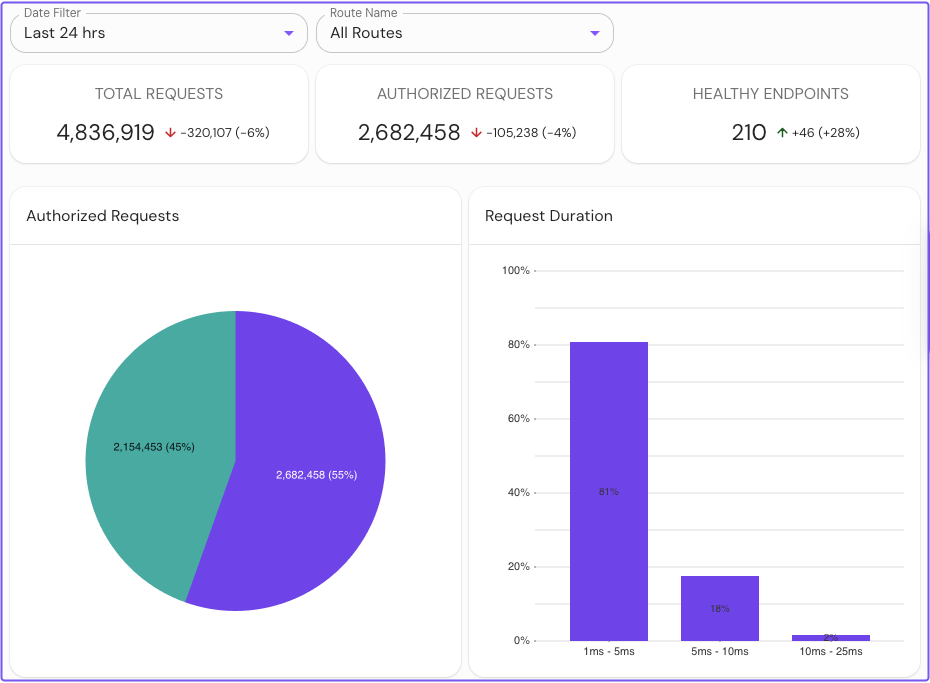
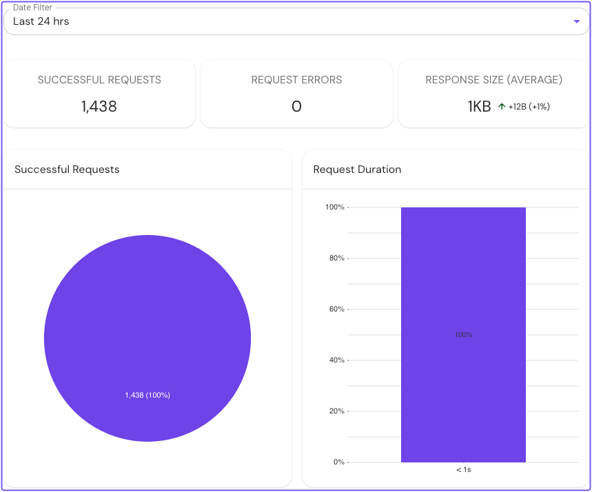

---
# cSpell:ignore tsdb

title: Configure Metrics in Pomerium Enterprise
sidebar_label: Metrics
description: Configure Prometheus metrics for the Pomerium Enterprise Console.
sidebar_position: 4
lang: en-US
keywords: [pomerium, enterprise pomerium, telemetry, metrics, prometheus]
---

# Configure Metrics in Pomerium Enterprise

Pomerium Enterprise uses Prometheus data to show traffic and monitoring views in the Console. You can either connect Enterprise to an external Prometheus instance or let Enterprise run an embedded Prometheus instance.

## Before You Start

To complete this guide, you need:

- A working [Pomerium Enterprise](/docs/deploy/enterprise) deployment
- A working [Pomerium Core](/docs/deploy/core) deployment
- Network access from Prometheus or the Enterprise Console to the metrics endpoints you configure

## Metrics Settings

Enterprise metrics use two different settings:

| Component | Setting | Purpose |
| :-- | :-- | :-- |
| Pomerium Core | [`metrics_address`](/docs/reference/metrics#metrics-address) / `METRICS_ADDRESS` | Exposes Core metrics for Prometheus to scrape. |
| Enterprise Console | [`metrics_addr`](/docs/deploy/enterprise/configure#metrics-addr) / `METRICS_ADDR` | Exposes Console metrics for Prometheus to scrape. |

For production deployments, expose metrics only on private network interfaces reachable by Prometheus or the Enterprise Console. These endpoints can include operational data you should not expose publicly.

## External Prometheus

Use external Prometheus when you already operate Prometheus or want to manage retention, alerting, and scraping yourself.

The example values below (`10.0.0.10`, `10.0.0.20`, `prometheus.example.com`) are placeholder hosts; substitute the private network addresses or DNS names that Prometheus reaches Core and the Console on. `metrics_address` and `metrics_addr` take a listen `host:port`; `prometheus_url` takes a Prometheus base URL.

1. In your Core configuration, set Core to listen for metrics on a private interface Prometheus can reach:

   ```yaml title="pomerium.yaml"
   metrics_address: 10.0.0.10:9091
   ```

1. In your Enterprise Console configuration, set the Console to listen for metrics on a private interface Prometheus can reach:

   ```yaml title="pomerium-enterprise.yaml"
   metrics_addr: 10.0.0.20:9092
   ```

1. Add both targets to Prometheus:

   ```yaml title="prometheus.yaml"
   scrape_configs:
     - job_name: 'pomerium-core'
       scrape_interval: 30s
       scrape_timeout: 5s
       static_configs:
         - targets: ['10.0.0.10:9091']

     - job_name: 'pomerium-enterprise'
       scrape_interval: 30s
       scrape_timeout: 5s
       static_configs:
         - targets: ['10.0.0.20:9092']
   ```

1. Reload Prometheus. The `/-/reload` endpoint requires Prometheus to be started with the `--web.enable-lifecycle` flag; without it the request returns `Lifecycle API is not enabled`. Restart Prometheus instead if you cannot enable the lifecycle API.

   ```bash
   curl -i -XPOST http://prometheus.example.com:9090/-/reload
   ```

1. Point the Enterprise Console at Prometheus:

   ```yaml title="pomerium-enterprise.yaml"
   prometheus_url: http://prometheus.example.com:9090
   ```

## Embedded Prometheus

Use embedded Prometheus when you want Enterprise to manage a local Prometheus process for a small deployment or test environment.

1. In your Core configuration, expose the Core metrics endpoint on a private address reachable by the Enterprise Console:

   ```yaml title="pomerium.yaml"
   metrics_address: 10.0.0.10:9091
   ```

1. In your Enterprise Console configuration, set a Prometheus data directory:

   ```yaml title="pomerium-enterprise.yaml"
   prometheus_data_dir: /var/lib/pomerium-console/tsdb
   ```

   The directory can be any absolute path the Console process can write to. Do not set `prometheus_url` when you use `prometheus_data_dir`; the embedded and external Prometheus modes are mutually exclusive. If you installed with OS packages, `/var/lib/pomerium-console/tsdb` matches the default service layout.

1. Optionally expose the embedded Prometheus server:

   ```yaml title="pomerium-enterprise.yaml"
   prometheus_listen_addr: 127.0.0.1:9090
   ```

## Verify Metrics

Restart Pomerium Core, the Enterprise Console, and Prometheus if you changed their configuration.

In the Enterprise Console, select **Traffic**. You should see route traffic metrics collected from your Pomerium deployment:



To view monitoring metrics for an external data source:

1. Select **External Data**.
1. Select an external data source.
1. Select the **Metrics** tab.

You should see monitoring data collected from the external data source record:


