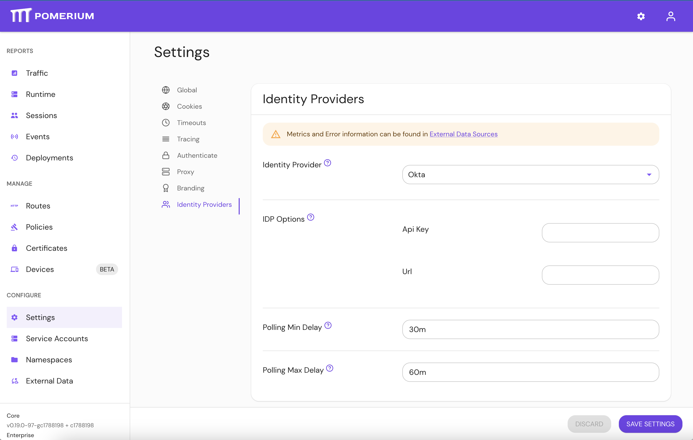

import UpgradeNotice from '@site/content/docs/admonitions/_upgrade-versions.mdx';

# Upgrading Pomerium Enterprise

Review the upgrade guide below before upgrading to the latest version of Pomerium Enterprise.

:::caution

<UpgradeNotice />

:::

## 0.24.0

### Before you upgrade

#### Breaking

- The deprecated `set_authorization_header` has been removed. If you relied on this setting to pass ID tokens to upstream applications, please update your instance to use [Set Request Headers](/docs/reference/routes/headers#set-request-headers) before upgrading.

## 0.23.0

### Before you upgrade

#### Breaking

- When using [`set_request_headers`](/docs/reference/routes/headers#set-request-headers), to prevent a ‘$’ character from being treated as the start of a variable substitution, you may need to replace it with ‘$$’.

## 0.22.0

### Before you upgrade

#### New

##### Hosted Authenticate Service

- [Hosted Authenticate Service](/docs/capabilities/hosted-authenticate-service.md) will now be used by default to handle single-sign-on. Pomerium hosts this service as a convenience to its users; no identity provider configuration or authenticate service url needs to be specified if the hosted authenticate service is used. [Self-hosted authenticate service](/docs/capabilities/self-hosted-authenticate-service.md) is still available for users who want to configure their own identity provider and authenticate service URL.

##### Wildcard From Routes

- [Wildcard From Routes](/docs/reference/routes/from#wildcard-from-routes) is a Beta support feature that allows you to define a wildcard route that points matching external routes to a single destination.

##### Better Memory Performance

- Internal [RDS changes](https://github.com/pomerium/pomerium/pull/4098) reduce memory consumption, offering a more consistent and linear memory performance, especially for environments with rapid configuration changes.

#### Fixes

v0.22.0 includes changes to device credential user references and external data source links in the Console.

#### Changed

v0.22.0 adds additional DNS Lookup Families and now requires a name when creating a Namespace.

## 0.21.0

### Before you upgrade

#### Breaking

##### Re-enroll devices

The [devices (beta)](/docs/capabilities/device-identity) data model had an internal change that is not forward compatible. Please re-register your enrolled devices and update their device IDs. You may need to update your existing policies as well.

#### Auto TLS

- You can autogenerate TLS certificates to secure communication between the Enterprise Console and the Databroker services with the `--derive-tls=domains` configuration setting. The `derive-tls` setting derives your CA from your `shared_secret` and generates TLS certificates to protect the Databroker gRPC endpoint.

#### Client TLS renegotiation

- You can renegotiate server-initiated TLS for upstream clusters with the new `tls_upstream_allow_renegotiation` configuration setting.

#### Fixes

- v0.21.0 includes various fixes to the Enterprise Console's UI, builds, gRPC calls, and more.

## 0.20.0

### Before You Upgrade

#### Groups & directory sync are managed from external data sources

IdP directory sync has been moved to be part of the [External Data Sources integration](/docs/integrations/), in order to provide unification with other external data sources, consolidate job scheduling and monitoring. Setting the below options in Pomerium config file would now result in an error. In Pomerium Enterprise Console, please navigate to Settings > Identity Provider and configure directory sync there.



- `idp_service_account`: use IdP provider specific options in the UI.
- `idp_refresh_directory_timeout`: use [Polling Min Delay](/docs/deploy/enterprise/configure#polling-minmax-delay).
- `idp_refresh_directory_interval`: replaced by [Polling Max Delay](/docs/deploy/enterprise/configure#polling-minmax-delay).
- `idp_qps`: not required, IdP providers adjust their qps rate.

Pomerium Core would only perform user authentication and session refresh with the IdP provider, and would not try to synchronize user details and groups, which is now part of [External Data Sources](/docs/integrations/). Please review your [identity provider's](/docs/identity-providers/) docs for instructions specific to your IdP (e.g. `Identity Providers` -> `Google` -> `Directory Sync (Enterprise)`).

## 0.19.0

### No changes required to upgrade

- This release has no breaking changes. Review the [v19 Changelog](/docs/deploy/enterprise/changelog#0190) for more information.

## 0.18.0

### Before You Upgrade

- When using [`external-data`](/docs/integrations/) the Databroker backend for Pomerium should be switched from Redis to [Postgres](/docs/internals/data-storage#postgres).

## 0.17.0

### Before You Upgrade

- The new `license-key` option is required for starting Pomerium Enterprise. Please contact your account team if you have not been issued one yet.

## 0.16.0

### Before You Upgrade

- The [`signing-key`](/docs/reference/signing-key) has been replaced with [`authenticate-service-url`](/docs/reference/authenticate-service-url). Instead of manually setting the signing key in the Enterprise Console to match the Authenticate Service, we specify the trusted URL of the Authenticate Service to pull the signing key from.

  The `signing-key` key will continue to work for existing configurations, but [device enrollment](/docs/capabilities/device-identity#new-enrollment) will not work until it is replaced by `authenticate-service-url`.

## 0.15.0

### Before You Upgrade

- `signing-key` is now a required option to improve request security from Pomerium Core. The value should match the one set in Pomerium Core. See the [signing key] reference page for more information on generating a key.
- `audience` is now a required option to improve request security from Pomerium Core. The value should match the Enterprise Console's external URL hostname, as defined in the [`from`](/docs/reference/routes) field in the Routes entry (not including the protocol).

[signing key]: /docs/reference/signing-key

### Helm Installations

- As of v0.15.0, All Helm charts have been consolidated to a single repository. Remove the `pomerium-enterprise` repo and upgrade from `pomerium`:

  ```bash
  helm repo remove pomerium-enterprise
  helm upgrade --install pomerium-console pomerium/pomerium-console --values=pomerium-console-values.yaml
  ```

- As noted above, `signing-key` must be shared between Pomerium and Enterprise. See the [Update Pomerium](/docs/guides/helm#update-pomerium) section of [Install Pomerium Enterprise in Helm](/docs/guides/helm) for more information.
