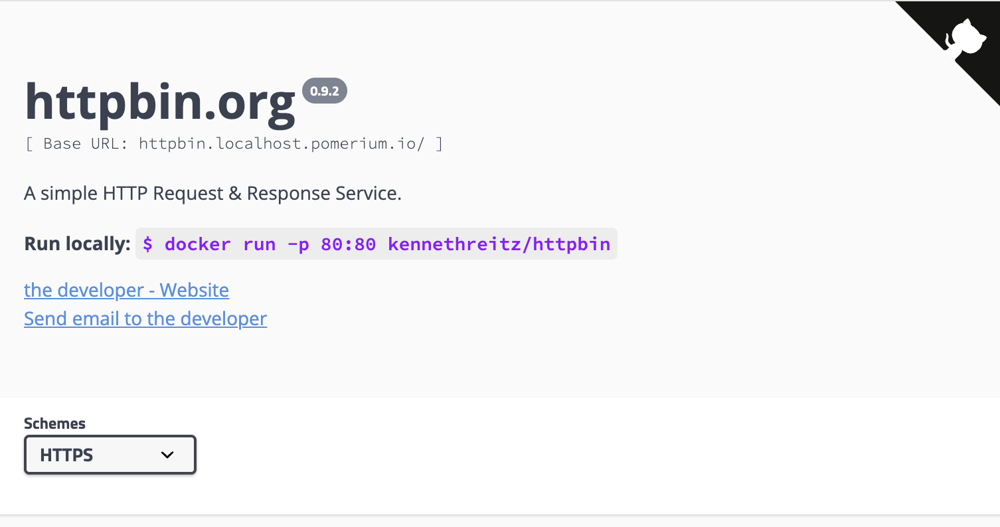

The Pomerium Ingress Controller now includes experimental support for the Kubernetes [Gateway API].

## Overview

Gateway API is an alternative to the Ingress API, aimed at standardizing more of the common functionality between different ingress implementations, and with a focus on role-based resource management.

Whether you already use the Gateway API for service networking in Kubernetes or are interested in using it for the first time with Pomerium, we'd love to hear from you! Please don't hesitate to reach out to support@pomerium.com or on the [discussion forum](https://discuss.pomerium.com).

To learn more about the Gateway API in general, see the official [Gateway API documentation][gateway api].

## Supported features

Ingress Controller now includes partial support for "Core" features from the Gateway API v1.2, for the "Gateway" and "HTTP" conformance profiles.

Some features are not supported:

- Gateway listeners must use the HTTPS protocol, not plain HTTP.

  (Plaintext HTTP is not supported because Pomerium uses session cookies for authentication, and it is not safe to transmit session cookies using unencrypted HTTP.)

- Currently [HTTPRoute](https://gateway-api.sigs.k8s.io/api-types/httproute/) is the only supported route type (GRPCRoute is not supported yet).

- [HTTPHeaderMatch](https://gateway-api.sigs.k8s.io/reference/spec/#gateway.networking.k8s.io%2fv1.HTTPHeaderMatch) is not supported yet.

- The [HTTPHeaderFilter](https://gateway-api.sigs.k8s.io/reference/spec/#gateway.networking.k8s.io%2fv1.HTTPHeaderFilter) `add` field is not supported. (You can overwrite a header value with the `set` field, but you cannot append to an existing header value.)

### Pomerium-specific extensions

Pomerium defines a PolicyFilter CRD for setting the authorization policy for a particular route. For example:

```yaml
apiVersion: gateway.pomerium.io/v1alpha1
kind: PolicyFilter
metadata:
  name: allow-internal
spec:
  ppl: |
    allow:
      and:
        - domain:
            is: your-company-domain.com
```

See [Pomerium Policy Language](/docs/capabilities/ppl) for complete details about policy syntax.

:::caution

Pomerium will deny access to any route without an explicit authorization, so you must set a PolicyFilter on every route you define for use with Pomerium.

:::

## Installation

To install the Pomerium Ingress Controller with support for Gateway API:

1. First install the Gateway API CRDs:

   ```sh
   kubectl apply -f https://github.com/kubernetes-sigs/gateway-api/releases/download/v1.2.0/standard-install.yaml
   ```

1. Then install the Pomerium Ingress Controller using the `gateway-api` kustomization:

   ```sh
   kubectl apply -k github.com/pomerium/ingress-controller/config/gateway-api\?ref=v0.28.0
   ```

   This installs and configures the Ingress Controller, and adds a [GatewayClass](https://gateway-api.sigs.k8s.io/concepts/api-overview/#gatewayclass) named `pomerium-gateway` for use with the Gateway API.

1. You will also need to set up a [global Pomerium configuration](/docs/deploy/k8s/configure). This is a minimal example for use with Gateway API:

   ```yaml title="pomerium-global.yaml"
   apiVersion: ingress.pomerium.io/v1
   kind: Pomerium
   metadata:
     name: global
   spec:
     secrets: pomerium/bootstrap
   ```

   Deploy with `kubectl apply -f pomerium-global.yaml`.

   :::info

   You don't need to include any certificates in this global configuration when usnig the Gateway API, as certificates are instead defined on individual Gateway listeners.

   :::

## Example usage

Let's look at how you can configure a route and policy using the Gateway API.

1. We'll need a TLS certificate for the domain to be used with this route. (For testing purposes you could generate a certificate using [mkcert]. In production you may want to use a solution like [cert-manager](https://cert-manager.io/docs/usage/gateway/).)

   For this example we'll assume we have a wildcard certificate for `*.localhost.pomerium.io`, and we'll create a Secret to store this certificate:

   ```bash
   kubectl create secret tls pomerium-wildcard-tls \
     --cert=_wildcard.localhost.pomerium.io.pem \
     --key=_wildcard.localhost.pomerium.io-key.pem
   ```

1. Next we'll set up a Gateway that uses this certificate:

   ```yaml title="pomerium-gateway.yaml"
   apiVersion: gateway.networking.k8s.io/v1
   kind: Gateway
   metadata:
     name: localhost-pomerium-io
   spec:
     gatewayClassName: pomerium-gateway
     listeners:
       - name: https
         hostname: '*.localhost.pomerium.io'
         protocol: HTTPS
         port: 443
         tls:
           mode: Terminate
           certificateRefs:
             - name: pomerium-wildcard-tls
   ```

   Deploy with `kubectl apply -f pomerium-gateway.yaml`.

1. We'll also need a service. Here we'll use httpbin as an example:

   ```yaml title="httpbin-service.yaml"
   apiVersion: v1
   kind: Service
   metadata:
     name: httpbin
   spec:
     selector:
       app: httpbin
     ports:
       - port: 80
         targetPort: 80
         name: http
   ---
   apiVersion: apps/v1
   kind: Deployment
   metadata:
     name: httpbin-deployment
     labels:
       app: httpbin
   spec:
     replicas: 1
     selector:
       matchLabels:
         app: httpbin
     template:
       metadata:
         labels:
           app: httpbin
       spec:
         containers:
           - name: httpbin
             image: docker.io/kennethreitz/httpbin
             ports:
               - containerPort: 80
   ```

   Deploy with `kubectl apply -f httpbin-service.yaml`.

1. For Pomerium to grant access to this service we'll also need to define an authorization policy:

   ```yaml title="allow-by-email.yaml"
   apiVersion: gateway.pomerium.io/v1alpha1
   kind: PolicyFilter
   metadata:
     name: allow-by-email
   spec:
     ppl: |
       allow:
         and:
           - email:
               is: your-email-here@example.com
   ```

   Be sure to replace `your-email-here@example.com` with your actual email address, and then run `kubectl apply -f allow-by-email.yaml`.

1. Finally, we can define a route to the example service using the gateway and policy:

   ```yaml title="httpbin-route.yaml"
   apiVersion: gateway.networking.k8s.io/v1
   kind: HTTPRoute
   metadata:
     name: httpbin-route
   spec:
     parentRefs:
       - name: localhost-pomerium-io
     hostnames:
       - 'httpbin.localhost.pomerium.io'
     rules:
       - backendRefs:
           - name: httpbin
             port: 80
         filters:
           - type: ExtensionRef
             extensionRef:
               group: gateway.pomerium.io
               kind: PolicyFilter
               name: allow-by-email
   ```

   Deploy with `kubectl apply -f httpbin-route.yaml`.

Now, if you navigate to the route hostname in your browser (https://httpbin.localhost.pomerium.io in the example above), you should be prompted to sign in to access the route. If you sign in, and the account you use matches the email address from the policy spec, you should be granted access to the httpbin service:



[mkcert]: https://github.com/FiloSottile/mkcert
[gateway api]: https://gateway-api.sigs.k8s.io/
