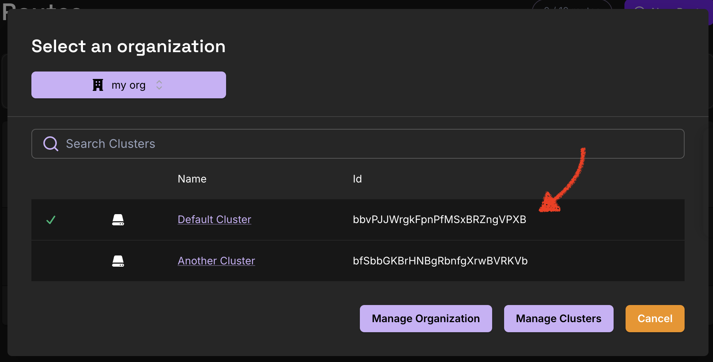

import TabItem from '@theme/TabItem';
import Tabs from '@theme/Tabs';

# Sync to Pomerium Zero / Enterprise <Since version="v0.33"/>

You can now bring your Kubernetes-derived configuration into Pomerium Zero or Pomerium Enterprise.

## Overview

The Pomerium Ingress Controller configures Pomerium routes and policies based on Kubernetes Ingress or Gateway API objects. By default, this configuration happens internally, within the Ingress Controller itself.

However, you can optionally configure Ingress Controller to sync this configuration to Pomerium Zero or Pomerium Enterprise. This allows you to mix and match different sources of configuration. You could define some routes using Ingress objects, some directly in the console web UI, and even some using the [Pomerium Terraform](/docs/deploy/terraform) provider.

## How to configure

<Tabs queryString="destination">
<TabItem value="zero" label="Pomerium Zero">

You will need:

- An existing Pomerium Zero deployment (see [Install Pomerium Zero](/docs/deploy/cloud/install)) in Kubernetes.
- An [API user](/docs/internals/management-api-zero#get-api-user-token) token, which will allow Ingress Controller to manage configuration in Pomerium Zero.

Ingress Controller will run alongside your existing Pomerium Zero deployment.

First, save the API user token into a Kubernetes secret:

```
kubectl create secret generic -n pomerium pomerium-zero-api-user \
  --from-literal=token=<YOUR-API-TOKEN-HERE>
```

You will also need to determine the ID of the Pomerium Zero cluster you want to use. In the Pomerium Zero console, click on the cluster selector in the header bar, and note the cluster ID:



Next, deploy Ingress Controller: create a new directory (say, `ic-zero/`) and save the following kustomize configuration. On the highlighted line, be sure to replace the cluster ID from this example with your real cluster ID.

```yaml title="ic-zero/kustomization.yaml"
namespace: pomerium
resources:
  - https://github.com/pomerium/ingress-controller/config/default?ref=main
patches:
  - patch: |-
      - op: replace
        path: /spec/template/spec/containers/0/args/0
        value: controller
      - op: add
        path: /spec/template/spec/containers/0/env/-
        value:
          name: POMERIUM_ZERO_API_USER
          valueFrom:
            secretKeyRef:
              name: pomerium-zero-api-user
              key: token
      - op: add
        path: /spec/template/spec/containers/0/args/-
        value: '--sync-api-url=https://console.pomerium.app'
      - op: add
        path: /spec/template/spec/containers/0/args/-
        //highlight-next-line
        value: '--sync-api-namespace-id=bbvPJJWrgkFpnPfMSxBRZngVPXB'
      - op: add
        path: /spec/template/spec/containers/0/args/-
        value: '--sync-api-token=$(POMERIUM_ZERO_API_USER)'
    target:
      group: apps
      version: v1
      kind: Deployment
      name: pomerium
```

Again, make sure to substitute your own cluster ID on the highlighted line above.

Now, apply this configuration to start Ingress Controller:

```
kubectl apply -k ic-zero/
```

</TabItem>

<TabItem value="enterprise" label="Pomerium Enterprise">

To deploy Ingress Controller syncing to Pomerium Enterprise, start with this configuration:

```
kubectl apply -k github.com/pomerium/documentation//k8s/ic-console\?ref=main
```

This configures deployments for both the Pomerium Ingress Controller and Pomerium Enterprise. It also configures Pomerium Enterprise to generate a "bootstrap" service account token, which Ingress Controller will use to authenticate to it.

In order to use the service account token, Ingress Controller will need the shared secret passed in as the API token. Currently this needs to be created as a separate secret:

```
kubectl get secret -n pomerium bootstrap -o jsonpath='{.data.shared_secret}' | \
  base64 -d | \
  kubectl create secret generic -n pomerium api-token --from-file=token=/dev/stdin
```

Then complete the rest of the Pomerium Enterprise [setup instructions](/docs/deploy/enterprise/install?method=kustomize#create-cloudsmith-directory-secret), starting from the step "Create Cloudsmith Directory Secret".

</TabItem>
</Tabs>

## Details

Once the Pomerium Ingress Controller is running, you should start to see any routes you create using Ingress or HTTPRoute objects appear in the Pomerium Zero console. In the console UI edit pages, these are marked with a small "ingress-controller" chip.

### Naming

Routes created from an Ingress object will be named like `<namespace>-<ingress name>-<hostname>`. For example, an Ingress `foo` in the `default` namespace with hostname `bar.example.com` will create a corresponding Pomerium route named `default-foo-bar-example-com`.

For a single Ingress object with multiple rules, Ingress Controller will create multiple routes (one route for each rule).

For each Ingress object, Ingress Controller will create a corresponding policy entity, named like `<namespace>-<ingress name>`.

Certificates created from Kubernetes Secrets will be named like `<namespace>-<secret name>`.

## Troubleshooting

#### Changes synced to Pomerium Zero do not take effect right away

Make sure the "Auto-apply changesets" option is enabled in the Pomerium Zero settings. Look for Settings → Advanced → Auto-apply changesets. Otherwise, each change must be manually approved before it will take effect.

#### Attempting to delete a Kubernetes object fails

When the Pomerium Ingress Controller syncs configuration based on a Kubernetes object, it attaches a finalizer to that object. This way, when the object is deleted, the Ingress Controller still has the information it needs to be able to delete the corresponding entity from Pomerium Zero or Pomerium Enterprise. However, if some error prevents this deletion from succeeding, the finalizer keeps the object around until the sync does succeed.

However, if there is some unrecoverable sync error, you can manually `kubectl edit` the corresponding object and delete the finalizer `api.pomerium.io/finalizer`. This may leave a "stale" entity in Pomerium Zero or Pomerium Enterprise.

#### Pomerium Enterprise and duplicate TLS certificates

When syncing to Pomerium Enterprise, if the same TLS certificate appears in multiple different Kubernetes secrets, Ingress Controller may be unable to sync objects referencing one or more of these secrets.

You will see the error message `certificate overlaps with existing certificates` in this case. To avoid this problem, please ensure that you do not have the same certificate referenced in multiple Kubernetes secrets.

Note that if a certificate is provided to Pomerium, it can be used for any Pomerium route.
