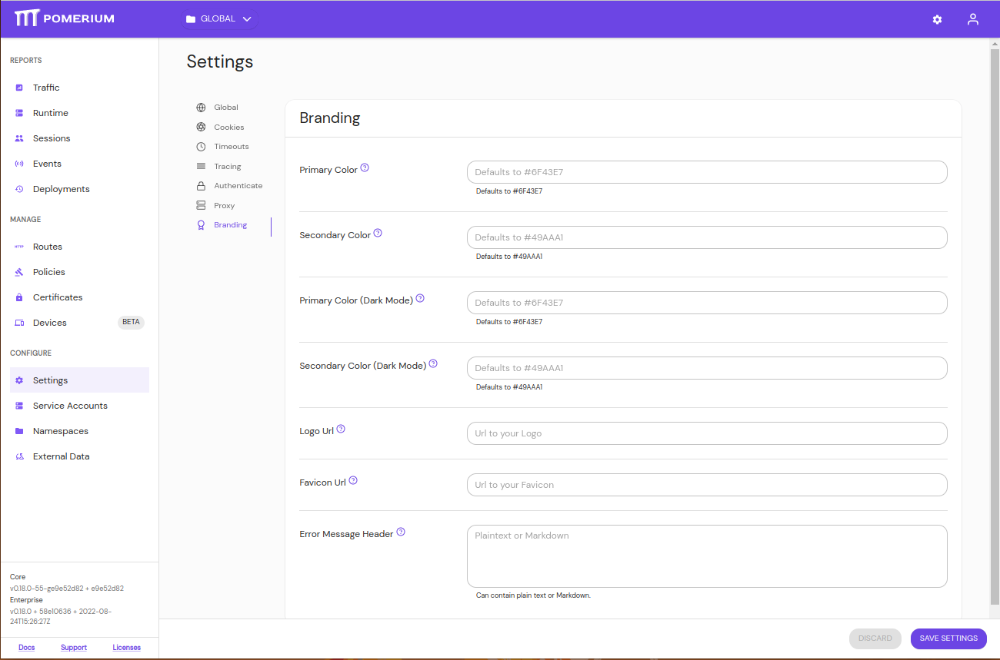
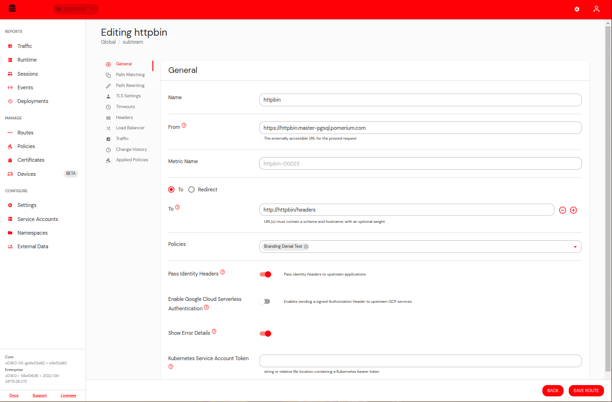
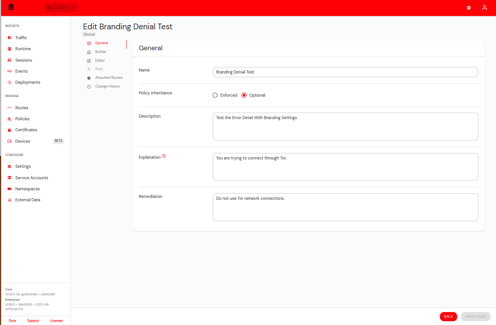

Most of the Branding settings are located in the Branding Tab of the main Settings Page.

There is also a setting to enable Error Details on Edit Route's General Tab.

Policies have two new fields, explanation and remediation.

Explanation is an optional short description of why the user would have been denied. Likewise, remediation is an optional field to cover how the user can self-remediate their state. Oftentimes, this will be a link to your internal help desk support site or knowledge base repo.

