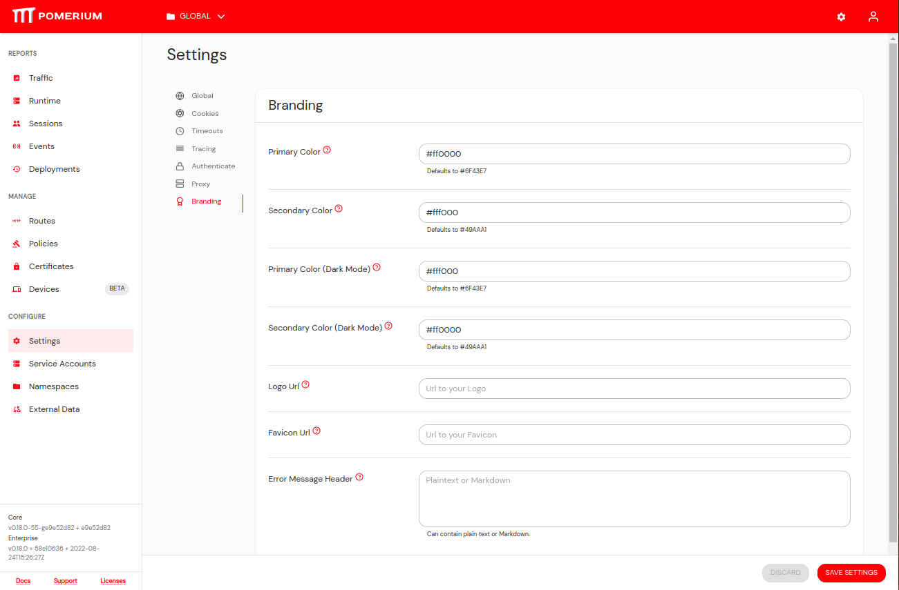
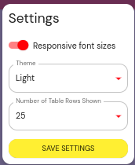
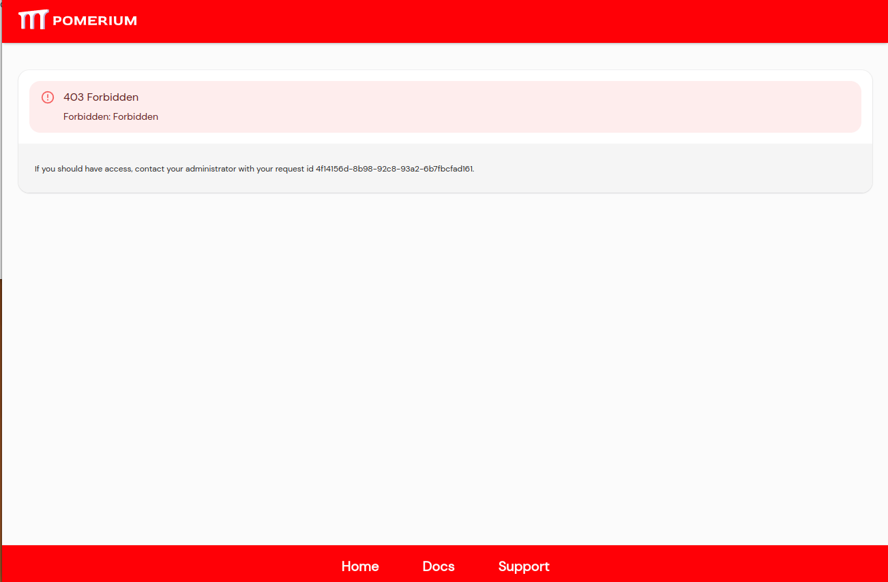
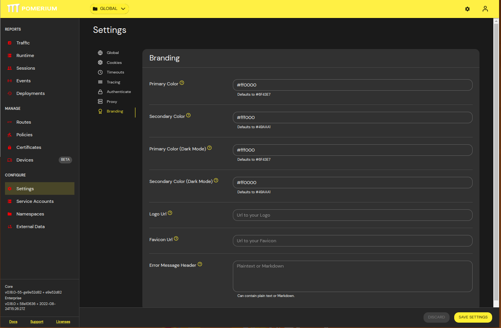

Adding a [hex code](https://color.adobe.com/create/color-wheel) to the Primary Color setting will affect the majority of the theming on the console.
For more details on how the types of colors will impact the look and feel of Pomerium, see [material ui](https://material.io/resources/color/#!/?view.left=0&view.right=0)'s color documentation.

There is also a secondary color that is used for a few things such as certain button colors.

Choosing colors also affects the User Info and Error Pages that the Open Source serves.

You can also set different colors when user's choose dark mode.

