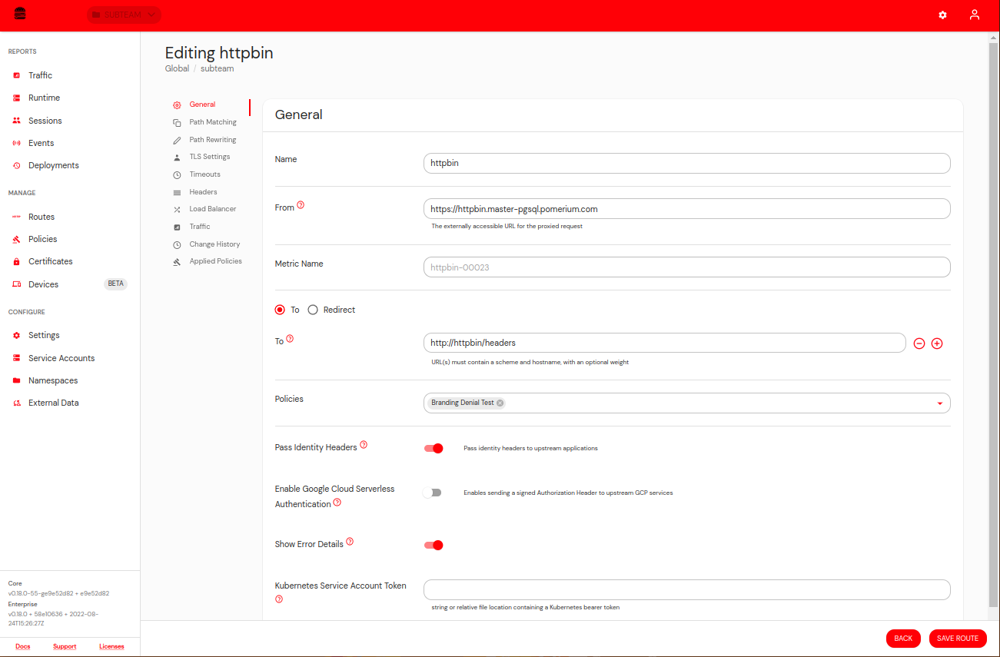
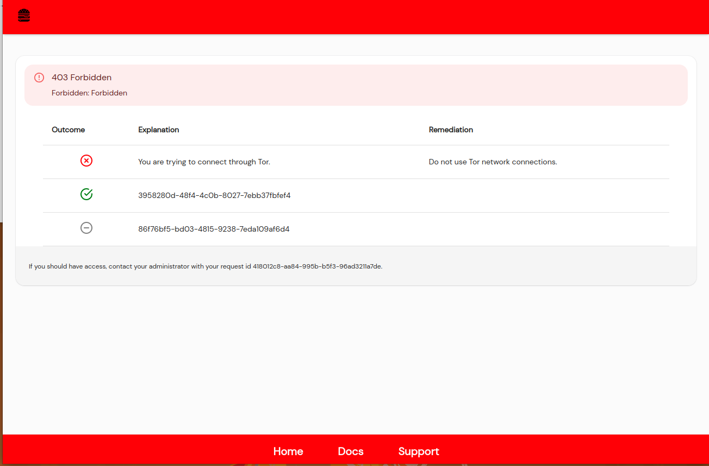
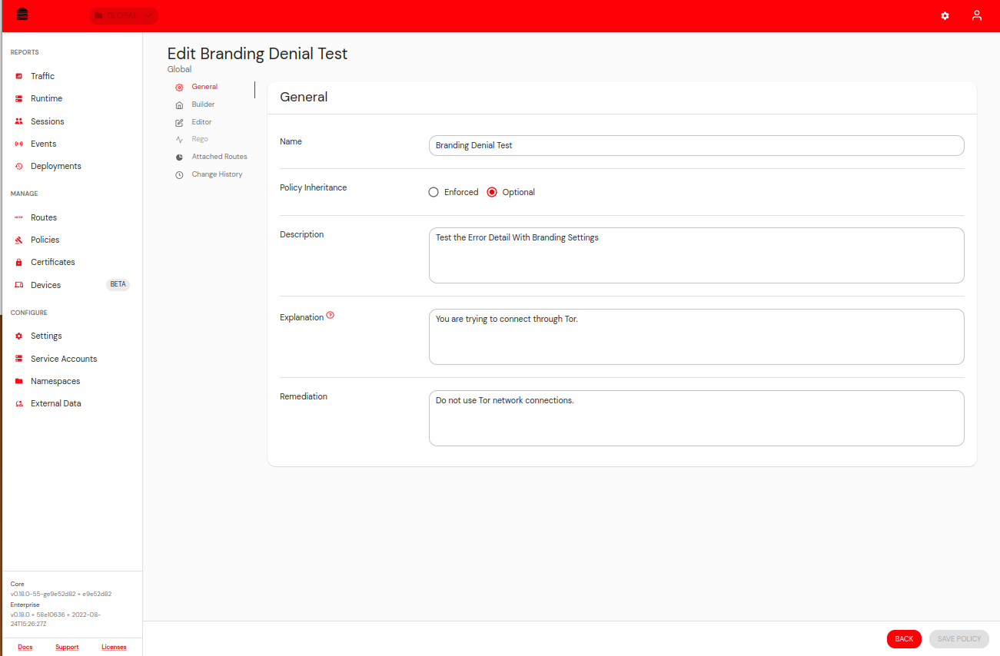
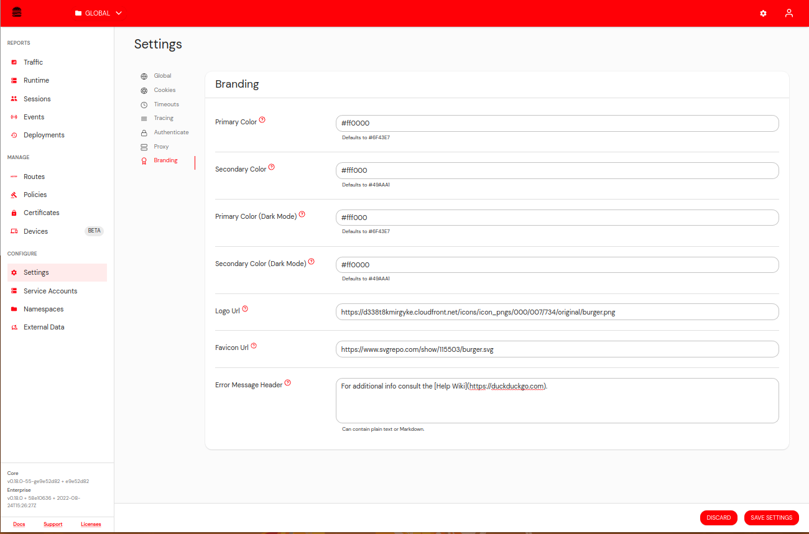
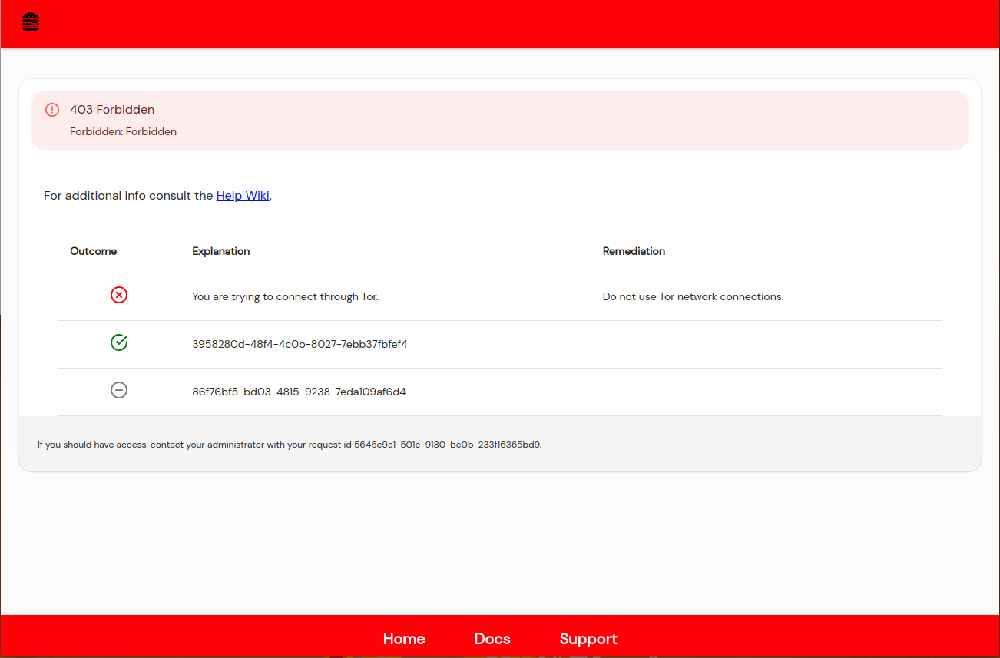

It is possible to customize the error messages displayed on 403 unauthorized pages.

This feature is enabled on a per Route basis by toggling the setting in the General Tab of the Route settings.

Error Message will appear similar to this example.

Policies without an explanation or remediation field will show the policy ID.

If and explanation or remediation are added to the policy they will show up in the error details.

You can additionally add a Header paragraph that supports markdown to all error pages in the General Settings (same place you add colors and logos).

You can see the link added to the Error Page.
