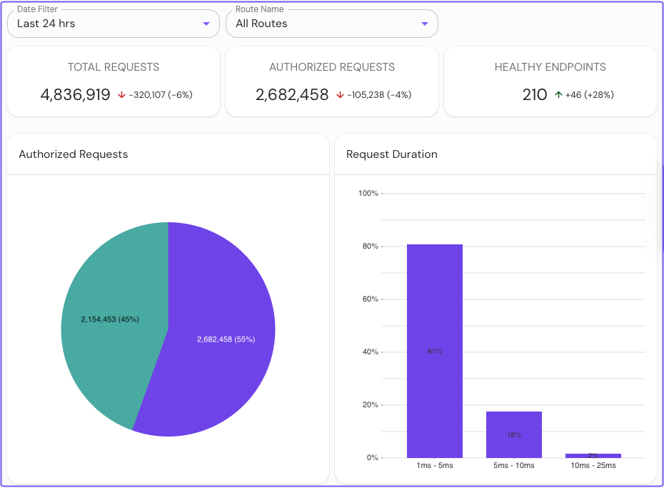
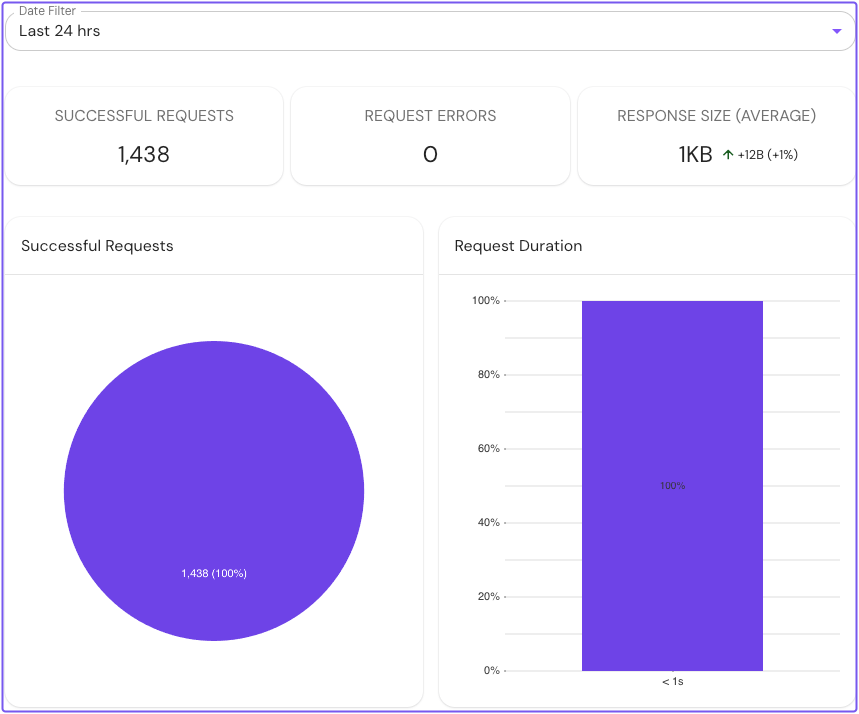

---
# cSpell:ignore XPOST tsdb

title: Configure Metrics in Pomerium Enterprise
sidebar_label: Metrics
description: Learn how to configure Prometheus to power metrics in the Pomerium Enterprise web console.
lang: en-US
keywords: [pomerium, enterprise pomerium, telemetry, metrics, prometheus]
toc_max_heading_level: 2
---

import Tabs from '@theme/Tabs';
import TabItem from '@theme/TabItem';

Learn how to configure [Prometheus](https://prometheus.io/) as a metrics collection backend in Pomerium Enterprise.

## Overview

Pomerium Enterprise uses Prometheus to collect observability and monitoring metrics from your Pomerium deployment. To set up Pomerium to work with Prometheus, you must configure either an external or embedded Prometheus instance.

This guide explains what the external and embedded Prometheus options are, and how to configure them.

## Before you start

To complete this guide, you need:

- [Pomerium Enterprise](/docs/enterprise)
- [Pomerium Core](/docs/core)

This guide runs both Pomerium instances on localhost (`127.0.0.1`).

## Configure Pomerium

In your Pomerium Enterprise configuration file, define the `metrics_addr` key to a network interface or port:

```yaml title="pomerium-enterprise.yaml"
metrics_addr: 127.0.0.1:9092
```

This setting exposes internal metrics within the Enterprise web console. If not defined, Pomerium will expose `127.0.0.1` on port `:9092` by default.

## Configure Prometheus

<Tabs>
<TabItem label="External Prometheus" value="external-prometheus">

### External Prometheus

An external Prometheus instance runs as its own process separate from Pomerium. Use this option if you prefer to configure and maintain Prometheus yourself.

The steps below show you how to connect Prometheus to Pomerium Core and Pomerium Enterprise.

:::tip

For production deployments, we suggest using a dedicated Prometheus instance.

:::

1. In your Prometheus configuration file, add [instances](https://prometheus.io/docs/concepts/jobs_instances/#jobs-and-instances) for Pomerium and Pomerium Enterprise:

   ```yaml title="prometheus.yaml"
   - job_name: 'Pomerium'
      scrape_interval: 30s
      scrape_timeout: 5s
      static_configs:
         - targets: ['127.0.0.1:9091']
   - job_name: 'Pomerium Enterprise'
      scrape_interval: 30s
      scrape_timeout: 5s
      static_configs:
         - targets: ['127.0.0.1:9092']

   ```

1. [Reload](https://prometheus.io/docs/prometheus/latest/configuration/configuration/#configuration) the Prometheus configuration:

   ```bash
   curl -i -XPOST path.to.prometheus:port/-/reload
   ```

1. In your Pomerium Enterprise configuration file, define the [`prometheus_url`](/docs/enterprise/configure#prometheus-url) key to point to your Prometheus instance. The example below uses port 9090, the default [Prometheus port](https://prometheus.io/docs/introduction/first_steps/).

   ```yaml title="pomerium-enterprise.yaml"
   prometheus_url: http://192.168.122.50:9090
   ```

1. In your Pomerium configuration file, define the [`metrics_address`](/docs/reference/metrics#metrics-address) key to a network interface or port. In the example below, Pomerium provides metrics at port `9091` on an IP address reachable by Pomerium Enterprise:

   ```yaml title="pomerium.yaml"
   metrics_address: 127.0.0.1:9091
   ```

   :::note

   If you're running Pomerium Enterprise in a distributed environment where the IP address is unknown at the time of deployment, you can use the resolvable fully qualified domain name (FQDN) of the Pomerium host (for example, `pomerium0.internal.example.com`). Or, you can override this key with the [`METRICS_ADDRESS`](/docs/reference/metrics#metrics-address) environment variable.

   We do not recommend exposing this endpoint to public traffic as it can contain potentially sensitive information.

   :::

</TabItem>
<TabItem label="Embedded Prometheus" value="embedded-prometheus">

### Embedded Prometheus

Pomerium Enterprise supports an embedded Prometheus instance that you configure only in Pomerium. Use this option if you don't want to maintain an external Prometheus instance, or if you're testing metrics.

To configure an embedded Prometheus instance, add the [`prometheus_data_dir`](/docs/enterprise/configure#prometheus-data-dir) key and file path in your Pomerium Enterprise configuration file:

```yaml title="pomerium-enterprise.yaml"
prometheus_data_dir: /var/lib/pomerium-console/tsdb
```

:::note

The directory path can be any location that you have permissions to write to. This example uses the default location created if you install Pomerium Enterprise with the [OS Packages](/docs/enterprise/install#install-pomerium-enterprise) option.

:::

</TabItem>
</Tabs>

## Test the configuration

To view metrics collected by Prometheus, you must restart the Pomerium and Pomerium Enterprise services.

In the Pomerium Enterprise web console, select **Traffic**. You should see route traffic metrics collected from your Pomerium deployment:

    

To view monitoring metrics for an external data source:

1. Select **External Data**.
1. Select an external data source.
1. Select the **Metrics** tab. You should see monitoring data collected from the external data source record:

   
