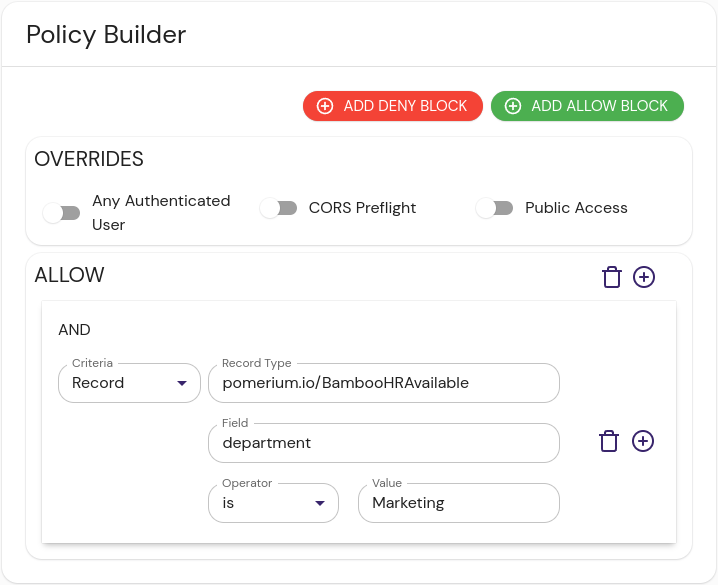

import Tabs from '@theme/Tabs';
import TabItem from '@theme/TabItem';

The BambooHR integration provides integration with HR data such as group memberships, employment status, out of the office, location, etc.

## Install

1. Create new BambooHR API key by navigating to **Your profile** → **API Keys**, and adding a new API Key. 

1. In order to correctly parse dates returned by BambooHR API you will need provide a time zone - either an `UTC` or [IANA Time Zone] database name, i.e. `America/New_York`. 

<Tabs>
<TabItem value="compose" label="Docker Compose">

These instructions assume a local testing environment using [Docker Compose]. Adjust as needed for your deployment environment.

1. Add the datasource docker image to Docker Compose:

  ```yaml showLineNumbers
  version: "3"
  services:
    bamboohr:
      image: docker.cloudsmith.io/pomerium/datasource/datasource:main
      command:
        - bamboohr
        - --bamboohr-api-key=$YOUR_API_KEY
        - --bamboohr-subdomain=$YOUR_BAMBOOHR_SUBDOMAIN
        - --bamboohr-time-zone=America/New_York
        - --address=:8080
      container_name: bamboohr
      restart: always
      expose:
        - 8080
  ```

1. Bring up the new container.

</TabItem>
<TabItem value="binary" label="Binary">

These instructions assume a local testing environment. Adjust as needed for your deployment environment.

1. Download the latest [release] of the [Pomerium datasource] project and extract it.

1. Change directory and run the binary:

  ```sh
  cd pomerium-datasource-*
  ./pomerium-datasource bamboohr --bamboohr-api-key=$YOUR_API_KEY --bamboohr-subdomian=$YOUR_BAMBOOHR_SUBDOMAIN --bamboohr-time-zone=America/New_York
  ```

  The output should resemble:

  ```sh
  {"level":"info","message":"ready"}
  ```

</TabItem>
</Tabs>

## Configure Configure External Data Source

BambooHR data connector exposes two API endpoints: 

- `/employees/all` returns all employees 
- `/employees/available` returns employees that are not currently out of the office due to vacation or other leave reasons. 

To create new external data record:

1. In the Pomerium Enterprise Console, navigate to **CONFIGURE** → **External Data** and click **+ ADD EXTERNAL DATA SOURCE**.

1. Fill out the following fields:

  | Field       | Content                                    | Notes                                                                             |
  | :---------- | :----------------------------------------- | :-------------------------------------------------------------------------------- |
  | URL         | `http://bamboohr:8080/employees/available` | Adjust for the endpoint you'll write policies against.                            |
  | Record type | `pomerium.io/BambooHRAvailable`            | As above, adjust to somethinglike pomerium.io/BambooHRAll for the other endpoint. |
  | Foreign Key | `user.email`                               | Pomerium uses the users's email to associate IdP and Bamboo user entries.         |

1. Click **SAVE EXTERNAL DATA SOURCE**.

1. Define a new policy. The example policy below only allows access to the persons in the *Marketing* department and only when they are not on vacation.

  <Tabs>
  <TabItem value="builder" label="Builder">

  

  </TabItem>
  <TabItem value="editor" label="Editor">

  ```yaml showLineNumbers
  allow:
    and:
      - record:
          field: department
          is: Marketing
          type: pomerium.io/BambooHRAvailable
  ```

  </TabItem>
  </Tabs>

## Reference

The BambooHR data source provides the following record details; see [BambooHR Field Reference] for details.

- `department`
- `division`
- `status`
- `first_name`
- `last_name`
- `country`
- `state`

[datasource]: https://github.com/pomerium/pomerium
[Docker Compose]: https://docs.docker.com/compose/
[IANA Time Zone]: https://www.iana.org/time-zones
[BambooHR Field Reference]: https://documentation.bamboohr.com/docs/list-of-field-names
[release]: https://github.com/pomerium/datasource/releases
[Pomerium datasource]: https://github.com/pomerium/datasource