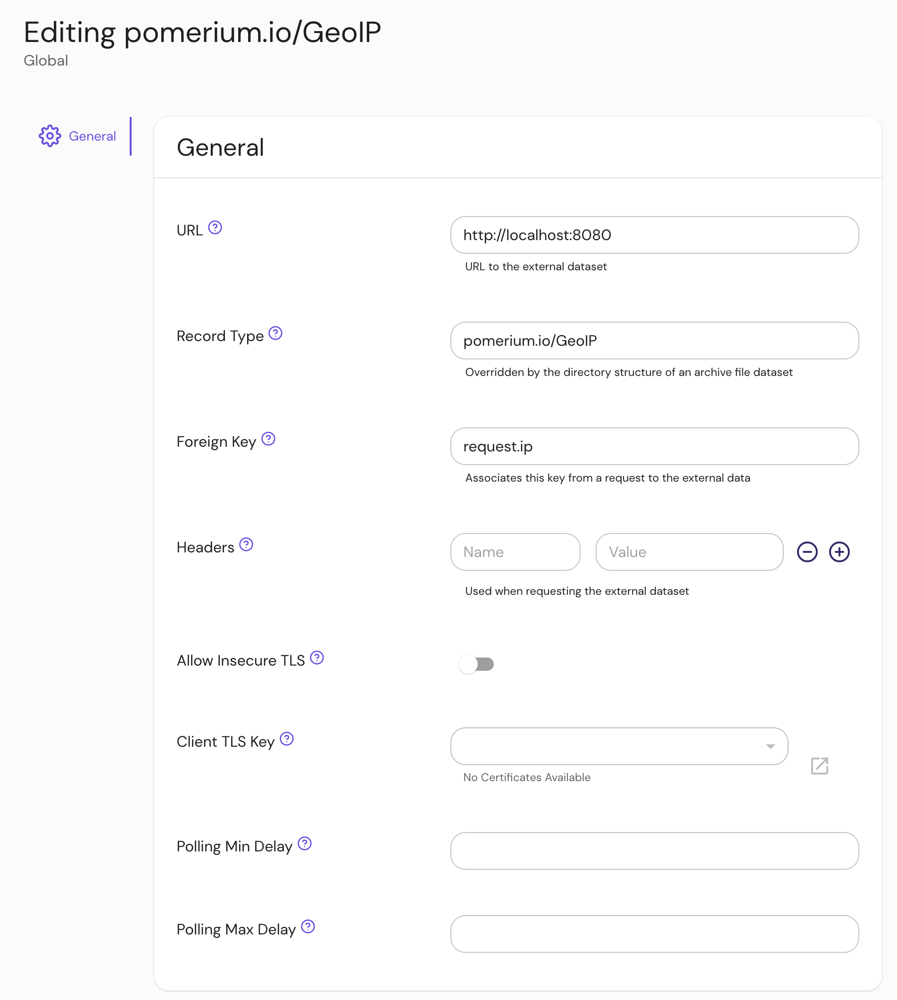

import Tabs from "@theme/Tabs";
import TabItem from "@theme/TabItem";

The GeoIP integration provides provides a list of IP address ranges and their country of origin:

```json tittle="Example"
[
  {
    "$index": { "cidr": "1.0.0.0/24" },
    "id": "1.0.0.0/24",
    "country": "US",
    "state": "",
    "city": "",
    "zip": "",
    "timezone": ""
  },
  {
    "$index": { "cidr": "1.0.1.0/24" },
    "id": "1.0.1.0/24",
    "country": "CN",
    "state": "",
    "city": "",
    "zip": "",
    "timezone": ""
  }
]
```

## Install

These instructions assume a local testing environment using [Docker Compose]. Adjust as needed for your deployment environment.

First download the IP2Location CSV GeoIP database from [ip2location.com].

Next start the datasource docker image:

```yaml title="docker-compose.yaml"
services:
  ip2location:
    image: docker.cloudsmith.io/pomerium/datasource/datasource:main
    command:
      - ip2location
      - /var/ip2location.csv.zip
    ports:
      - 8080:8080
    volumes:
      - ${PWD}/IP2LOCATION-LITE-DB1.CSV.ZIP:/var/ip2location.csv.zip
```

## Configure External Data Source

Create an external data source:



## Configure Pomerium Enterprise Console

An example policy to restrict access to IP addresses within the United States would look something like this:

<Tabs>
<TabItem value="builder" label="Builder">


</TabItem>
<TabItem value="editor" label="Editor">

```yaml showLineNumbers
allow:
  and:
    - record:
        field: country
        is: US
        type: pomerium.io/GeoIP
```

</TabItem>
</Tabs>

This policy looks at the `country`

## Reference

[Docker Compose]: https://docs.docker.com/compose/
[ip2location.com]: https://www.ip2location.com/
