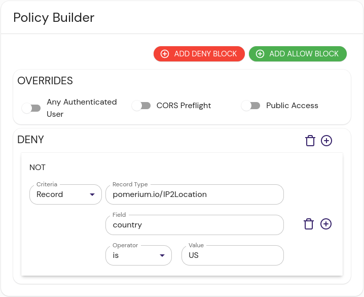

import Tabs from '@theme/Tabs';
import TabItem from '@theme/TabItem';

The $EXT_DATA_PROVIDER integration provides {{Fill me in with content specific to this data provider}}.

This dataset provides a list of IP address ranges and their country of origin, according to ARIN:

```json tittle="Example"
{"$index":{"cidr":"1.0.0.0/24"},"id":"1.0.0.0/24","country":"US","state":"","city":"","zip":"","timezone":""},
{"$index":{"cidr":"1.0.1.0/24"},"id":"1.0.1.0/24","country":"CN","state":"","city":"","zip":"","timezone":""},
```


## Install

These instructions assume a local testing environment using [Docker Compose]. Adjust as needed for your deployment environment.


<Tabs>
<TabItem value="cloudsmith" label="Cloudsmith">


</TabItem>
<TabItem value="dockerhub" label="DockerHub">


</TabItem>
</Tabs>


To invoke the $EXT_DATA_PROVIDER integration from the datasource, run:

```
$COMMAND
```

## Configure Pomerium Enterprise Console

An example policy to restrict access to IP addresses within the United States would look something like this:

<Tabs>
<TabItem value="builder" label="Builder">



</TabItem>
<TabItem value="editor" label="Editor">

```yaml showLineNumbers
allow:
  and:
    - record:
        field: country
        is: US
        type: pomerium.io/IP2Location
```

</TabItem>
</Tabs>

This policy looks at the `country`

## Reference

[Docker Compose]: https://docs.docker.com/compose/