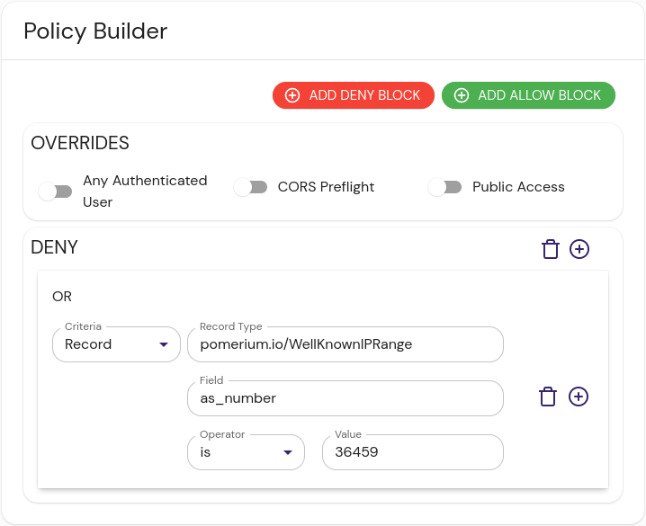

import Tabs from "@theme/Tabs";
import TabItem from "@theme/TabItem";

The Well Known IP Ranges integration provides a list of IP address ranges for various service providers.

```json title="Example"
[
  {
    "index": { "cidr": "1.0.0.0/24" },
    "id": "1.0.0.0/24",
    "as_number": "13335",
    "country_code": "US",
    "as_name": "CLOUDFLARENET"
  },
  {
    "index": { "cidr": "1.0.4.0/23" },
    "id": "1.0.4.0/23",
    "as_number": "38803",
    "country_code": "AU",
    "as_name": "WPL-AS-AP"
  },
  {
    "index": { "cidr": "1.0.6.0/23" },
    "id": "1.0.6.0/23",
    "as_number": "38803",
    "country_code": "AU",
    "as_name": "WPL-AS-AP"
  }
]
```

:::caution
The external data sources we provide are meant to be examples and inspiration for users to create their own data sources. We won't maintain these integrations in perpetuity, and changes to the APIs they interact with may break them in the future.

The [datasource](https://github.com/pomerium/datasource) project is open-source, and if the community wishes to provide contributions to keep it working in the future, we will shepherd those updates.
:::

## Install

<Tabs>
<TabItem value="compose" label="Docker Compose">

These instructions assume a local testing environment using [Docker Compose]. Adjust as needed for your deployment environment.

1. Add the datasource docker image to Docker Compose:

   ```yaml
   services:
     wellknownipranges:
       image: pomerium/datasource:latest
       command:
         - well-known-ips
       ports:
         - 8080:8080
   ```

1. Bring up the new container.

</TabItem>

<TabItem value="binary" label="Local Binary">

1. Download the latest [release] of the [Pomerium datasource] project and extract it.
1. Change directory and run the binary:

   ```sh
   cd datasource-v*
   ./datasource well-known-ips
   ```

   The output should resemble:

   ```sh
   <nil> INF starting well-known-ips http server address=:8080 ip2asn-url=https://iptoasn.com/data/ip2asn-v4.tsv.gz
   ```

</TabItem>

</Tabs>

## Configure External Data Source

Create an external data source:

1. In the Pomerium Enterprise Console, navigate to **CONFIGURE** → **External Data** and click **+ ADD EXTERNAL DATA SOURCE**.

1. Fill out the following fields:

| Field       | Content                      | Notes                                                                                                |
| :---------- | :--------------------------- | :--------------------------------------------------------------------------------------------------- |
| URL         | http://localhost:8080        | If you configured the service in Docker Compose with a set container name, you can use that instead. |
| Record type | pomerium.io/WellKnownIPRange |                                                                                                      |
| Foreign Key | request.ip                   |                                                                                                      |

## Configure Pomerium Enterprise Console

A policy requiring a well known IP address would look something like this:

<Tabs>
<TabItem value="builder" label="Builder">



</TabItem>
<TabItem value="editor" label="Editor">

```yaml showLineNumbers
deny:
  or:
    - record:
        is: "36459"
        field: as_number
        type: pomerium.io/WellKnownIPRange
```

</TabItem>
</Tabs>

## Reference

- It has an optional flag `--address`, to change the listening port from the default `:8080`.

[docker compose]: https://docs.docker.com/compose/
[pomerium datasource]: https://github.com/pomerium/datasource
[release]: https://github.com/pomerium/datasource/releases
