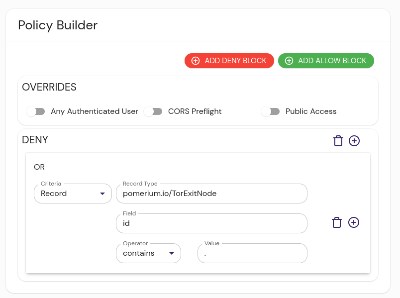

import Tabs from "@theme/Tabs";
import TabItem from "@theme/TabItem";

The Tor Exit Nodes integration provides the IP addresses of known Tor exit nodes.

```json title="Example"
  {"id": "101.3.121.242"},
  {"id": "102.130.113.9"},
```

## Install

This datasource is bundled into Pomerium Enterprise console as of version 18.

:::caution
The external data sources we provide are meant to be examples and inspiration for users to create their own data sources. We won't maintain these integrations in perpetuity, and changes to the APIs they interact with may break them in the future.

The [datasource](https://github.com/pomerium/datasource) project is open-source, and if the community wishes to provide contributions to keep it working in the future, we will shepherd those updates.
:::

## Configure Pomerium Enterprise Console

A policy excluding exit nodes would look something like this:

<Tabs>
<TabItem value="builder" label="Builder">



</TabItem>
<TabItem value="editor" label="Editor">

```yaml showLineNumbers
deny:
  or:
    - record:
        contains: .
        field: id
        type: pomerium.io/TorExitNode
```

</TabItem>
</Tabs>
