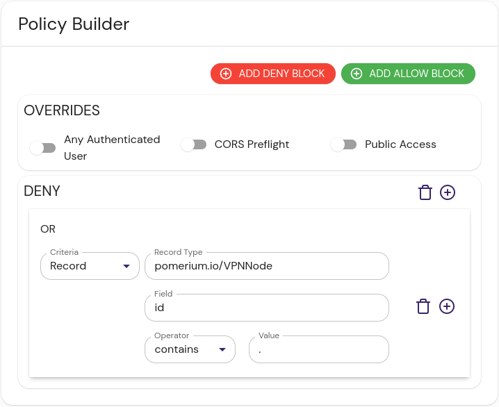

import Tabs from "@theme/Tabs";
import TabItem from "@theme/TabItem";

The VPN Providers integration provides provides a list of IP address ranges for well known VPN providers.

```json title="Example"
[{ "id": "1.116.0.0/15" }, { "id": "1.12.32.0/23" }, { "id": "1.14.0.0/15" }]
```

## Install

No installation is necessary for the VPN Providers external data source. It is provided from Github's CDN available at [https://raw.githubusercontent.com/pomerium/vpnlist/main/vpnlist.json](https://raw.githubusercontent.com/pomerium/vpnlist/main/vpnlist.json).

## Configure Pomerium Enterprise Console

Create an external data source:

1. In the Pomerium Enterprise Console, navigate to **CONFIGURE** → **External Data** and click **+ ADD EXTERNAL DATA SOURCE**.

1. Fill out the following fields:

   | Field       | Content                                                              |
   | :---------- | :------------------------------------------------------------------- |
   | URL         | https://raw.githubusercontent.com/pomerium/vpnlist/main/vpnlist.json |
   | Record type | pomerium.io/VPNNode                                                  |
   | Foreign Key | request.ip                                                           |

1. Click **SAVE EXTERNAL DATA SOURCE**.

A policy excluding VPN nodes would look something like this:

<Tabs>
<TabItem value="builder" label="Builder">



</TabItem>
<TabItem value="editor" label="Editor">

```yaml showLineNumbers
deny:
  or:
    - record:
        contains: .
        field: id
        type: pomerium.io/VPNNode
```

</TabItem>
</Tabs>

[docker compose]: https://docs.docker.com/compose/
