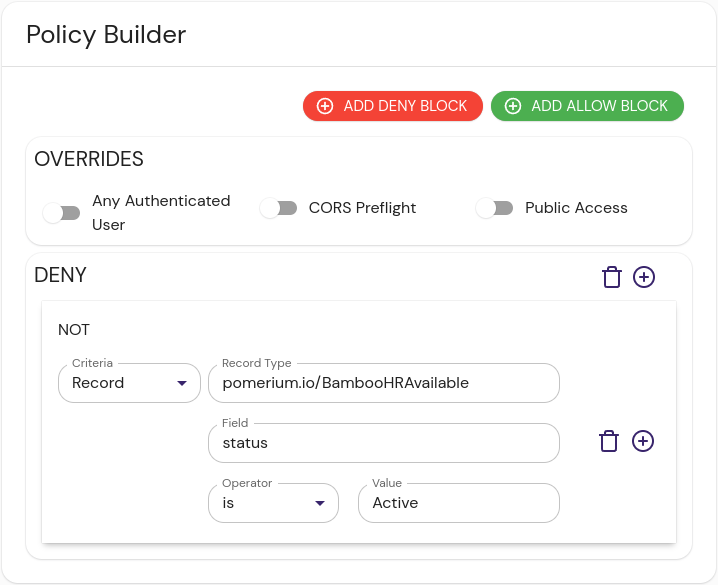

import Tabs from '@theme/Tabs';
import TabItem from '@theme/TabItem';

The Zenefits integration provides integration with HR data from Zenefits, such as group memberships, employment status, out of the office, etc.


:::caution
The external data sources we provide are meant to be examples and inspiration for users to create their own data sources. We won't maintain these integrations in perpituity, and changes to the APIs they interact with may break them in the future.

The [datasource](https://github.com/pomerium/datasource) project is open-source, and if the community wishes to provide contributions to keep it working in the future, we will shepherd those updates.
:::


## Install

1. Create a Zenefits API key by navigating to **Admin Apps** → **Company Profile** → **Custom Integrations**, and adding a new API Token in the **REST API ACCESS** box. 

  Make sure to only select scopes that you need. At a minimum, `People`, `Status` and `Work email` scopes are required. 

In order to correctly parse dates returned by Zenefits API you will need to provide a time zone - either an `UTC` or [IANA Time Zone] database name, i.e. `America/New_York`. 

<Tabs>
<TabItem value="cloudsmith" label="Docker Compose">

These instructions assume a local testing environment using [Docker Compose]. Adjust as needed for your deployment environment.

1. Add the datasource docker image to Docker Compose:

```yaml showLineNumbers
version: "3"
services:
  zenefits:
    image: docker.cloudsmith.io/pomerium/datasource/datasource:main
    command:
      - zenefits
      - --zenefits-api-key=YOUR_API_KEY
      - --time-zone=America/New_York
      - --address=:8080
    container_name: zenefits
    restart: always
    expose:
      - 8080
```
</TabItem>

<TabItem value="binary" label="Binary">

These instructions assume a local testing environment. Adjust as needed for your deployment environment.

1. Download the latest [release] of the [Pomerium datasource] project and extract it.

1. Change directory and run the binary:

  ```sh
  cd datasource-v*
  ./datasource zenefits --zenefits-api-key=$YOUR_API_KEY --time-zone=America/New_York
  ```

  The output should resemble:

  ```sh
  {"level":"info","address":"localhost:8080","message":"ready"}
  ```

</TabItem>
</Tabs>

## Configure Pomerium Enterprise Console

1. In the Pomerium Enterprise Console, navigate to **CONFIGURE** → **External Data** and click **+ ADD EXTERNAL DATA SOURCE**.

1. Fill out the following fields:

  | Field       | Content                          | Notes                                                                     |
  | :---------- | :------------------------------- | :------------------------------------------------------------------------ |
  | URL         | `http://zenefits:8080/employees` | Adjust the hostname as needed depending on your local test environment.   |
  | Record type | `pomerium.io/Zenefits`           |                                                                           |
  | Foreign Key | `user.email`                     | Pomerium uses the users's email to associate IdP and Zenefits user entries. |

1. Define a new policy. The example policy below only allows persons in the list (i.e. not out of office or on vacation) and in `active` status (i.e. not `terminated` or `onboarding`) to pass. 

  <Tabs>
  <TabItem value="builder" label="Builder">

  

  </TabItem>
  <TabItem value="editor" label="Editor">

  ```yaml showLineNumbers
  allow:
    and:
      - record:
          field: status
          is: active
          type: pomerium.io/Zenefits
  ```

  </TabItem>
  </Tabs>

You may add a similar policy around `type` field to i.e. differentiate between employees and contractors. 

## Reference

The reference Zenefits data source provides the following record details:

- The Zenefits `workEmail` field becomes an `id` of each record, intended to be matched with Pomerium's `user.email` foreign key.
- We've only talked about `status` and `type` but there are many other fields you can build policies around. See [Zenefits People API] for details. 
- All persons currently on leave or vacation will not be present in the dataset output.

[Pomerium datasource]: https://github.com/pomerium/pomerium
[release]: https://github.com/pomerium/datasource/releases
[datasource]: https://github.com/pomerium/pomerium
[Docker Compose]: https://docs.docker.com/compose/
[IANA Time Zone]: https://www.iana.org/time-zones
[Zenefits People API]: https://developers.zenefits.com/docs/people
