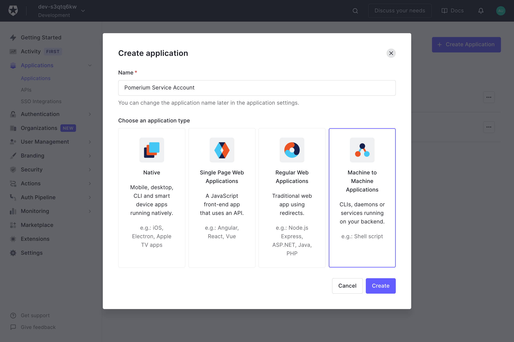
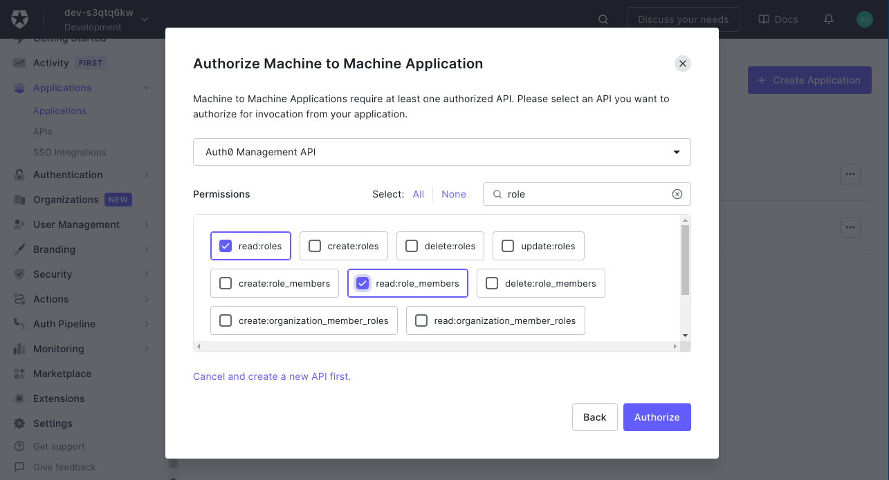
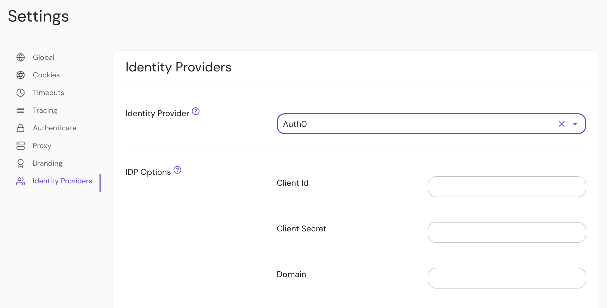

## Setting Up Directory Sync

1. Create a **Machine to Machine Application**. A different application is used for grabbing roles to keep things more secure.

   

   Click **Create**.

1. On the next page select **Auth0 Management API** from the dropdown. Under **Permissions** use the filter on the right to narrow things down to `role`, and choose the `read:roles` and `read:role_members` roles.

   

   Then click **Authorize**.

1. Retrieve the **Client ID** and **Client Secret** from the **Settings** tab.

### Configure Pomerium Enterprise Console

Under **Settings → Identity Providers**, select "Auth0" as the identity provider and set the Client ID, Client Secret and Domain.

