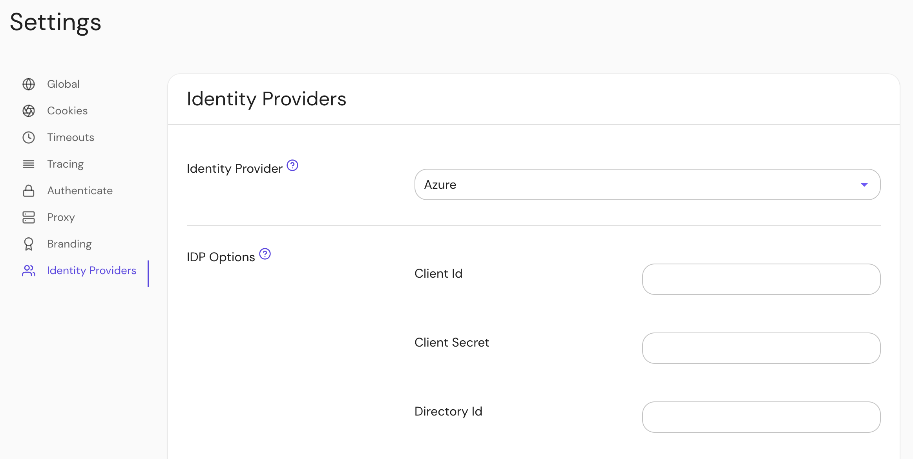

## Setting Up Directory Sync

Azure uses the same Client ID and Client Secret used in [Pomerium Core](/docs/identity-providers).

### Configure Pomerium Enterprise Console

Under **Settings → Identity Providers**, select "Azure" as the identity provider and set the Client ID, Client Secret and Directory (Tenant) ID.

