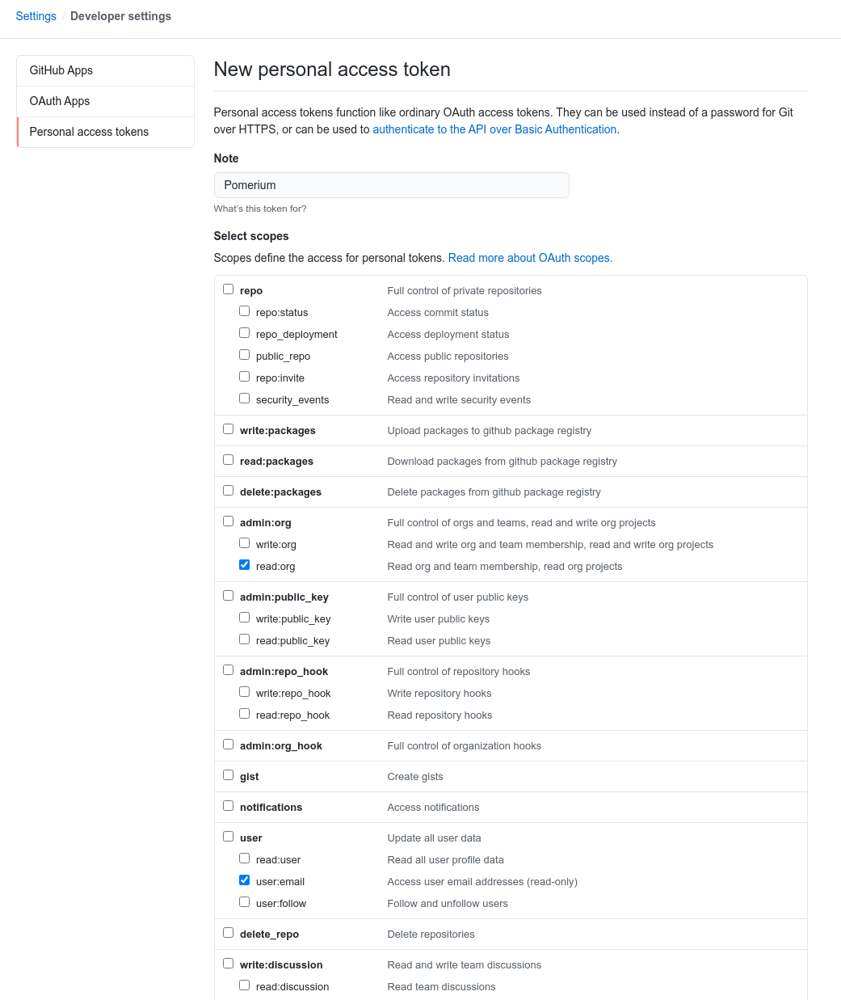
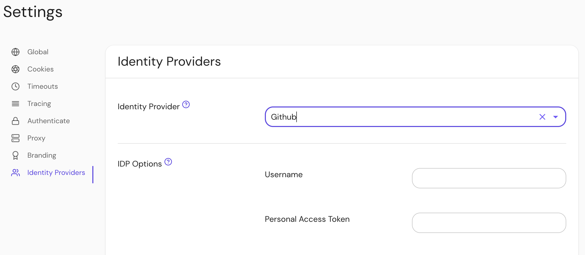

## Setting Up Directory Sync

In order for Pomerium to validate group membership, we'll also need to configure a [Personal Access Token](https://docs.github.com/en/authentication/keeping-your-account-and-data-secure/creating-a-personal-access-token) in GitHub.

Create a new token at [github.com/settings/tokens/new](https://github.com/settings/tokens/new). It needs the `read:org` and `user:email` permissions.

### Configure Pomerium Enterprise Console

Under **Settings → Identity Providers**, select "Github" as the identity provider and set the Username and Personal Access Token.

