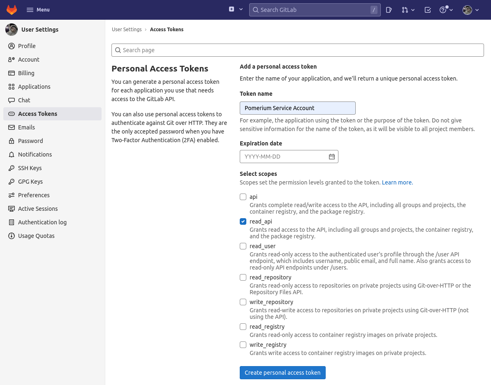
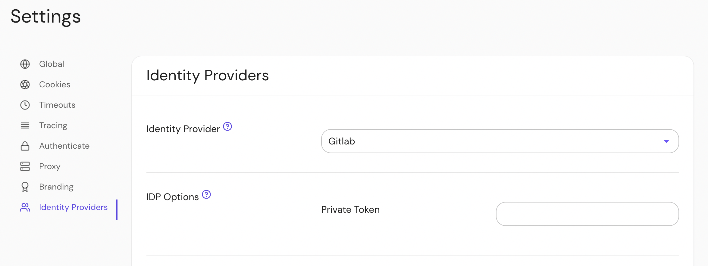

## Setting Up Directory Sync

In order for Pomerium to validate group membership, we'll also need to configure a [Personal Access Token](gitlab.com/-/profile/personal_access_tokens) in Gitlab.

### Configure Pomerium Enterprise Console

Under **Settings → Identity Providers**, select "Gitlab" as the identity provider and set the Private Token.

