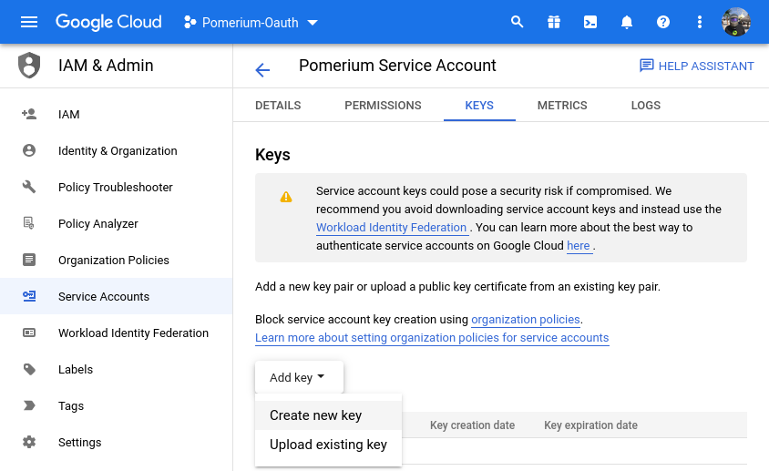
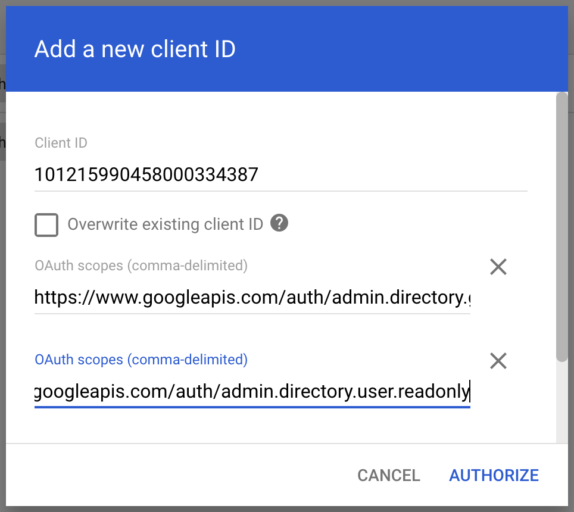

## Setting Up Directory Sync

### Create a service account

In order for Pomerium to validate group membership, we'll also need to configure a [service account](https://console.cloud.google.com/iam-admin/serviceaccounts) with [G-suite domain-wide delegation](https://developers.google.com/admin-sdk/directory/v1/guides/delegation) enabled.

1. Open the [**Service accounts** page](https://console.developers.google.com/iam-admin/serviceaccounts). If prompted, select a project.

1. Click **+ Create Service Account**, enter a name and description for the service account. You can use the default service account ID, or choose a different, unique one. When done click **Create and continue**.

1. The next sections, labeled **Grant this service account access to project** and **Grant users access to this service account**, are not required. Click **Continue** to both, and then **Create**.

1. Select your new service account, and click on the **KEYS** tab. Select **Add key**, then **Create new key**:

  

  In the side panel that appears, select the format for your key: **JSON**.

1. Click **Create**. Your new public/private key pair is generated and downloaded to your machine; it serves as the only copy of this key. For information on how to store it securely, see [Managing service account keys](https://cloud.google.com/iam/docs/understanding-service-accounts#managing_service_account_keys).

1. Click **Close** on the **Private key saved to your computer** dialog, then click **←** to return to the table of your service accounts.

Next, we need to enable enable G Suite domain-wide delegation:

1. Locate the newly-created service account in the table. Under **Actions**, click **Manage Details**.

1. In the service account details, click **Advanced settings**. **Show domain-wide delegation**, then ensure the **Enable G Suite Domain-wide Delegation** checkbox is checked.

  :::caution
  Domain-wide delegation may not be possible from here, depending on what type of Google account you have, as well as Google's updates to their interface. Consult their documentation on [Domain-Wide Delegation of Authority] as needed.

  If you haven't yet configured your app's OAuth consent screen, you must do so before you can enable domain-wide delegation. Follow the on-screen instructions to [configure the OAuth consent screen](https://support.google.com/cloud/answer/10311615?hl=en&ref_topic=3473162#), then repeat the above steps and re-check the checkbox.
  :::

1. Click **Save** to update the service account, and return to the table of service accounts. A new column, **Domain-wide delegation**, can be seen. Click **View Client ID**, to obtain and make a note of the client ID.

### Set directory permissions for Workspaces

Next, we need to give that service account permissionson the GSuite / Workspace side of the house.

1. From your Google Workspace domain's [Admin console](http://admin.google.com/) Main menu, go to **Security** > **Access and data control** > **API controls**.

1. In the **Domain wide delegation** pane, select **Manage Domain Wide Delegation**.

1. Click **Add new**.

1. In the **Client ID** field, enter the client ID obtained from the service account creation steps above.

1. In the **OAuth Scopes** field, enter a comma-delimited list of the scopes required for your application (for a list of possible scopes, see [Authorize requests](https://developers.google.com/admin-sdk/directory/v1/guides/authorizing)).

  Include at a minimum the following list of scopes:
    - `https://www.googleapis.com/auth/admin.directory.group.readonly`
    - `https://www.googleapis.com/auth/admin.directory.user.readonly`

1. Click the **Authorize** button.

