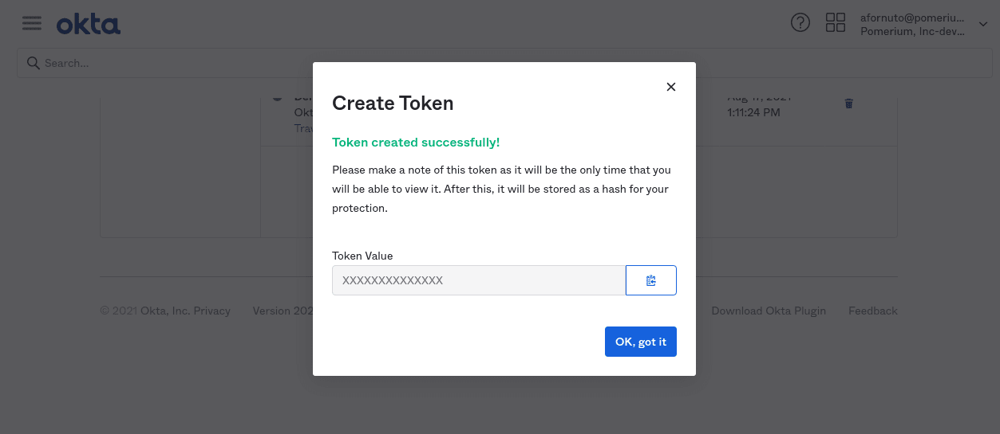

## Setting Up Directory Sync

### Create an Okta Token

In order for Pomerium to validate group membership, we'll also need to configure a [Token](https://help.okta.com/en-us/Content/Topics/Security/API.htm?cshid=Security_API#Security_API) in Okta.

1. From the main menu, navigate to **Security → API**. Select the **Tokens** tab, and click the **Create Token** button. Name the token, then save the value to apply to our Pomerium configuration:

   

### Configure Pomerium Enterprise Console

Under **Settings → Identity Providers**, select "Okta" as the identity provider and set the API Key and URL.

