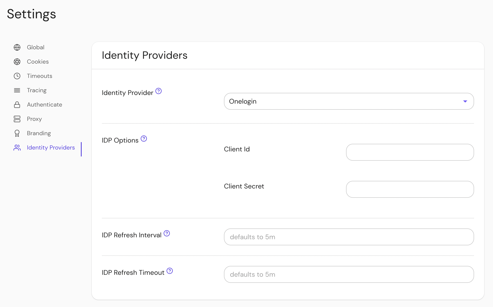

## Setting Up Directory Sync

### Create OneLogin Credentials

In order for Pomerium to validate group membership, we'll also need to configure [API Credentials](https://developers.onelogin.com/api-docs/1/getting-started/working-with-api-credentials) in OneLogin.

1. From the **Administration** dashboard, navigate to **Developers → API Credentials** and select **New Credential**.

1. Name the new credential and give it "Read users" access:

A [Group's ID](https://developers.onelogin.com/openid-connect/api/user-info) will be used to affirm user group membership.

### Configure Pomerium Enterprise Console
Under **Settings → Identity Providers**, select "Onelogin" as the identity provider and set the Client ID and Client Secret.

