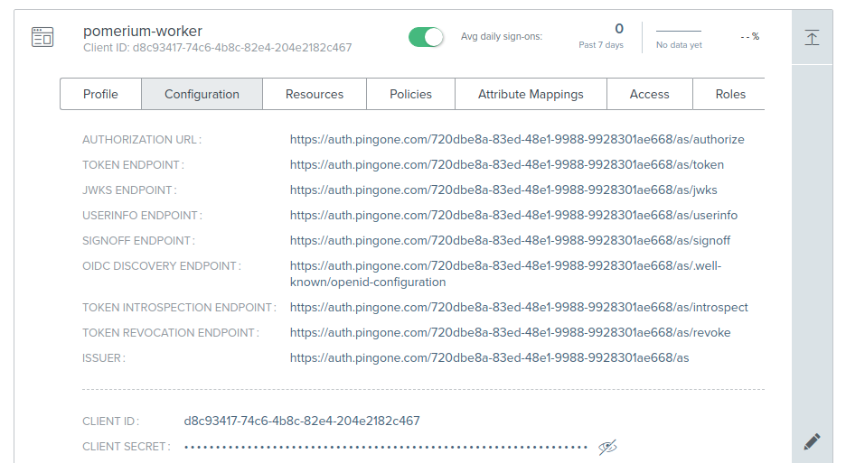

## Setting Up Directory Sync

### Create a Ping Worker Application

In order for Pomerium to validate group membership, we'll also need to configure a [Worker Application](https://docs.pingidentity.com/bundle/pingdirectory-73/page/lfm1564011499001.html) in Ping.

1. Click **Add Application**, and select **Worker → Worker App**.

   

1. Toggle the green slider to enable your new application.

1. This application's **Client ID** and **Client Secret** will be used in the Pomerium Enterprise Console.

   

### Configure Pomerium Enterprise Console

Under **Settings → Identity Providers**, select "Ping" as the identity provider and set the Client ID, Client Secret and Environment ID. The Environment ID can be found in Ping under **Environment → Properties**.

