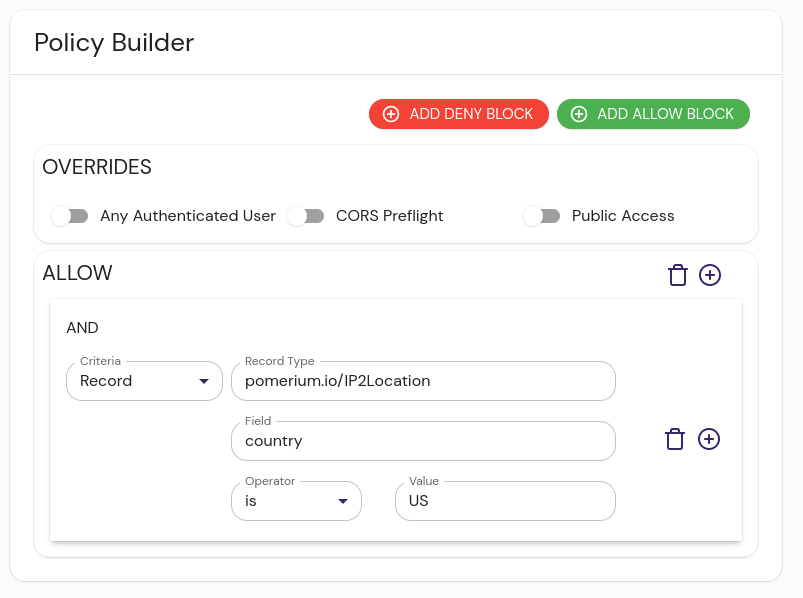
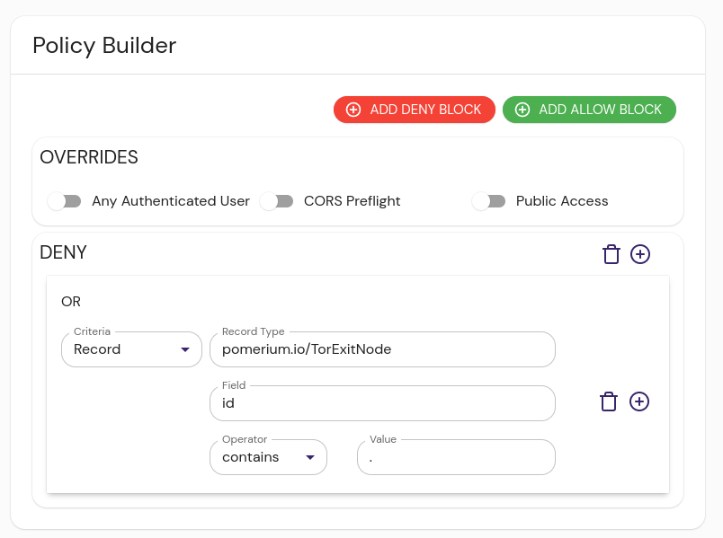

import Tabs from '@theme/Tabs';
import TabItem from '@theme/TabItem';

By adding an external data source, Pomerium administrators can extend access policies by comparing data from an incoming request against any properly formatted data set. To explain how this works, let's look at the external datasets Pomerium provides.

## GeoIP Lookup

This dataset provides a list of IP address ranges and their country of origin, according to ARIN:

```json tittle="Example"
{"$index":{"cidr":"1.0.0.0/24"},"id":"1.0.0.0/24","country":"US","state":"","city":"","zip":"","timezone":""},
{"$index":{"cidr":"1.0.1.0/24"},"id":"1.0.1.0/24","country":"CN","state":"","city":"","zip":"","timezone":""},
```

An example policy to restrict access to IP addresses within the United States would look something like this:

<Tabs>
<TabItem value="builder" label="Builder">



</TabItem>
<TabItem value="editor" label="Editor">

```yaml showLineNumbers
allow:
  and:
    - record:
        field: country
        is: US
        type: pomerium.io/IP2Location

```

</TabItem>
</Tabs>

This policy looks at the `country` 

## Tor Exit Nodes

This dataset provides Tor exit node IP addresses.

```json tittle="Example"
  {"id": "101.3.121.242"},
  {"id": "102.130.113.9"},
```

A policy excluding exit nodes would look something like this:

<Tabs>
<TabItem value="builder" label="Builder">



</TabItem>
<TabItem value="editor" label="Editor">

```yaml showLineNumbers
deny:
  or:
    - record:
        contains: .
        field: id
        type: pomerium.io/TorExitNode

```

</TabItem>
</Tabs>

## Custom datasets

The examples above are provided by Pomerium, but we encourage the community to build and share additional datasets, or integrate with internal datasets to extend their Pomerium policies.