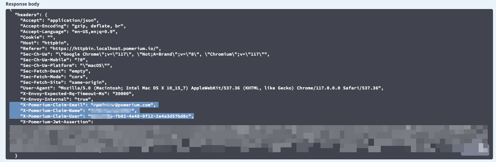
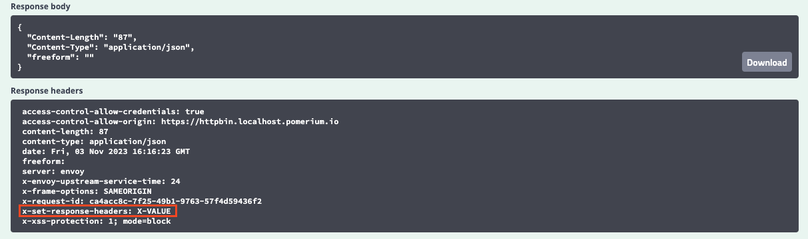

---
# cSpell:ignore Referer, KHTML, WORKDIR, workdir, nodeserver
id: advanced-routes
title: Build Advanced Routes
description: In this lesson, you'll learn how to build advanced routes.
keywords: [reverse proxy, routes, advanced routing, routing]
sidebar_label: 6. Advanced Routes
sidebar_position: 6
---

# Build Advanced Routes

Now that you've built advanced policies, let's build on your routes a bit more.

:::note **Before You Start**

Make sure you've completed the following tutorials:

- [**Get Started**](/docs/get-started/fundamentals/core/get-started)
- [**Build a Simple Route**](/docs/get-started/fundamentals/core/build-routes)
- [**Build a Simple Policy**](/docs/get-started/fundamentals/core/build-policies)
- [**Identity Verification with JWTs**](/docs/get-started/fundamentals/core/jwt-verification)
- [**Build Advanced Policies**](/docs/get-started/fundamentals/core/advanced-policies)

Each tutorial builds on the same configuration files. In this tutorial, you'll build new routes with some of Pomerium's route-level settings.

:::

## Advanced route configuration settings

Pomerium provides route-level settings that allow you to customize how the proxy service handles requests. More advanced configurations allow identity header pass-through, path and prefix rewrites, and request and response header modifications.

For the purposes of this tutorial, we will only review the following settings to give you an idea of how you can further configure your routes for your use case:

- Remove Request Headers
- Host Rewrite Headers
- Set Response Headers
- Redirects
- Prefix & Prefix Rewrite

### Configure HTTPBin

To see how some of these settings work, we will configure Pomerium and Docker Compose to host an HTTPBin server. If you're not familiar with [HTTPBin](https://httpbin.org/), it's a call-and-response HTTP server you can use to test (you guessed it) HTTP requests and responses.

Add the `httpbin` service to your Docker Compose file:

```yaml title="docker-compose.yaml"
httpbin:
  image: kennethreitz/httpbin
  ports:
    - 80:80
```

Add the `httpbin` route in your Pomerium configuration file:

```yaml title="config.yaml"
- from: https://httpbin.localhost.pomerium.io
  to: http://httpbin:80
```

Add `pass_identity_headers` to your `httpbin` route:

```yaml title="config.yaml"
pass_identity_headers: true
```

Then add a simple policy:

```yaml
policy:
  allow:
    and:
      - domain:
          is: example.com
```

**Remember**: All of these are being added to your `httpbin` route!

Now, run Docker Compose, access the `httpbin` route, and inspect a request:

1. Navigate to: `https://httpbin.localhost.pomerium.io`

1. Select **Request inspection**

1. Select the **/headers** row

1. Select **Try it out**, **Execute**

Now, scroll down to **Response body**. You should see a payload like this:

```json
{
  "headers": {
    "Accept": "application/json",
    "Accept-Encoding": "gzip, deflate, br",
    "Accept-Language": "en-US,en;q=0.9",
    "Cookie": "",
    "Host": "httpbin",
    "Referer": "https://httpbin.localhost.pomerium.io/",
    "Sec-Ch-Ua": "\"Google Chrome\";v=\"119\", \"Chromium\";v=\"119\", \"Not?A_Brand\";v=\"24\"",
    "Sec-Ch-Ua-Mobile": "?0",
    "Sec-Ch-Ua-Platform": "\"macOS\"",
    "Sec-Fetch-Dest": "empty",
    "Sec-Fetch-Mode": "cors",
    "Sec-Fetch-Site": "same-origin",
    "User-Agent": "Mozilla/5.0 (Macintosh; Intel Mac OS X 10_15_7) AppleWebKit/537.36 (KHTML, like Gecko) Chrome/119.0.0.0 Safari/537.36",
    "X-Envoy-Expected-Rq-Timeout-Ms": "30000",
    "X-Envoy-Internal": "true",
    "X-Pomerium-Jwt-Assertion": "..."
  }
}
```

Because we added `pass_identity_headers`, we can see that the request includes the `X-Pomerium-Jwt-Assertion` header. This tells us that the identity header has been correctly passed to the upstream application (in this case, to HTTPBin).

Since we're forwarding the JWT, let's try adding the JWT Claims Headers global setting to your configuration file, right under the signing_key:

```yaml
signing_key: LS0tLS1CRUdJTiBFQyBQUklWQVRFIEtFWS0tLS0tCk1IY0NBUUVFSUVSNThaeDA2SHJXTW9PUTRaNjlMaDdMZUtFZW5TSmJZcHJvZ3V3TEl0blNvQW9HQ0NxR1NNNDkKQXdFSG9VUURRZ0FFK1FtamZKQ2ovdzkrOUhrRDVlbTlIZFhRM3ViUEhIdWNOMTlNOXJxR05PeEpTRmR3VHgvaAphdVkvcVFSWWR0YVpnVEpEUWZSYVQ2Q1pPYndSYTl2TXNnPT0KLS0tLS1FTkQgRUMgUFJJVkFURSBLRVktLS0tLQo=

jwt_claims_headers:
  X-Pomerium-Claim-Email: email
  X-Pomerium-Claim-User: user
  X-Pomerium-Claim-Name: name
```

This setting sends JWT claims as _unsigned_ headers to the upstream application (unlike the _signed_ JWT assertion header). If you restart the Pomerium Docker instance and send another request to HTTPBin, you'll notice these claims are included in the request:



So, this adds headers from the JWT to our request, but what if you wanted to remove them for privacy or security reasons? Or what if you wanted to add other headers to your request?

This is where Pomerium's flexibility comes in! Let's try a few examples using our header settings.

### Set and remove request headers

Under your `httpbin` route, add the following settings:

```yaml
- from: https://httpbin.localhost.pomerium.io
    to: http://httpbin:80
    set_request_headers:
      X-SET-REQUEST-HEADERS: X-VALUE
    remove_request_headers:
      - X-Pomerium-Claim-User
      - X-Pomerium-Claim-Name
```

We're telling Pomerium to add a header to the request called `X-Set-Request-Headers` with a value of `X-Value`. We're also telling Pomerium to remove the `User` and `Name` claims that are included as unsigned claims headers. This ensures that these specific headers do _not_ reach the upstream application.

If you run `docker compose up` and check HTTPBin again, you'll notice both the claims headers have been removed, and the test `X-Set-Request-Headers` header is there, too.

### Set response headers

Similarly, you can configure responses as well:

```yaml
- from: https://httpbin.localhost.pomerium.io
    to: http://httpbin:80
    set_response_headers:
      X-SET-RESPONSE-HEADERS: X-VALUE
    set_request_headers:
      X-SET-REQUEST-HEADERS: X-VALUE
    remove_request_headers:
      - X-Pomerium-Claim-User
      - X-Pomerium-Claim-Name
```

If you go HTTPBin's **Response inspection** row and test a request, you'll notice the test `X-Set-Response-Headers` header is included in the response.



### Set the Host header

You can also control the `Host:` header's behavior, which is useful if your upstream server expects a certain value for this header.

For example, the value of the Host header is currently `httpbin`.

However, if you add `preserve_host_header` and set it to `true`, you'll notice the value changes from `httpbin` to `httpbin.localhost.pomerium.io`:

```yaml title="config.yaml"
- from: https://httpbin.localhost.pomerium.io
    to: https://httpbin:80
    set_response_headers:
      X-SET-RESPONSE-HEADERS: X-VALUE
    set_request_headers:
      X-SET-REQUEST-HEADERS: X-VALUE
    remove_request_headers:
      - X-Pomerium-Claim-User
      - X-Pomerium-Claim-Name
    preserve_host_header: true
```

That's because this setting preserves the Host header from the proxied request instead of taking the value from the destination's hostname.

Alternatively, you can also use `host_rewrite_header` to change the Host header's value to that of any incoming request (in this case, it would still be `httpbin.localhost.pomerium.io`).

```yaml title="config.yaml"
- from: https://httpbin.localhost.pomerium.io
    to: https://httpbin:80
    set_response_headers:
      X-SET-RESPONSE-HEADERS: X-VALUE
    set_request_headers:
      X-SET-REQUEST-HEADERS: X-VALUE
    remove_request_headers:
      - X-Pomerium-Claim-User
      - X-Pomerium-Claim-Name
    # preserve_host_header: true
		host_rewrite_header: true
```

### Configure redirects

What if you wanted to redirect users?

Pomerium makes this simple to implement. Just swap out `to:` with the `redirect:` syntax:

```yaml title="config.yaml"
- from: https://httpbin.localhost.pomerium.io
  redirect: {'host_redirect': 'verify.localhost.pomerium.io'}
```

Now, when you access `httpbin`, Pomerium will redirect you to the Verify service.

### Configure prefix and path settings

#### Configure Node server

To demonstrate these settings, we must add one more service to our configuration: A simple Node HTTP server.

First, you must have [Node.js](https://nodejs.org/en/download) installed.

After you install Node.js:

1. Create a new directory called `app`

1. `cd` into `app`

1. Initiate a Node application: `npm init`

1. Create an `index.js` file: `touch index.js`

1. Install Express: `npm i express`

Add the following code inside `index.js`:

```js title="index.js"
const express = require('express');
const app = express();

app.get('/', (req, res) => {
  console.log(req);
  res.send('Hello World!');
});

app.get('/admin', (req, res) => {
  res.send('This is an admin only page');
});

app.listen(5001, () => console.log('Server is up and running'));
```

This mini server builds two different endpoints:

- `/`
- `/admin`

Your `app` directory should now have a `package.json` file and a `node_modules` folder.

Next, test your server:

```bash
node index.js
```

Navigate to `localhost:5001` to see if your server serves the `Hello World!` message.


Similarly, if you go to `localhost:5001/admin`, you should see `This is an admin only page`.


#### Dockerize Node server

Next, we will Dockerize our Node server. In the `./app` directory, create the following files:

- `touch Dockerfile`
- `touch .dockerignore`

In `Dockerfile`, add the following instructions:

```yaml title="Dockerfile"
# pull the Node.js Docker image
FROM node:alpine

# create the directory inside the container
WORKDIR /usr/src/app

# copy the package.json files from local machine to the workdir in container
COPY package*.json ./

# run npm install in our local machine
RUN npm install

# copy the generated modules and all other files to the container
COPY . .

# our app is running on port 5001 within the container, so need to expose it
EXPOSE 5001

# the command that starts our app
CMD ["node", "index.js"]
```

In `.dockerignore`, add:

```yaml title=".dockerignore"
node_modules npm-debug.log
```

In Docker Compose, add your Node server:

```yaml title="docker-compose.yaml"
nodeserver:
  build:
    context: ./app
  ports:
    - '5001:5001'
```

In your configuration file, add a route to the Node server:

```yaml title="config.yaml"
routes:
  - from: https://nodeserver.localhost.pomerium.io
    to: http://nodeserver:5001
    policy:
      allow:
        and:
          - domain:
              is: example.com
```

Now, `cd` back into your root project and run the following command to build your Node server so it's accessible inside your container:

```bash
docker compose up --build
```

With your containers running, go to https://nodeserver.localhost.pomerium.io.

You should see `Hello World!!`.

If you go to https://nodeserver.localhost.pomerium.io/admin, you should see the `/admin` page.

Next, in your Pomerium configuration file, add the `prefix:` setting and give it the value of `/admin`:

```yaml
- from: https://nodeserver.localhost.pomerium.io
    to: http://nodeserver:5001
    prefix: /admin
```

Restart Docker and navigate to `https://nodeserver.localhost.pomerium.io`. Because this URL doesn't include the `/admin` prefix in its path, Pomerium won't match the route, which results in a `404` error.

The `prefix` setting will only match the route if the request has the prefix in its path. So, if you try `https://nodeserver.localhost.pomerium.io/admin`, Pomerium should direct you to the `/admin` only page.

Next, let's add `prefix_rewrite`. To use it, give `prefix_rewrite` the value of `/`. If the incoming request's prefix matches the value of `prefix` (`/admin`), Pomerium will rewrite `prefix` to match the value of `prefix_rewrite`:

```yaml
- from: https://nodeserver.localhost.pomerium.io
    to: http://nodeserver:5001
    prefix: /admin
    prefix_rewrite: /
```

Now, if you navigate to `https://nodeserver.localhost.pomerium.io/admin`, Pomerium will redirect you to the `/` page.

If you don't include the `/admin` prefix, the request will `404`.

## Clean up

This was just to show you Pomerium's flexibility when it comes to advanced routes. We won't be using the HTTPbin or Node server services going forward. To keep your configuration files clean and easy to manage, remove the following services and routes:

In your configuration file:

- Remove the `httpbin` and `nodeserver` routes and their attached policies from `- routes`
- Remove `jwt_claims_headers`

In your project's root folder:

- Delete `app` and its contents

In your Docker Compose file:

- Remove the `httpbin` and `nodeserver` services

## Summary

In this tutorial, you added several new services and built routes to them.

You also added per-route settings that handle redirects _and_ modify requests, responses, header values, and URL paths and prefixes.

Now that you've seen what you can do with routes, it's time to learn how to proxy TCP connections with Pomerium!

### Configuration file state

After cleaning up your files, your configuration should look similar to this:

```yaml
authenticate_service_url: https://authenticate.pomerium.app

signing_key: LS0tLS1CRUdJTiBFQyBQUklWQVRFIEtFWS0tLS0tCk1IY0NBUUVFSUVSNThaeDA2SHJXTW9PUTRaNjlMaDdMZUtFZW5TSmJZcHJvZ3V3TEl0blNvQW9HQ0NxR1NNNDkKQXdFSG9VUURRZ0FFK1FtamZKQ2ovdzkrOUhrRDVlbTlIZFhRM3ViUEhIdWNOMTlNOXJxR05PeEpTRmR3VHgvaAphdVkvcVFSWWR0YVpnVEpEUWZSYVQ2Q1pPYndSYTl2TXNnPT0KLS0tLS1FTkQgRUMgUFJJVkFURSBLRVktLS0tLQo=

routes:
  - from: https://verify.localhost.pomerium.io
    to: http://verify:8000
    pass_identity_headers: true
    policy:
      allow:
        or:
          - domain:
              is: example.com
          - claim/Name: <"Your Name">
      deny:
        and:
          - email:
              starts_with: admin
  - from: https://grafana.localhost.pomerium.io
    to: http://grafana:3000
    pass_identity_headers: true
    policy:
	    allow:
	      and:
	        - domain:
	            is: example.com
```

Docker Compose

```yaml
services:
  pomerium:
    image: pomerium/pomerium:latest
    volumes:
      - ./config.yaml:/pomerium/config.yaml:ro
    ports:
      - 443:443
  verify:
    image: pomerium/verify:latest
    expose:
      - 8000
    environment:
      - JWKS_ENDPOINT=https://pomerium/.well-known/pomerium/jwks.json
  grafana:
    image: grafana/grafana:latest
    ports:
      - 3000:3000
```
