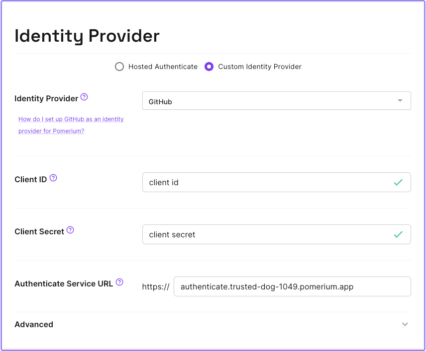

# Zero Fundamentals: Configure a Custom Identity Provider

So far, you've been using our [Hosted Authenticate service](/docs/capabilities/hosted-authenticate-service), which provides a hosted authenticate service URL (`authenticate.pomerium.app`) and Pomerium's hosted identity provider to authenticate users.

In this guide, you'll replace Pomerium's hosted identity provider with your own custom identity provider to handle authentication.

:::note Before you start

Make sure you've completed the following tutorials:

- [**Build a Simple Route**](/docs/get-started/fundamentals/zero-build-routes)
- [**Build a Simple Policy**](/docs/get-started/fundamentals/zero-build-policies)
- [**Single Sign-on with JWTs**](/docs/get-started/fundamentals/zero-single-sign-on)
- [**Build Advanced Policies**](/docs/get-started/fundamentals/zero-advanced-policies)
- [**Build Advanced Routes**](/docs/get-started/fundamentals/zero-advanced-routes)
- [**Build TCP Routes**](/docs/get-started/fundamentals/zero-tcp-routes)

Each tutorial builds on the same configuration files. In this guide, you'll replace our hosted identity provider solution with your own custom identity provider.

:::

## Choose an identity provider

You can integrate Pomerium with any identity provider (IdP) that supports the OAuth2.0 and OIDC protocols. For the purposes of this guide, we will use [GitHub](/docs/integrations/github) as the IdP (the configuration is simpler than other IdPs).

If you prefer to use another IdP instead of GitHub, feel free to do so. You can refer to our identity provider guides for setup instructions.

- [Apple](/docs/integrations/apple)
- [Auth0](/docs/integrations/auth0)
- [Microsoft Entra ID (Azure AD)](/docs/integrations/azure)
- [Cognito](/docs/integrations/cognito)
- [GitHub](/docs/integrations/github)
- [GitLab](/docs/integrations/gitlab)
- [Google](/docs/integrations/google)
- [Okta](/docs/integrations/okta)
- [OneLogin](/docs/integrations/one-login)
- [Ping Identity](/docs/integrations/ping)
- [OIDC](/docs/integrations/oidc)

## Configure your identity provider

In the Zero Console:

1. select **Settings**
1. Scroll to **Identity Provider**
1. Select **Custom Identity Provider**
1. In the **Identity Provider** dropdown, select **GitHub**
1. Enter your **Client ID** and **Client Secret**
1. Enter your **Authenticate Service URL**

If you still want to use Pomerium's authenticate service URL instead of your own, enter a URL with this format:

`authenticate.<CLUSTER_SUBDOMAIN>.pomerium.app`

Skip the advanced settings (unless you need to configure these for your IdP) and save your changes.

## Test the IdP integration

Now, when you access a route:

1. Pomerium will redirect you to the configured IdP to authenticate.
1. Upon successful authentication, the IdP will redirect you back to Pomerium's authenticate service with the Pomerium-managed service URL.
1. Pomerium's proxy service will forward your request to the upstream service.

## Next Steps: Add a Custom Domain

That's it for our Pomerium Zero courses, but if you want to continue learning how to use Pomerium Zero, try adding a [Custom Domain](/docs/capabilities/custom-domains).

From there, you can also check out any of our [Guides](/docs/guides) to learn how to secure common apps and services behind Pomerium.
