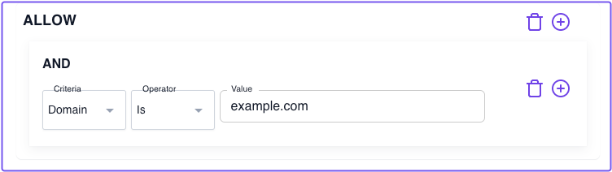
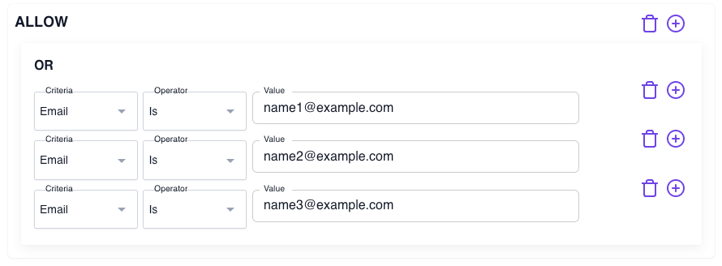
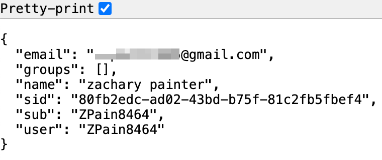
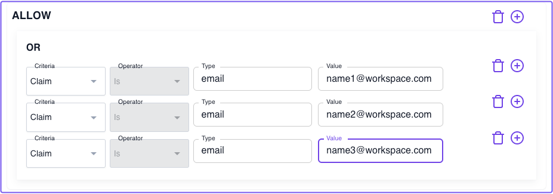
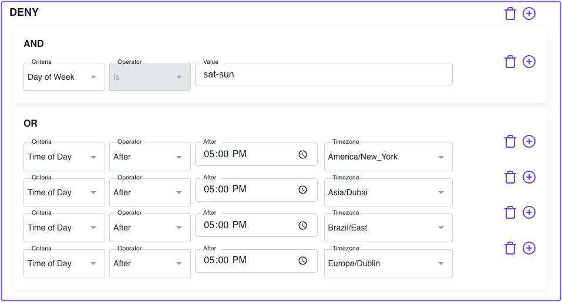
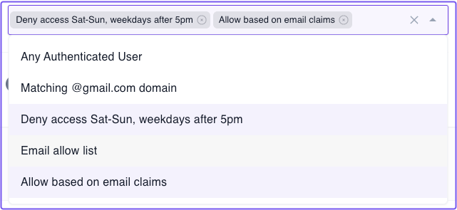

import Tabs from '@theme/Tabs';
import TabItem from '@theme/TabItem';

# Zero Fundamentals: Build Advanced Policies

In this guide, you'll learn how to build **Advanced Policies** with Pomerium.

:::note **Before You Start**

Make sure you've completed the following guides:

- [**Build a Simple Route**](/docs/get-started/fundamentals/zero/zero-build-routes)
- [**Build a Simple Policy**](/docs/get-started/fundamentals/zero/zero-build-policies)
- [**Single Sign-on (SSO)**](/docs/get-started/fundamentals/zero/zero-single-sign-on)

Each tutorial builds on the same configuration files. In this tutorial, you'll add complexity to your authorization policy.

:::

## What's an advanced policy?

An “advanced policy” means the policy includes:

- Chaining policy blocks
- Additional operators, criteria, and matchers

If you're following these guides sequentially, your current policy only includes one policy block and one criterion. It grants access only if the user's email address matches the domain specified in the policy:

<Tabs>
<TabItem value="ppl-builder" label="PPL Builder">



</TabItem>
<TabItem value="ppl-editor" label="PPL Editor">

```yaml showLineNumbers
allow:
  and:
    - domain:
        is: example.com
```

</TabItem>
</Tabs>

This policy is a great first step to protecting your services. If you're using a workspace email address, you can immediately restrict access to allow only members of your organization. But you'll likely want to add more complex policies that only grant access to a specific user or group of users.

With Pomerium Policy Language (PPL), you can build richer policies that apply to real-world use cases. Let's cover a few example "real-world" policies below that would fall into the "advanced" category.

### Grant access based on the email criterion

You can build an allowlist so that access is only granted to users with a matching email address:

1. Create a new policy and name it something like "Email allow list"
1. Add an **ALLOW** block with an **Or** operator
1. Select the **Email** criterion
1. In the **Value** field, enter an email address that should have access

<Tabs>
<TabItem value="ppl-builder" label="PPL Builder">



</TabItem>
<TabItem value="ppl-editor" label="PPL Editor">

```yaml showLineNumbers
allow:
  or:
    - email:
        is: name1@example.com
    - email:
        is: name2@example.com
    - email:
        is: name3@example.com
```

</TabItem>
</Tabs>

You can add as many email addresses as you want before saving your policy.

### Grant access based on JWT claims

You can apply claims data from a user's JWT as context in your authorization policies. One claim commonly included in JWTs is the `email` claim.

Taking the policy you just created, you could create an identical policy that sources the value of the user's email from the JWT itself.

**Get the value of the `email` claim**

    While running your Docker containers, access a route in the browser and append `/.pomerium/user` to it.

    For example, `grafana.my-cluster-1799.pomerium.app/.pomerium/user`

    This action displays user information in a plaintext, JSON format pulled from claims in the user's JWT.
      

**Add custom claims to policy**

    In **Policies**:

    1. Create a new policy and name it "Allow based on email claim"
    1. Add an **ALLOW** block and an **Or** operator
    1. Under **Criteria**, select **Claim**
    1. In **Type**, enter the claim name (`email`)
    1. In **Value**, enter the email address
    <Tabs>
    <TabItem value="ppl-builder" label="PPL Builder">
    
    </TabItem>
    <TabItem value="ppl-editor" label="PPL Editor">

    ```yaml showLineNumbers
    allow:
      or:
        - claim/email: name1@workspace.com
        - claim/email: name2@workspace.com
        - claim/email: name3@workspace.com
    ```
    </TabItem>
    </Tabs>

### Deny based on day of week, time of day

Lastly, we'll create a new policy that denies access to any user on Saturday, Sunday, or weekdays after 5PM.

Deny access based on the [day of the week](/docs/internals/ppl#day-of-week-matcher):

1. Create a new policy named "Deny access Sat-Sun and weekdays after 5pm"
1. Add a **DENY** block with an **And** operator
1. For **Criteria**, select **Day of Week**
1. For **Value**, enter "sat-sun"

Deny access based on the [time of day](/docs/internals/ppl#time-of-day-matcher):

1. Add another **Deny** block with an **Or** operator
1. For **Criteria**, select **Time of Day**
1. In the **Operator** field, select **After**
1. In the **After** field, select **5:00PM**
1. For **Timezone**, select the appropriate timezone for your users

Add as many timezones as necessary based on your users' locations.

<Tabs>
<TabItem value="ppl-builder" label="PPL Builder">



</TabItem>
<TabItem value="ppl-editor" label="PPL Editor">

```yaml showLineNumbers
deny:
  and:
    - day_of_week: sat-sun
  or:
    - time_of_day:
        timezone: America/New_York
        after: 17:00
    - time_of_day:
        timezone: Asia/Dubai
        after: 17:00
    - time_of_day:
        timezone: Brazil/East
        after: 17:00
    - time_of_day:
        timezone: Europe/Dublin
        after: 17:00
```

</TabItem>
</Tabs>

Save your policy.

### Attach policies to a route

Now, select a route and go to the **Policies** field. You'll notice you can attach multiple policies to any route.



In this way, you can chain together multiple policies to add richer access control to any route.

## Up Next: Build Advanced Routes

Now that you've seen some advanced policies, you should learn about advanced routes.

Go to [**Advanced Routes**](/docs/get-started/fundamentals/zero/zero-advanced-routes).
