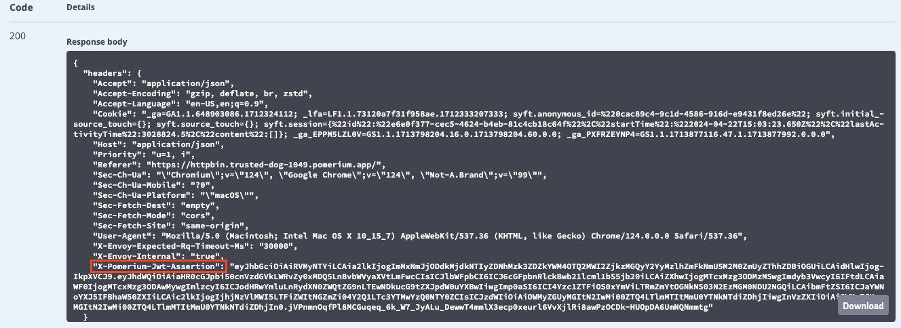
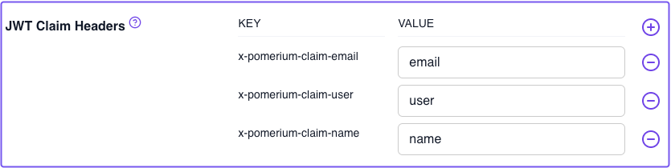
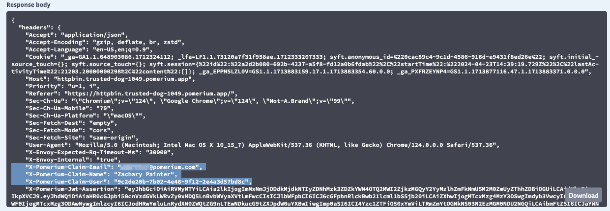
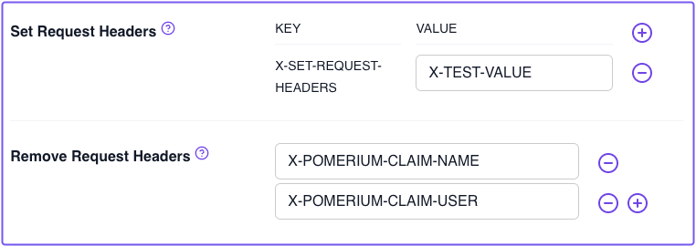
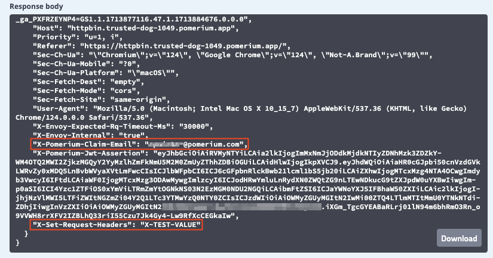
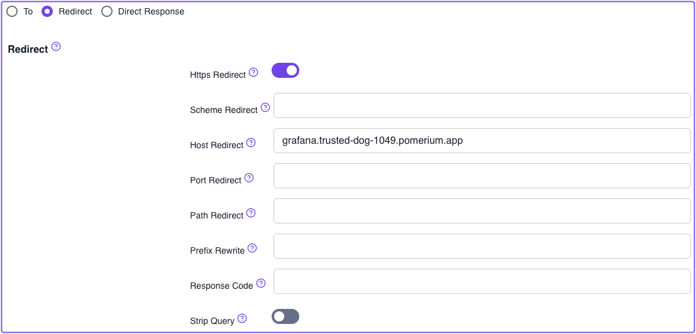
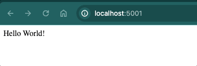
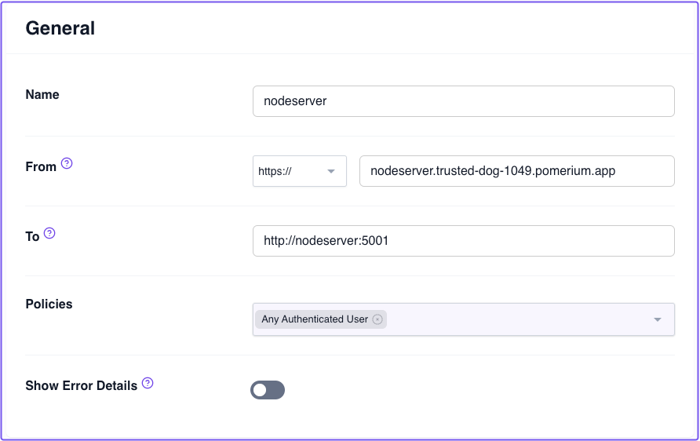
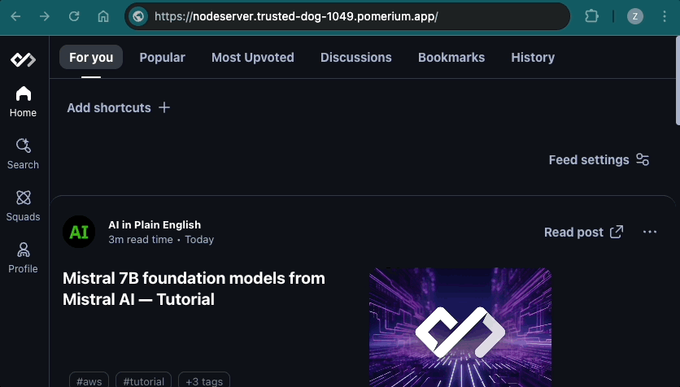
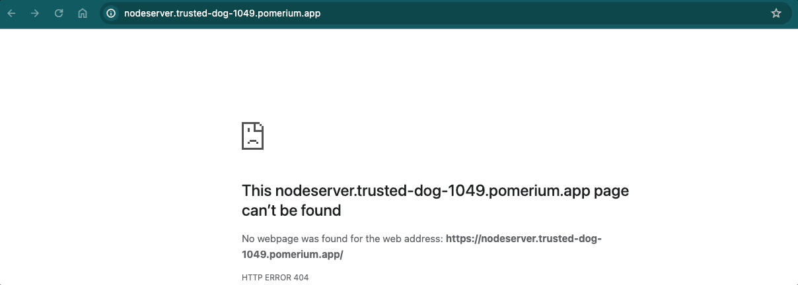

---
# cSpell:ignore WORKDIR, workdir, nodeserver

id: zero-advanced-routes
title: Advanced Routes
sidebar_label: 5. Advanced Routes
sidebar_position: 5
---

# Zero Fundamentals: Build Advanced Routes

In this guide, you'll build advanced routes by exploring some of the route settings available in Pomerium Zero.

:::note **Before You Start**

Make sure you've completed the following guides:

- [**Build a Simple Route**](/docs/get-started/fundamentals/zero/zero-build-routes)
- [**Build a Simple Policy**](/docs/get-started/fundamentals/zero/zero-build-policies)
- [**Single Sign-on (SSO)**](/docs/get-started/fundamentals/zero/zero-single-sign-on)
- [**Build Advanced Policies**](/docs/get-started/fundamentals/zero/zero-advanced-policies)

Each tutorial builds on the same configuration files. In this tutorial, you'll build new routes with some of Pomerium's route-level settings.

:::

## What are advanced routes?

Pomerium provides many route-level settings that allow you to customize how the Proxy service handles requests. More advanced configurations allow identity header pass-through, path and prefix rewrites, and request and response header modifications.

In the Zero Console, these settings are organized into categories, like TLS Settings and Headers settings. For the purposes of this guide, we will test only select settings from the categories listed below:

- **Headers**
- **Path Matching**
- **Path Rewriting**
- **Advanced settings**

### Set up HTTPBin

To test these settings, we will configure Pomerium Zero and Docker Compose to host an HTTPBin server. If you're not familiar with [HTTPBin](https://httpbin.org/), it's a call-and-response HTTP server you can use to test (you guessed it) HTTP requests and responses.

Add the `httpbin` service to your Docker Compose file:

```yaml title="docker-compose.yaml"
httpbin:
  image: kennethreitz/httpbin
  networks:
    main: {}
  ports:
    - 80:80
```

Add the `httpbin` route:

1. Create a new route
1. Add **From** and **To** URLs
1. For **Policies**, select `Any Authenticated User`

Save your route and apply your changeset.

## Test Headers settings

### Pass identity headers (per route)

[Pass Identity Headers](/docs/reference/routes/pass-identity-headers-per-route) is a route-level setting that forwards the user's JWT to the upstream application in a signed HTTP header. The HTTP header must use the (case insensitive) `x-pomerium-jwt-assertion` format. You configured this setting in the [previous guide](/docs/get-started/fundamentals/zero/zero-single-sign-on), but let's see how it looks as a request header.

In the Zero Console:

1. Edit your HTTPBin route
1. Select **Headers**
1. Apply the **Pass Identity Headers** setting
1. Save your route and apply the changeset

Access the HTTPBin route and send a request. To send a request, on the HTTPBin page:

1. Open the **Request inspection** dropdown menu
1. In **GET /headers**, select **Try it out**
1. Select **Execute** to send the request

In the **Response body** field, you'll see the JWT assertion header:



:::info JWTs and SDKs

Read the following documentation to learn more about identity verification in Pomerium:

- [**Identity verification**](/docs/capabilities/getting-users-identity)
- [**Manually verifying the JWT**](/docs/capabilities/getting-users-identity#manual-verification)

We also provide SDKs for JWT verification in the following languages:

- [**Go**](https://github.com/pomerium/sdk-go)
- [**Node.js and Express**](https://github.com/pomerium/js-sdk/tree/main/examples/express)
- [**JavaScript**](https://github.com/pomerium/js-sdk)

:::

### JWT Claim Headers

The pass identity headers setting can also forward _unsigned_ identity headers as additional [JWT Claim Headers](/docs/reference/jwt-claim-headers).

To add JWT claim headers in Pomerium Zero:

1. Select the **Settings** tab in the main sidebar
1. In **Editing Cluster Settings**, select **Headers**
1. In the **JWT Claim Headers** field, enter the values below:

   | **KEY**                  | **VALUE** |
   | :----------------------- | :-------- |
   | `x-pomerium-claim-email` | `email`   |
   | `x-pomerium-claim-user`  | `user`    |
   | `x-pomerium-claim-name`  | `name`    |

   For example:

   

After you save your changes, apply your changeset, and access your HTTPBin route, inspect the request. You'll see these additional, unsigned HTTP headers added to the response body:



### Set and remove request headers

Now, configure [**Set Request Headers**](/docs/reference/routes/headers#set-request-headers) to add static custom HTTP headers to your request:

1. Go back to the HTTPBin headers settings
1. In **Property Name**, enter `X-SET-REQUEST-HEADERS`
1. In **Property Value**, enter `X-TEST-VALUE`

   Next, configure [**Remove Request Headers**](/docs/reference/routes/headers#remove-request-headers) to remove two of the JWT claim headers you set in the previous section.

1. In the **Remove Request Headers** field, enter `X-POMERIUM-CLAIM-NAME` and `X-POMERIUM-CLAIM-USER`.

   

Apply your changeset and test the request again. You'll notice that the request header was added to the request, and the specified JWT claim headers were removed:

    

### Rewrite Host header to a literal value

You may need to modify the value of the Host header. For example, some servers may only accept Host headers with a value that matches the [Origin](https://developer.mozilla.org/en-US/docs/Web/HTTP/Headers/Origin) of the request. The [Host Rewrite](/docs/reference/routes/headers#2-host-rewrite) setting allows you to modify the Host header in the HTTP request to a literal value.

If you don't tamper with this setting, the value of the Host header will be the hostname of our upstream service: `"Host": "httpbin"`.

Now, go back to the **Headers** tab for the HTTPBin route. In the **Host Rewrite to Literal** field, enter your HTTPBin route.

For example, `httpbin.righteous-gemstone-1734.pomerium.app`


After applying your changeset, check the request headers in HTTPBin again. You'll notice Pomerium rewrites the Host header to the domain you entered in the Zero Console:

`"Host": "httpbin.righteous-gemstone-1734.pomerium.app"`

## Test Advanced settings

### Redirects

Configuring a [**Redirect**](/docs/reference/routes/redirect) instructs Pomerium to send the request to a different URL.

To configure a redirect:

1. Go to your HTTPBin route and select **Advanced**, **Redirect**
1. Turn on **HTTPS Redirect**
1. In the **Host Redirect** field, enter a URL you want to redirect requests to, and remove the scheme

   For example: 

After you save your route changes, you'll notice in the **General** tab that the **To** URL has been removed.

If you access your route in the browser, you'll notice it redirects you to the specified URL:


### Direct Response

You can configure Pomerium to send a small, static HTTP response to the downstream client for a managed route.

To configure a **Direct Response**:

1. Select a route
1. Select **Advanced**, **Direct Response**
1. In **Status**, enter an HTTP response status code like `200` (this field only accepts numerical values)
1. In **Body**, enter some example text, like "This is a test response."

After you save your route changes, you'll notice in the **General** tab that the **To** URL has been removed.

Now, navigate to the URL. Pomerium should send back a `200 OK` response with the example text.

## Test prefix and path settings

### Configure Node server

To demonstrate these settings, you need to add a simple Node HTTP server to your Docker Compose file.

First, make sure you install [Node.js](https://nodejs.org/en/download).

After you've installed Node.js:

1. Create a new directory called `app` and `cd` into it
1. Initiate a Node application: `npm init`
1. Create an `index.js` file: `touch index.js`
1. Install Express: `npm i express`

Add the following code inside `index.js`:

```js title="index.js"
const express = require('express');
const app = express();

app.get('/', (req, res) => {
  res.send('Hello World!');
});

app.get('/admin', (req, res) => {
  res.send('This is an admin only page');
});

app.listen(5001, () => console.log('Server is up and running'));
```

This mini server builds two different endpoints:

- `/`
- `/admin`

Your `app` directory should now have a `package.json` file and a `node_modules` folder.

Next, test your server:

```bash
node index.js
```

Navigate to `localhost:5001` to see if your server serves the `Hello World!` message. Similarly, if you go to `localhost:5001/admin`, you should see `This is an admin only page`.



#### Dockerize Node server

Next, we will Dockerize our Node server. In the `./app` directory, create the following files:

```bash
touch Dockerfile && touch .dockerignore
```

In `Dockerfile`, add the following instructions:

```yaml title="Dockerfile"
# pull the Node.js Docker image
FROM node:alpine

# create the directory inside the container
WORKDIR /usr/src/app

# copy the package.json files from local machine to the workdir in container
COPY package*.json ./

# run npm install in our local machine
RUN npm install

# copy the generated modules and all other files to the container
COPY . .

# our app is running on port 5001 within the container, so we need to expose it
EXPOSE 5001

# the command that starts our app
CMD ["node", "index.js"]
```

In `.dockerignore`, add:

```yaml title=".dockerignore"
node_modules npm-debug.log
```

In Docker Compose, add your Node server:

```yaml title="docker-compose.yaml"
nodeserver:
  networks:
    main: {}
  build:
    context: ./app
  ports:
    - 5001:5001
```

In Pomerium Zero, add a route and point it to `nodeserver`. For example:

    

Save your changes and apply your changeset. Then, test your route.

### Path Matching: Prefix

Assuming your route works, we will configure the [**Prefix**](/docs/reference/routes/path-matching#prefix) setting.

The `prefix` setting instructs Pomerium to only match the route if the incoming request has the specified prefix in its path.

In the Zero Console:

1. Go to your Node server route
1. Select **Path Matching**
1. In the **Prefix** field, enter `/admin`

If you append the `/admin` endpoint to your route, Pomerium should direct you to the `/admin` only page. If you don't append `/admin`, you will see a `404` error:



### Path Rewriting: Prefix Rewrite

Next, let's add [**Prefix Rewrite**](/docs/reference/routes/path-rewriting#prefix-rewrite).

In the Zero Console:

1. Select **Path Rewriting**
1. In the **Prefix Rewrite** field, enter a `/`

If the incoming request's prefix matches the value of `prefix` (`/admin`), Pomerium will rewrite `prefix` to match the value of `prefix_rewrite`.

Now, if you navigate to the `/admin` endpoint, Pomerium will redirect you to the `/` page. If you don't include the `/admin` prefix, the request will `404`.



Great job! You've configured several advanced routes in Pomerium Zero.

## Up Next: TCP Routes

In the next guide, you'll secure TCP routes and access an SSH service.

Go to [TCP Routes](/docs/get-started/fundamentals/zero/zero-tcp-routes).

#### Configuration file state

At this point, your Docker Compose file should look like:

```yaml title="docker-compose.yaml"
services:
  pomerium:
    image: pomerium/pomerium:latest
    ports:
      - 443:443
    restart: always
    environment:
      POMERIUM_ZERO_TOKEN: <CLUSTER_TOKEN>
      XDG_CACHE_HOME: /var/cache
    volumes:
      - pomerium-cache:/var/cache
    networks:
      main:
        aliases:
          - verify.<CLUSTER_SUBDOMAIN>.pomerium.app
          - authenticate.<CLUSTER_SUBDOMAIN>.pomerium.app
  verify:
    image: pomerium/verify:latest
    networks:
      main:
        aliases:
          - verify
  grafana:
    image: grafana/grafana:latest
    ports:
      - 3000:3000
    networks:
      main: {}
    environment:
      - GF_AUTH_SIGNOUT_REDIRECT_URL=https://grafana.<CLUSTER_SUBDOMAIN>.pomerium.app/.pomerium/sign_out
      - GF_AUTH_JWT_ENABLED=true
      - GF_AUTH_JWT_HEADER_NAME=X-Pomerium-Jwt-Assertion
      - GF_AUTH_JWT_EMAIL_CLAIM=email
      - GF_AUTH_JWT_USERNAME_CLAIM=sub
      - GF_AUTH_JWT_JWK_SET_URL=https://authenticate.<CLUSTER_SUBDOMAIN>.pomerium.app/.well-known/pomerium/jwks.json
      - GF_AUTH_JWT_CACHE_TTL=60m
      - GF_AUTH_JWT_AUTO_SIGN_UP=true
    volumes:
      - ./grafana-storage:/var/lib/grafana

  httpbin:
    networks:
      main: {}
    image: kennethreitz/httpbin
    ports:
      - 80:80

  nodeserver:
    networks:
      main: {}
    build:
      context: ./app
    ports:
      - 5001:5001

networks:
  main: {}

volumes:
  pomerium-cache:
```
